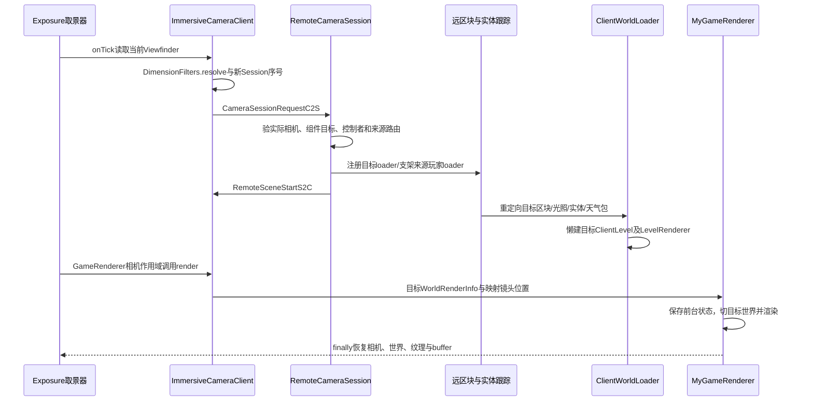
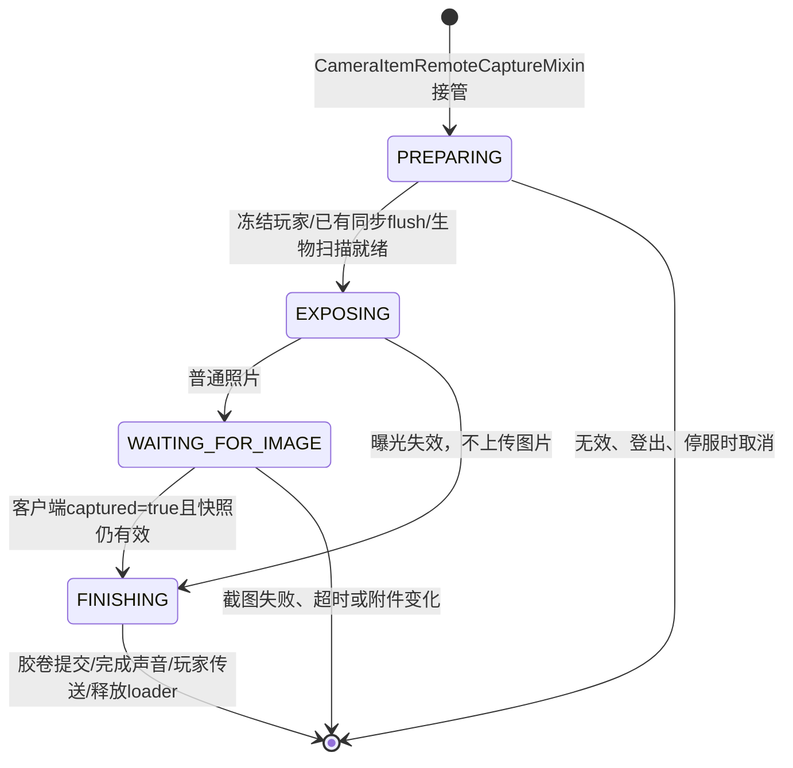

# Shuttershadow 代码维护 Wiki

本文对应 Minecraft 1.21.1 / NeoForge 21.1.252 的当前源码，描述实现、状态所有者、调用顺序和每个显式声明的方法。对外调用示例、参数契约、数据包扩展见 [API Wiki](API.md)；安装与启动见 [README](../README.md)。下文的“内核”就是本项目 `core`、`network`、`access`、`mixin` 代码，不需要安装 Immersive Portals，也不创建传送门。

## 阅读顺序与模块边界

维护取景效果先看 `ImmersiveCameraClient → RemoteCameraSession → MyGameRenderer`；维护胶卷行为看 `CameraItemRemoteCaptureMixin → DimensionFilmCapture / RemoteStandPreparation / MobDimensionFilmCapture`；维护网络与多人看 `PacketRedirection → RemoteChunkTracking → PlayerChunkLoading → MixinTrackedEntity`；维护真实跨维移动看 `SeamlessTeleportation → ServerTeleportationManager → ClientTeleportationManager`。

| 目录 | 负责的状态 | 主要边界 |
| --- | --- | --- |
| 根包 | 物品、附魔、来源路由、照片/胶卷玩法 | 接入 Exposure 事件与 CameraHolder |
| `api` | 对外的稳定调用入口 | 外部代码应使用这一层，不依赖 Mixin 私有字段 |
| `client` | 当前取景会话、临时截图与来源玩家投影 | 客户端主/渲染线程；不修改玩家真实所在世界 |
| `network` | 协议、场景包、服务端相机及支架事务 | 客户端请求只提供意图，服务端重新验证相机和路由 |
| `core/chunk_loading` | 额外 loader、票据、区块批次、实体观察者 | 额外观察与原版玩家订阅分别维护 |
| `core/render` | 每世界 renderer/lightmap/fog、section 缓存、渲染堆栈 | 目标渲染结束必须恢复全部前台状态 |
| `core/teleportation` | 当前服务器的传送集合，真实玩家/载具换世界 | 不加入目的地 3×3 区块等待 |
| `compat` | 可选 Sodium/Iris invoker | 未安装时为空适配器，兼容 Mixin 按模组存在性选择 |
| `access` | 由 Mixin 实现的内部状态桥 | `IE`/`ip_`/`portal_` 名称是已保留的桥名，不代表传送门玩法 |
| `mixin` | Exposure、Minecraft、可选渲染器的注入和 accessor | 后文逐条指出全局基础设施与相机局部条件 |
| `util` / `event` | 通用算法、任务作用域与生命周期事件 | 释放和异常恢复也在这里形成闭环 |
| `data` | 附魔、标签和语言资源生成 | Gradle `runData` 执行，普通游戏启动不执行生成 |

## 线程和生命周期

服务端相机路由、loader/票据、玩家和生物传送都在服务端主线程运行。C2S 业务包经 `enqueueWork` 进入该线程；`ChunkLoading` 会抛错拒绝错线程调用，`SeamlessTeleportation` 则返回 `null`。不要在网络线程直接调用游戏实体方法。

客户端 `ClientWorldLoader` 的世界创建和切换要求 Minecraft 主线程。渲染方法、GL 操作和 renderer 状态交换属于客户端渲染线程。`RemoteClientChunkMap` 允许网格工作线程读同步的副表，修改必须走主线程；`DimensionCameraConfig` 的候选注册表缓存和文件刷新另有同步保护。

每玩家的服务端会话按 UUID 查询，但同时保存真实 `ServerPlayer` 对象，并核查在线列表仍指向该对象。复活替换对象时不能仅凭 UUID 复用 loader。支架 Pending 以支架 UUID 为键，再用支架、摄影师、相机引用及滤镜/胶卷快照验证。

退出时，业务 `onLogout`/`onServerStopping` 撤销拍摄并释放 loader；底层 `ServerCleanupEvent` 清跟踪、票据与每服务器任务。客户端登出取消截图/取景；`Minecraft.updateLevelInEngines` 切换/清除主世界时发布 `ClientCleanupEvent` 并释放多世界 renderer、次级 lightmap、可见列表及任务，主世界被清为空时再发布 `ClientExitEvent` 清维度类型映射。无缝传送走专门的状态迁移入口，不把有效目标世界全部清掉。世界级 GPU 对象只由其所有者释放，主 lightmap 不由次级 helper 销毁。

## 玩家跨维度观察的完整调用过程

下面区分“在相机里看目标世界”和“玩家实际进入目标世界”。前者玩家的真实实体一直在源世界。

1. `CameraItemRemoteCaptureMixin` 设置自恋狂相机的初始自拍参数，`ViewfinderNarcissismMixin` 同步自拍视角并防止换槽时旧取景器修改新相机；普通/自恋狂取景随后都进入同一远场路径。`ImmersiveCameraClient.onTick` 从当前活动 `Viewfinder` 附件取得滤镜，`DimensionFilters.resolve` 使用当前真实来源维度解析路由；目标与源相同不建立远场。
2. 路由、取景器、支架或来源世界改变就先 `close` 旧会话；新会话用递增正序号。没有收到场景响应时每 10 tick 重试请求。服务端不信任请求内目标，而是重新读取实际活动相机、滤镜组件和数据包路由。这样先看下界再切末地不会复用同一物品 ID 的旧目标。
3. `RemoteCameraSession.refreshRemoteWindow` 把映射镜头位置换成区块中心，实际 loader 半径为玩家请求、原版服务器视距和 `dimension_camera.max_view_distance` 的共同最小值。上限默认 8、允许 3～32，窗口为 `(2r+1)²` 方形区块。只有中心或半径变化才先加新 loader、再移除旧 loader。支架额外保留来源世界中可能出镜玩家的同步窗口。
4. `RemoteChunkTracking` 标记观察记录和加载需求，`RemoteChunkTickets.flushThrottling` 非阻塞地提交票据。已有 `ChunkHolder.getChunkToSend()` 才由 `PlayerChunkLoading.doChunkSending` 发送区块；玩家原版已经收到的来源区块复用原版同步。远批次使用独立 start/finish/ack，不占原版发送器的回执。
5. `PacketRedirection` 给原版区块、实体、光照等包加目标维度。`PacketRedirectionClient` 在客户端主线程用 `ClientWorldLoader.withSwitchedWorld` 临时设置网络处理的目标世界；原版包处理器仍完成真正的数据更新。CONFIGURATION 握手、登录维度类型映射必须先完成，才能构造合法的次级世界。
6. 正常帧的 `MixinGameRenderer` 在有效相机远场内调 `ImmersiveCameraClient.render`。它核查序号、目标和当前路由，按来源锚点的眼位插值计算镜头，再 push `WorldRenderInfo`。`MyGameRenderer.switchAndRenderTheWorld` 保存前台全部状态，切目标 renderer、fog、lightmap 和临时 buffer；原版 renderer 走目标 section 搜索，Sodium 走其兼容上下文。
7. 手动支架的源世界玩家只被投影绘制：`ImmersiveCameraClient.playerProjections → RemotePlayerRenderer`。渲染投影不改真实位置；服务端 `RemoteCaptureContext.projectedPlayersInFrame` 才用同映射和 Exposure 视锥/遮挡判断胶卷传送名单。
8. 渲染无论成功还是异常都在 `finally` 恢复主世界、相机、雾、光照、透明链、矩阵和兼容上下文。关闭取景/真实传送后清掉会话，不把远场 `ClientLevel` 当成玩家的真实世界。

## 三种拍摄与胶卷流程

| 操作 | 画面来源 | 玩家维度胶卷 | 生物维度胶卷 | 是否等完整照片窗口 |
| --- | --- | --- | --- | --- |
| 手持普通远景拍摄 | 当前有效目标取景画面 | 按其原玩法，不把远景自动视作自拍 | 照片首个合格非玩家生物从目标带到源 | 否，保留当前可见内容 |
| 手持玩家胶卷自拍 | 真实传送到目标后由 Exposure 拍摄 | 先无缝传送本人及直接载具，客户端维度确认后继续原拍摄 | 不走玩家自拍事务 | 不等目的地区块；只等真实世界切换确认 |
| 手动操作支架 | 当前目标场景，含源玩家投影 | 截图/免曝光事件完成后传送冻结的出镜且同意玩家 | 首个合格目标生物带到源 | 不等合影视距；生物胶卷另等小扫描窗口 |
| 红石支架 | 源维度原照片，隐藏玩家 | 完成后传送源镜头内且同意玩家；不生成目标照片 | 目标上下文只用于选生物和传送 | 不加载目标照片；生物胶卷仍等小扫描窗口 |

### 手动支架状态机

`RemoteStandPreparation.beginIfNeeded` 登记事务后原调用被延后；tick 到 `EXPOSING` 时通过 `DimensionFilmCapture.TakePhotoInvoker` 再调用原 Exposure `takePhoto`。重入遇同一事务时允许原方法继续，防止无限重入。

正常照片的 `addFrameToFilm`、快门声音及关闭动作在 Mixin 内被延后记录。客户端 `RemoteStandCapture` 或 `SourceStandCapture` 的 `Capture<Image>` 截图 future 完成时用负序号发送 `CameraSessionCloseC2S(captured)`。`captured=true` 表示截图任务成功，不代表后续图片处理或仓库上传已完成。服务端核查后先续上传授权，把 Frame 加进胶卷并同步菜单/支架，再播放咔嚓完成音，再按名单传玩家；生物传送另外等仓库上传回调。因此完成音以后取下胶卷不会误取消已提交照片。

曝光失效仍生成本次 Frame 的元数据/实体名单，并触发 Exposure 的拍摄/FrameAdded 等业务事件；Mixin 跳过胶卷 Frame 写入、客户端截图请求和图片上传。手动、红石支架均保留胶卷传送与完成声音。自恋狂只对手持取景器初始模式生效，支架没有自拍切换，不使用此效果。

手动支架可复用正在观察的会话；没有 active preview 时，`RemoteCaptureContext.resolveRoute` 也能独立解析支架当前滤镜，所以这里没有“必须先观察过”的逻辑门槛。没有预览时仍不等待整个照片取景窗口填满，画面以截图时已经同步/渲染的内容为准。

`MobDimensionFilmCapture` 只记录首个非玩家 `LivingEntity`。正常成片等仓库上传完成回调再传送；曝光失效走 `completeWithoutUpload`。等待时用 radius=0 的全局 loader 保活被选生物所在区块，并随生物跨区块换 loader；取消、超时及传送完成都释放。

### 真实玩家传送与载具

`DimensionFilmCapture` 或 `/tps` 调 `SeamlessTeleportation.teleportPlayer/teleportEntity → ServerTeleportationManager.forceTeleportPlayer`。API 校验线程、世界实例、实体存活与坐标；没有目的地扫描或 3×3 预加载。跨维玩家保留原 `ServerPlayer`，来源移除/目标加入的同步在正确维度包作用域中进行。

玩家直接乘坐的载具会重建到目标世界，复制状态/UUID/数值实体 ID，随后玩家恢复骑乘；不会递归把同船其他乘客全部带走。目标位置包扩展维度字段，客户端 `ClientTeleportationManager.forceTeleportPlayer` 将原 `LocalPlayer` 和客户端载具移到缓存目标 `ClientLevel`，切换主 renderer、粒子及雾上下文。普通非玩家实体跨维会返回新实例，调用者必须使用 API 返回值。

支架操作者若本人在出镜传送名单内，服务端先 `stopControlling/removeActiveExposureCamera`，关闭远场订阅；实际移动包排入之后才发 `RemoteSceneStopS2C`。客户端恢复支架 camera entity 的动作延后至真实换世界之后，防止玩家卡在旧支架画面、无法移动或转向。

## 常见维护入口与排查

| 现象/改动 | 先看 | 必须保持的契约 |
| --- | --- | --- |
| 滤镜目标不对、切镜头后旧画面 | `DimensionFilters`、`DimensionCameraConfig`、两个Session的route/sequence验证 | 同物品ID不同组件目标不能共享旧路由 |
| 第一张缺区块/地形 | `PlayerChunkLoading`、重定向包、`MyRenderHelper.earlyRemoteUpload`、目标renderer setup | 照片不扩大玩家已看的加载窗口 |
| 支架照片等待久 | `RemoteStandPreparation.State/invalidReason/mobChunksReady`及客户端截图future | 玩家胶卷不等目的地区块；生物搜索可等小窗口 |
| 咔嚓后换胶卷取消 | `deferFrameCommit`、`commitFrameAndPlaySound`、结果回执 | 声音在提交胶卷与渲染成功之后 |
| 操作者跨维卡在支架 | `teleportStandPlayersAfterPhoto`、`finishDimensionTeleport`、`clearDetachedStandViewfinder` | 清旧活动相机，客户端停止包晚于真实移动包 |
| 多人实体消失/载具重复 | `MixinTrackedEntity`、`MixinServerEntity`、`ServerTeleportationManager` | 原版seenBy与额外观察者分别维护，载具保留本次骑乘者同步 |
| 保存世界停住 | `RemoteChunkTickets`、停服生命周期事件、Pending释放 | 停服后不提交新加载票据，不join区块加载future |
| 光照丢失/GPU泄漏 | `DimensionRenderHelper`、`ClientWorldLoader`、`MyGameRenderer` | 主/次lightmap所有权区分；finally恢复；次级纹理退出释放 |
| 开光影黑屏/频闪 | `IrisInterface`、Iris color/depth Mixin、截图作用域 | 不修改普通玩家主画面的Iris目标；必须核对包版本字段 |
| 普通世界行为被相机影响 | 对应Mixin的`WorldRenderInfo/SourceStandCapture`条件 | 局部相机钩子必须带作用域；网络/缓存基础设施是明确全局改动 |

## 声明索引的范围

下列条目覆盖所有 `src/main/java` 顶层、嵌套和匿名类型，以及源码显式构造器、接口方法、静态/实例方法。方法签名保留参数类型和名称；源码路径可直接打开。Java 自动生成的默认构造器、record 字段访问器/`equals`/`hashCode`/默认 `toString`、enum `values/valueOf`、lambda 编译产物不当作手写方法重复列出；record 显式覆盖的实现仍逐条列出。静态注册器、CODEC、事件订阅lambda和Mixin静态初始化回调的职责写在所属类型说明中。

方法说明对应当前方法体，不把维护文档当成另一套实现规范；改代码时同步更新本表与API契约。类的 `private` 工具构造器只用于禁止实例化，不应被外部反射使用。

## 类型快速索引

**物品、玩法与入口**：[CameraEnchantments](#code-cameraenchantments)、[DimensionCameraConfig](#code-dimensioncameraconfig)、[DimensionCameraPredicate](#code-dimensioncamerapredicate)、[DimensionCameraPredicate.Route](#code-dimensioncamerapredicate-route)、[DimensionFilmCapture](#code-dimensionfilmcapture)、[DimensionFilmCapture.TakePhotoInvoker](#code-dimensionfilmcapture-takephotoinvoker)、[DimensionFilmCapture.State](#code-dimensionfilmcapture-state)、[DimensionFilmCapture.SourceSnapshot](#code-dimensionfilmcapture-sourcesnapshot)、[DimensionFilmCapture.Pending](#code-dimensionfilmcapture-pending)、[DimensionFilterItem](#code-dimensionfilteritem)、[DimensionFilterResources](#code-dimensionfilterresources)、[ExposureVisibility](#code-exposurevisibility)、[MobDimensionFilmCapture](#code-mobdimensionfilmcapture)、[MobDimensionFilmCapture.PendingKey](#code-mobdimensionfilmcapture-pendingkey)、[MobDimensionFilmCapture.Pending](#code-mobdimensionfilmcapture-pending)、[MobDimensionFilmRollItem](#code-mobdimensionfilmrollitem)、[PhotoTargetContext](#code-phototargetcontext)、[PlayerDimensionFilmRollItem](#code-playerdimensionfilmrollitem)、[RemoteCaptureContext](#code-remotecapturecontext)、[RemoteCaptureContext.Observation](#code-remotecapturecontext-observation)、[SeamlessTeleportCommand](#code-seamlessteleportcommand)、[Shuttershadow](#code-shuttershadow)、[ShuttershadowConfig](#code-shuttershadowconfig)。

**公开 API 实现**：[ChunkLoader](#code-chunkloader)、[ChunkLoader.ChunkPosConsumer](#code-chunkloader-chunkposconsumer)、[ChunkLoading](#code-chunkloading)、[DimensionFilters](#code-dimensionfilters)、[DimensionFilters.Route](#code-dimensionfilters-route)、[SeamlessTeleportation](#code-seamlessteleportation)。

**客户端相机**：[DimensionFilmClient](#code-dimensionfilmclient)、[DimensionFilterModels](#code-dimensionfiltermodels)、[DimensionFilterModels.<anonymous@63>](#code-dimensionfiltermodels-anonymous-63)、[DimensionFilterModels.<anonymous@63>.<anonymous@64>](#code-dimensionfiltermodels-anonymous-63-anonymous-64)、[ImmersiveCameraClient](#code-immersivecameraclient)、[ImmersiveCameraClient.Session](#code-immersivecameraclient-session)、[ImmersiveCameraClient.CaptureSnapshot](#code-immersivecameraclient-capturesnapshot)、[ImmersiveCameraClient.PlayerProjection](#code-immersivecameraclient-playerprojection)、[RemotePlayerRenderer](#code-remoteplayerrenderer)、[RemoteStandCapture](#code-remotestandcapture)、[RemoteStandCapture.<anonymous@77>](#code-remotestandcapture-anonymous-77)、[RemoteStandCapture.PreparedScreenshot](#code-remotestandcapture-preparedscreenshot)、[ShuttershadowClient](#code-shuttershadowclient)、[SourceStandCapture](#code-sourcestandcapture)、[SourceStandCapture.ScopeAction](#code-sourcestandcapture-scopeaction)、[SourceStandCapture.NativeScreenshot](#code-sourcestandcapture-nativescreenshot)。

**网络与服务端相机状态**：[CameraSessionCloseC2S](#code-camerasessionclosec2s)、[CameraSessionRequestC2S](#code-camerasessionrequestc2s)、[CoreNetworkHandshake](#code-corenetworkhandshake)、[CoreNetworkHandshake.ModVersion](#code-corenetworkhandshake-modversion)、[CoreNetworkHandshake.CoreConfigurationTask](#code-corenetworkhandshake-coreconfigurationtask)、[CoreNetworkHandshake.S2CConfigStartPacket](#code-corenetworkhandshake-s2cconfigstartpacket)、[CoreNetworkHandshake.C2SConfigCompletePacket](#code-corenetworkhandshake-c2sconfigcompletepacket)、[CorePayloads](#code-corepayloads)、[DimensionFilmReadyC2S](#code-dimensionfilmreadyc2s)、[DimensionFilmStartS2C](#code-dimensionfilmstarts2c)、[MiscNetworking](#code-miscnetworking)、[MiscNetworking.DimIdSyncPacket](#code-miscnetworking-dimidsyncpacket)、[PacketRedirection](#code-packetredirection)、[PacketRedirection.Payload](#code-packetredirection-payload)、[PacketRedirectionClient](#code-packetredirectionclient)、[RemoteCameraSession](#code-remotecamerasession)、[RemoteCameraSession.CaptureLoader](#code-remotecamerasession-captureloader)、[RemoteChunkBatchReceivedC2S](#code-remotechunkbatchreceivedc2s)、[RemoteSceneStartS2C](#code-remotescenestarts2c)、[RemoteSceneStopS2C](#code-remotescenestops2c)、[RemoteStandPreparation](#code-remotestandpreparation)、[RemoteStandPreparation.UploadWindow](#code-remotestandpreparation-uploadwindow)、[RemoteStandPreparation.Armed](#code-remotestandpreparation-armed)、[RemoteStandPreparation.State](#code-remotestandpreparation-state)、[RemoteStandPreparation.Pending](#code-remotestandpreparation-pending)、[ShuttershadowNetwork](#code-shuttershadownetwork)、[StandTeleportPreferenceC2S](#code-standteleportpreferencec2s)。

**内核：区块、世界、渲染与传送**：[EntitySync](#code-entitysync)、[PerformanceLevel](#code-performancelevel)、[PlayerChunkLoading](#code-playerchunkloading)、[RemoteChunkTickets](#code-remotechunktickets)、[RemoteChunkTickets.ChunkTicketInfo](#code-remotechunktickets-chunkticketinfo)、[RemoteChunkTracking](#code-remotechunktracking)、[RemoteChunkTracking.PlayerWatchRecord](#code-remotechunktracking-playerwatchrecord)、[RemoteChunkTracking.<anonymous@340>](#code-remotechunktracking-anonymous-340)、[RemoteClientChunkMap](#code-remoteclientchunkmap)、[WorldInfoSender](#code-worldinfosender)、[ClientPerformanceMonitor](#code-clientperformancemonitor)、[ClientPerformanceMonitor.Record](#code-clientperformancemonitor-record)、[ClientWorldLoader](#code-clientworldloader)、[CoreConfig](#code-coreconfig)、[CoreSettings](#code-coresettings)、[CoreSettings.PostClientTickEvent](#code-coresettings-postclienttickevent)、[CoreSettings.PreGameRenderEvent](#code-coresettings-pregamerenderevent)、[DimensionRuntime](#code-dimensionruntime)、[DimensionRuntimeClient](#code-dimensionruntimeclient)、[GcMonitor](#code-gcmonitor)、[MiscGlobals](#code-miscglobals)、[PlatformBridge](#code-platformbridge)、[DimensionRenderHelper](#code-dimensionrenderhelper)、[FogRendererContext](#code-fogrenderercontext)、[GLResourceCache](#code-glresourcecache)、[MyGameRenderer](#code-mygamerenderer)、[MyRenderHelper](#code-myrenderhelper)、[RemoteViewArea](#code-remoteviewarea)、[RemoteViewArea.Column](#code-remoteviewarea-column)、[RemoteViewArea.Preset](#code-remoteviewarea-preset)、[RenderStates](#code-renderstates)、[StaticFieldsSwappingManager](#code-staticfieldsswappingmanager)、[StaticFieldsSwappingManager.ContextRecord](#code-staticfieldsswappingmanager-contextrecord)、[VisibleSectionDiscovery](#code-visiblesectiondiscovery)、[WorldRenderInfo](#code-worldrenderinfo)、[ServerRuntimeState](#code-serverruntimestate)、[ClientTeleportationManager](#code-clientteleportationmanager)、[ServerTeleportationManager](#code-serverteleportationmanager)、[VanillaRuntimeHooks](#code-vanillaruntimehooks)。

**可选渲染兼容适配**：[CoreCompatMixinPlugin](#code-corecompatmixinplugin)、[IESodiumRenderSectionManager](#code-iesodiumrendersectionmanager)、[IrisInterface](#code-irisinterface)、[IrisInterface.Invoker](#code-irisinterface-invoker)、[IrisInterface.OnIrisPresent](#code-irisinterface-onirispresent)、[SodiumInterface](#code-sodiuminterface)、[SodiumInterface.Invoker](#code-sodiuminterface-invoker)、[SodiumInterface.OnSodiumPresent](#code-sodiuminterface-onsodiumpresent)、[SodiumRenderingContext](#code-sodiumrenderingcontext)。

**内部访问桥**：[IEAbstractClientPlayer](#code-ieabstractclientplayer)、[IECamera](#code-iecamera)、[IEChunkMap](#code-iechunkmap)、[IEClientPlayNetworkHandler](#code-ieclientplaynetworkhandler)、[IEClientWorld](#code-ieclientworld)、[IEEntity](#code-ieentity)、[IEGameRenderer](#code-iegamerenderer)、[IEMinecraftClient](#code-ieminecraftclient)、[IEMinecraftServer](#code-ieminecraftserver)、[IEParticleManager](#code-ieparticlemanager)、[IEPlayerMoveC2SPacket](#code-ieplayermovec2spacket)、[IEPlayerPositionLookS2CPacket](#code-ieplayerpositionlooks2cpacket)、[IERenderSection](#code-ierendersection)、[IEServerPlayerEntity](#code-ieserverplayerentity)、[IETrackedEntity](#code-ietrackedentity)、[IEWorld](#code-ieworld)、[IEWorldRenderer](#code-ieworldrenderer)。

**共享工具与任务**：[CaptureEntitySearchRange](#code-captureentitysearchrange)、[CHelper](#code-chelper)、[CountDownInt](#code-countdownint)、[Helper](#code-helper)、[McHelper](#code-mchelper)、[MiscHelper](#code-mischelper)、[MyTaskList](#code-mytasklist)、[MyTaskList.MyTask](#code-mytasklist-mytask)、[ServerTaskList](#code-servertasklist)、[WorldContextHelper](#code-worldcontexthelper)。

**生命周期事件**：[ClientCleanupEvent](#code-clientcleanupevent)、[ClientExitEvent](#code-clientexitevent)、[ServerCleanupEvent](#code-servercleanupevent)。

**数据生成**：[CameraEnchantmentData](#code-cameraenchantmentdata)、[CameraEnchantmentData.Tags](#code-cameraenchantmentdata-tags)、[CameraEnchantmentData.Languages](#code-cameraenchantmentdata-languages)。

**Mixin**：[IrisCameraColorTargetMixin](#code-iriscameracolortargetmixin)、[IrisCameraDepthTargetMixin](#code-iriscameradepthtargetmixin)、[MixinShaderInstanceForIris](#code-mixinshaderinstanceforiris)、[IESodiumWorldRenderer](#code-iesodiumworldrenderer)、[MixinSodiumOcclusionCuller](#code-mixinsodiumocclusionculler)、[MixinSodiumRenderSectionManager](#code-mixinsodiumrendersectionmanager)、[BackgroundScreenshotRemoteMixin](#code-backgroundscreenshotremotemixin)、[CameraCaptureTemplateRemoteMixin](#code-cameracapturetemplateremotemixin)、[CameraItemRemoteCaptureMixin](#code-cameraitemremotecapturemixin)、[CameraStandPlayerFallbackMixin](#code-camerastandplayerfallbackmixin)、[CameraStandRedstoneReleaseMixin](#code-camerastandredstonereleasemixin)、[DimensionFilterDataMixin](#code-dimensionfilterdatamixin)、[EntitiesInFrameCaptureRangeMixin](#code-entitiesinframecapturerangemixin)、[ExposureCameraStandStopControllingMixin](#code-exposurecamerastandstopcontrollingmixin)、[ExposureCameraStandStopMixin](#code-exposurecamerastandstopmixin)、[ExposureRepositoryRemoteMixin](#code-exposurerepositoryremotemixin)、[ShutterRemoteCompletionMixin](#code-shutterremotecompletionmixin)、[ViewfinderNarcissismMixin](#code-viewfindernarcissismmixin)、[ViewfinderOverlaySelfieMixin](#code-viewfinderoverlayselfiemixin)、[IEBlockStatePredictionHandler](#code-ieblockstatepredictionhandler)、[IEClientLevelData](#code-ieclientleveldata)、[IEClientLevel_Accessor](#code-ieclientlevel-accessor)、[IEParticle](#code-ieparticle)、[IERenderSystem](#code-ierendersystem)、[IESectionRenderDispatcher](#code-iesectionrenderdispatcher)、[LevelRendererRemotePlayerMixin](#code-levelrendererremoteplayermixin)、[MixinAbstractClientPlayer](#code-mixinabstractclientplayer)、[MixinBiomeAmbientSoundPlayer](#code-mixinbiomeambientsoundplayer)、[MixinBlockStatePredictionHandler](#code-mixinblockstatepredictionhandler)、[MixinBossHealthOverlay_CVB](#code-mixinbosshealthoverlay-cvb)、[MixinCamera](#code-mixincamera)、[MixinClientboundPlayerPositionPacket](#code-mixinclientboundplayerpositionpacket)、[MixinClientLevel](#code-mixinclientlevel)、[MixinClientLevel_Sound](#code-mixinclientlevel-sound)、[MixinClientPacketListener](#code-mixinclientpacketlistener)、[MixinFogRenderer](#code-mixinfogrenderer)、[MixinFrustum_FixDeadLoop](#code-mixinfrustum-fixdeadloop)、[MixinGameRenderer](#code-mixingamerenderer)、[MixinGlStateManager](#code-mixinglstatemanager)、[MixinLevelRenderer](#code-mixinlevelrenderer)、[MixinLevelRenderer_Optional](#code-mixinlevelrenderer-optional)、[MixinMinecraft](#code-mixinminecraft)、[MixinMinecraft_RedirectedPacket](#code-mixinminecraft-redirectedpacket)、[MixinParticleEngine](#code-mixinparticleengine)、[MixinRenderSection](#code-mixinrendersection)、[MixinSectionBufferBuilderPack](#code-mixinsectionbufferbuilderpack)、[MixinSectionRenderDispatcher](#code-mixinsectionrenderdispatcher)、[MixinServerBoundMovePlayerPacket](#code-mixinserverboundmoveplayerpacket)、[MixinServerboundMovePlayerPacketWrite](#code-mixinserverboundmoveplayerpacketwrite)、[SourceStandEntityRenderMixin](#code-sourcestandentityrendermixin)、[MixinClientboundCustomPayloadPacket](#code-mixinclientboundcustompayloadpacket)、[MixinEntity](#code-mixinentity)、[MixinLevel](#code-mixinlevel)、[MixinLivingEntity](#code-mixinlivingentity)、[MixinPlayerPositionLookS2CPacket](#code-mixinplayerpositionlooks2cpacket)、[MixinServerboundMovePlayerPacketRead](#code-mixinserverboundmoveplayerpacketread)、[MixinServerboundMovePlayerPacket_S](#code-mixinserverboundmoveplayerpacket-s)、[IEServerCommonPacketListenerImpl](#code-ieservercommonpacketlistenerimpl)、[IEServerConfigurationPacketListenerImpl](#code-ieserverconfigurationpacketlistenerimpl)、[MixinChunkHolder](#code-mixinchunkholder)、[MixinChunkMap_C](#code-mixinchunkmap-c)、[MixinDistanceManager](#code-mixindistancemanager)、[MixinMinecraftServer](#code-mixinminecraftserver)、[MixinPlayerChunkSender](#code-mixinplayerchunksender)、[MixinPlayerList](#code-mixinplayerlist)、[MixinPlayerList_Misc](#code-mixinplayerlist-misc)、[MixinServerEntity](#code-mixinserverentity)、[MixinServerGamePacketListenerImpl](#code-mixinservergamepacketlistenerimpl)、[MixinServerGamePacketListenerImpl_Redirect](#code-mixinservergamepacketlistenerimpl-redirect)、[MixinServerLevel](#code-mixinserverlevel)、[MixinServerPlayer](#code-mixinserverplayer)、[MixinTrackedEntity](#code-mixintrackedentity)。

## 物品、玩法与入口

### CameraEnchantments

源码：[CameraEnchantments.java](../src/main/java/com/xfw/shuttershadow/CameraEnchantments.java)。类型：`class`。

定义曝光失效与自恋狂的附魔资源键；只对Exposure相机检查附魔等级。

线程/生命周期：数据/物品解析按调用端；可见性检查在持有实体的游戏线程。

| 声明 | 作用 |
| --- | --- |
| `CameraEnchantments()` | 工具类私有构造器，禁止建立实例。 |
| `key(String path)` | 把模组内路径组成ENCHANTMENT注册表资源键。 |
| `has(ItemStack camera, ResourceKey<Enchantment> enchantment)` | 先确认是CameraItem，再检查附魔组件中对应键的等级是否大于0。 |

### DimensionCameraConfig

源码：[DimensionCameraConfig.java](../src/main/java/com/xfw/shuttershadow/DimensionCameraConfig.java)。类型：`class`。

维度路由解析及JSON兜底配置。优先使用Exposure滤镜注册表的数据包路由；按RegistryAccess弱缓存候选滤镜，按文件修改时间缓存本地JSON。

线程/生命周期：数据/物品解析按调用端；可见性检查在持有实体的游戏线程。

| 声明 | 作用 |
| --- | --- |
| `DimensionCameraConfig(JsonObject root)` | 解析filters→物品ID→targets→目标维度→routes→来源维度，跳过非对象和非法ID，保存只读嵌套映射。 |
| `load()` | 读取配置文件修改时间；缓存未变就返回原对象，否则在类锁内读取文件或生成默认内容；读取失败使用默认路由。 |
| `forFilter(ResourceLocation filter, ResourceLocation target, ResourceLocation source)` | 按滤镜物品、组件目标、当前来源维度取JSON路由，缺失任意一层返回null。 |
| `parseRoutes(JsonObject routeValues)` | 用ROUTE_CODEC解码每条来源路由，只收集成功解码的项，返回只读映射。 |
| `resolve(RegistryAccess registryAccess, ItemStack filterStack, ResourceLocation sourceDimension)` | 查找第一个物品谓词命中的Exposure滤镜，从其维度谓词取来源路由；没有可用数据包路由时使用本地JSON兜底。 |
| `defaults()` | 构造三种原版目标维度的默认来源路由及coordinate_scale。 |
| `addTargetRoutes(JsonObject targets, String target, JsonObject[] routes)` | 把给定目标的来源路由打包进targets对象。 |
| `route(String source, String target, double coordinateScale)` | 创建含source_dimension、target_dimension、coordinate_scale的JSON对象。 |
| `object(JsonObject root, String key)` | 安全取得JSON子对象，缺失或类型错误返回空对象。 |
| `modified(Path path)` | 读取文件最后修改毫秒数；不存在或IO失败返回-1。 |

### DimensionCameraPredicate

源码：[DimensionCameraPredicate.java](../src/main/java/com/xfw/shuttershadow/DimensionCameraPredicate.java)。类型：`record`。

Exposure物品子谓词携带的来源维度→目标路由映射；CODEC把缺省比例表示成NaN，具体比例在解析后决定。

线程/生命周期：数据/物品解析按调用端；可见性检查在持有实体的游戏线程。

未在表中显式声明的record字段访问器、值比较等由Java生成；数据字段见源码记录头。

| 声明 | 作用 |
| --- | --- |
| `DimensionCameraPredicate(Map<ResourceLocation, Route> routes)` | 紧凑构造器拒绝空路由和null项，并复制为保持顺序的只读Map。 |
| `routeFor(ResourceLocation sourceDimension)` | 按来源维度查路由；null来源返回null。 |
| `from(Filter filter)` | 从Filter的子谓词集合找到本类型，找不到返回null。 |
| `matches(ItemStack stack)` | 始终返回true：此子谓词负责携带路由，物品/组件筛选由外层Exposure谓词负责。 |

### DimensionCameraPredicate.Route

源码：[DimensionCameraPredicate.java](../src/main/java/com/xfw/shuttershadow/DimensionCameraPredicate.java)。类型：`record`。

单条目标维度及比例记录；记录访问器由Java生成。

线程/生命周期：数据/物品解析按调用端；可见性检查在持有实体的游戏线程。

未在表中显式声明的record字段访问器、值比较等由Java生成；数据字段见源码记录头。

| 声明 | 作用 |
| --- | --- |
| `Route(ResourceLocation targetDimension, double coordinateScale)` | 紧凑构造器拒绝null目标以及非正/无穷比例，允许NaN作为自动比例标记。 |

### DimensionFilmCapture

源码：[DimensionFilmCapture.java](../src/main/java/com/xfw/shuttershadow/DimensionFilmCapture.java)。类型：`class`。

玩家维度胶卷事务。手持自拍先进行真实无缝传送，再等客户端世界切换确认后调用Exposure拍摄；手动支架在照片完成后传送已冻结的出镜玩家。服务端UUID表存事务、短暂保护锁与支架传送偏好。

线程/生命周期：服务端主线程；由Exposure事件、相机方法或服务器命令进入。

| 声明 | 作用 |
| --- | --- |
| `DimensionFilmCapture()` | 工具类私有构造器。 |
| `activeSource(CameraHolder holder)` | 仅当该操作者事务处于CALLING_EXPOSURE时提供传送前来源快照，给照片额外数据使用。 |
| `beginIfNeeded(CameraItem item, CameraHolder holder, ServerPlayer player, ItemStack camera)` | 拦截手持玩家胶卷自拍，解析当前滤镜路由，保存来源快照，开启事务、传送并发送DimensionFilmStart；支架和无需跨维的拍摄不接管。异常时移除事务和保护锁。 |
| `teleportStandPlayersAfterPhoto(CameraHolder holder, ItemStack camera)` | 支架普通入口：确认玩家胶卷，解析远场并计算出镜玩家后委托列表重载。 |
| `teleportStandPlayersAfterPhoto(RemoteCaptureContext remote, ItemStack camera, List<ServerPlayer> players)` | 对冻结的出镜玩家逐个确认存活、来源世界、在线身份及个人同意状态；若操作者本人在镜头内，先停止支架控制再清掉其远景订阅，传送后发送客户端清理标记。 |
| `teleport(ServerPlayer player, ResourceKey<Level> targetKey, Vec3 targetPosition)` | 设定短暂传送保护锁，标记显式胶卷传送作用域，在finally移除作用域；实际移动交给SeamlessTeleportation。 |
| `shouldBlockPortalTeleport(ServerPlayer player)` | 返回玩家是否仍处于胶卷传送保护期，供底层拒绝意外重复传送。 |
| `isExplicitTransferInProgress(ServerPlayer player)` | 检查当前调用是否来自明确的胶卷传送作用域，允许该次预期移动穿过保护。 |
| `setStandTeleportPreference(ServerPlayer player, boolean accepted)` | 保存玩家对支架胶卷传送的同意状态。 |
| `acceptsStandTeleport(ServerPlayer player)` | 读取同意状态，未设置默认允许。 |
| `clientReady(ServerPlayer player, long transaction)` | 验证客户端确认的事务号、状态、当前目标世界及胶卷自拍状态；进入CALLING_EXPOSURE后通过Mixin桥调用takePhoto，finally移除事务。 |
| `snapshot(ServerPlayer player)` | 拍摄事务开始时记录来源维度、位置与当前位置群系。 |
| `hasDimensionFilmSelfie(CameraItem item, ItemStack camera)` | 确认相机在自拍模式且满足玩家维度胶卷条件。 |
| `hasPlayerDimensionFilm(ItemStack camera)` | 确认附件胶卷为PlayerDimensionFilmRollItem且滤镜非空。 |
| `onServerTick(ServerTickEvent.Post event)` | 移除死亡、离线、过期或不再等待客户端的事务；递减保护锁并清除到期项。 |
| `onLogout(PlayerEvent.PlayerLoggedOutEvent event)` | 玩家登出时清除其事务、保护锁、显式作用域及支架同意状态。 |
| `onServerStopping(ServerStoppingEvent event)` | 服务端停止时清空全部事务与玩家偏好，避免下一次单人世界复用静态状态。 |

### DimensionFilmCapture.TakePhotoInvoker

源码：[DimensionFilmCapture.java](../src/main/java/com/xfw/shuttershadow/DimensionFilmCapture.java)。类型：`interface`。

由CameraItemRemoteCaptureMixin实现的takePhoto桥，不是网络入口。

线程/生命周期：服务端主线程；由Exposure事件、相机方法或服务器命令进入。

| 声明 | 作用 |
| --- | --- |
| `shuttershadow$invokeTakePhoto(CameraHolder holder, ServerPlayer player, ItemStack camera)` | 以原CameraHolder、服务端玩家与相机物品调用Exposure原拍摄方法。 |

### DimensionFilmCapture.State

源码：[DimensionFilmCapture.java](../src/main/java/com/xfw/shuttershadow/DimensionFilmCapture.java)。类型：`enum`。

WAITING_FOR_CLIENT等待真实世界切换确认；CALLING_EXPOSURE执行已传送后的原拍摄。无显式方法。

线程/生命周期：服务端主线程；由Exposure事件、相机方法或服务器命令进入。

此类型没有显式声明的方法；职责由字段、记录数据或父类事件语义承载。

### DimensionFilmCapture.SourceSnapshot

源码：[DimensionFilmCapture.java](../src/main/java/com/xfw/shuttershadow/DimensionFilmCapture.java)。类型：`record`。

来源维度、玩家脚底位置与群系记录，供传送后照片保留来源信息。无显式方法。

线程/生命周期：服务端主线程；由Exposure事件、相机方法或服务器命令进入。

未在表中显式声明的record字段访问器、值比较等由Java生成；数据字段见源码记录头。

此类型没有显式声明的方法；职责由字段、记录数据或父类事件语义承载。

### DimensionFilmCapture.Pending

源码：[DimensionFilmCapture.java](../src/main/java/com/xfw/shuttershadow/DimensionFilmCapture.java)。类型：`class`。

单个玩家胶卷自拍事务，持有原相机引用、目标维度、来源快照、状态及年龄。

线程/生命周期：服务端主线程；由Exposure事件、相机方法或服务器命令进入。

| 声明 | 作用 |
| --- | --- |
| `Pending(long transaction, ServerPlayer player, CameraItem item, CameraHolder holder, ItemStack camera, ResourceKey<Level> targetDimension, SourceSnapshot source)` | 保存事务参数；状态和年龄使用字段初值。 |

### DimensionFilterItem

源码：[DimensionFilterItem.java](../src/main/java/com/xfw/shuttershadow/DimensionFilterItem.java)。类型：`class`。

一个物品ID承载所有目标维度变体；名称和模型由dimension_filter_target组件区分。

线程/生命周期：数据/物品解析按调用端；可见性检查在持有实体的游戏线程。

| 声明 | 作用 |
| --- | --- |
| `DimensionFilterItem(Properties properties)` | 以传入Properties创建Exposure FilterItem。 |
| `getDescriptionId(ItemStack stack)` | 有目标组件时生成item.shuttershadow.dimension_filter.<命名空间>.<路径>语言键；缺失组件沿用父类。 |
| `getName(ItemStack stack)` | 按变体键取译名，缺少译名回退为带维度ID的英文名称。 |

### DimensionFilterResources

源码：[DimensionFilterResources.java](../src/main/java/com/xfw/shuttershadow/DimensionFilterResources.java)。类型：`class`。

把data/shuttershadow/dimensio_filter/<维度命名空间>/<维度路径>.json映射到Exposure读取的虚拟滤镜路径；按资源包优先级合并。

线程/生命周期：数据/物品解析按调用端；可见性检查在持有实体的游戏线程。

| 声明 | 作用 |
| --- | --- |
| `DimensionFilterResources()` | 工具类私有构造器。 |
| `merge(ResourceManager manager, Map<ResourceLocation, Resource> exposureFiles)` | 扫描本模组命名空间的新路径，验证维度路径，把资源转换为Exposure虚拟文件键，并用包优先级解决同名覆盖。 |
| `fromNetwork(ResourceProvider provider, ResourceLocation virtualFile)` | 针对从网络收到的Exposure虚拟路径寻找真实资源；ResourceManager使用完整优先级合并，普通ResourceProvider依次尝试虚拟路径和新路径。 |
| `hasDimensionPath(ResourceLocation id)` | 验证路径能拆成非空维度命名空间和维度路径，且构成合法ResourceLocation。 |

### ExposureVisibility

源码：[ExposureVisibility.java](../src/main/java/com/xfw/shuttershadow/ExposureVisibility.java)。类型：`class`。

集中复用Exposure视锥、可见距离与遮挡检查；玩家搜索额外受服务端支架玩家半径限制。

线程/生命周期：数据/物品解析按调用端；可见性检查在持有实体的游戏线程。

| 声明 | 作用 |
| --- | --- |
| `ExposureVisibility()` | 工具类私有构造器。 |
| `playersInFrame(CameraHolder holder, ItemStack camera)` | 在临时实体搜索半径作用域内调用EntitiesInFrame，然后筛出玩家并再次以真实距离限制。 |
| `isVisible(PointOfView view, Entity entity, double fov)` | 先排除相机与实体各轴距离超过128的候选，再以95%FOV创建视锥，检查眼睛入镜、焦距可见距离及无遮挡。 |

### MobDimensionFilmCapture

源码：[MobDimensionFilmCapture.java](../src/main/java/com/xfw/shuttershadow/MobDimensionFilmCapture.java)。类型：`class`。

生物胶卷在FrameAdded时记录首个非玩家生物，在上传完成或曝光失效免上传完成时把生物从目标维度带到源维度。等待期间仅保活生物所在区块。

线程/生命周期：服务端主线程；由Exposure事件、相机方法或服务器命令进入。

| 声明 | 作用 |
| --- | --- |
| `MobDimensionFilmCapture()` | 工具类私有构造器。 |
| `hasMobDimensionFilm(ItemStack camera)` | 判断FILM附件物品是否为MobDimensionFilmRollItem。 |
| `onFrameAdded(FrameAddedEvent event)` | 读取远场照片事件中的首个非玩家实体；源维度红石照片则从传送上下文按生物半径重新搜索目标生物。按摄影师UUID+照片ID登记Pending，替换旧事务先释放其loader。 |
| `expectUpload(ExposureRepository repository, ServerPlayer player, String id)` | 如果存在属于该摄影师的Pending，改写Exposure仓库上传完成回调；回调只在仍是同一事务时移除并传送。 |
| `completeWithoutUpload(ServerPlayer player, String id)` | 免曝光上传路径按摄影师和照片ID确认Pending后立即移除、传送。 |
| `cancelPending(ServerPlayer player, String exposureId)` | 取消指定照片Pending并释放保活loader。 |
| `onServerTick(ServerTickEvent.Post event)` | 服务端tick续期仍由支架准备事务拥有的照片，清理超时项，否则跟随目标生物移动其保活区块。 |
| `onLogout(PlayerEvent.PlayerLoggedOutEvent event)` | 登出时释放属于该摄影师的全部Pending。 |
| `onServerStopping(ServerStoppingEvent event)` | 停止服务端时释放全部loader并清空Pending。 |

### MobDimensionFilmCapture.PendingKey

源码：[MobDimensionFilmCapture.java](../src/main/java/com/xfw/shuttershadow/MobDimensionFilmCapture.java)。类型：`record`。

摄影师UUID与Exposure照片标识组成的事务键。无显式方法。

线程/生命周期：服务端主线程；由Exposure事件、相机方法或服务器命令进入。

未在表中显式声明的record字段访问器、值比较等由Java生成；数据字段见源码记录头。

此类型没有显式声明的方法；职责由字段、记录数据或父类事件语义承载。

### MobDimensionFilmCapture.Pending

源码：[MobDimensionFilmCapture.java](../src/main/java/com/xfw/shuttershadow/MobDimensionFilmCapture.java)。类型：`class`。

固定目标生物UUID及映射回源维度的位置；保活loader随生物移动，传送目的地保留拍摄时的位置。

线程/生命周期：服务端主线程；由Exposure事件、相机方法或服务器命令进入。

| 声明 | 作用 |
| --- | --- |
| `Pending(ServerPlayer photographer, RemoteCaptureContext remote, LivingEntity entity)` | 保存源/目标世界、实体UUID和反向映射目的地，注册半径0的全局保活loader。 |
| `release()` | 移除当前全局loader。 |
| `followEntity()` | 按UUID在目标世界找到实体，跨区块时先注册新半径0 loader，再释放旧loader。 |
| `transfer()` | 确认仍是存活非玩家LivingEntity，再调用无缝实体API；结果异常记录日志，finally无条件释放loader。 |

### MobDimensionFilmRollItem

源码：[MobDimensionFilmRollItem.java](../src/main/java/com/xfw/shuttershadow/MobDimensionFilmRollItem.java)。类型：`class`。

生物维度胶卷的物品类型标记，继承Exposure彩色胶卷。

线程/生命周期：按调用方线程使用；包含游戏/GL对象的方法需对应游戏端线程，纯换算无世界状态。

| 声明 | 作用 |
| --- | --- |
| `MobDimensionFilmRollItem(Item.Properties properties)` | 使用COLOR曝光类型和本类胶卷条颜色构造父类。 |

### PhotoTargetContext

源码：[PhotoTargetContext.java](../src/main/java/com/xfw/shuttershadow/PhotoTargetContext.java)。类型：`class`。

Exposure照片ExtraData补写shuttershadow来源维度/位置/群系，区分远场照片和先传送再自拍。

线程/生命周期：服务端主线程；由Exposure事件、相机方法或服务器命令进入。

| 声明 | 作用 |
| --- | --- |
| `PhotoTargetContext()` | 工具类私有构造器。 |
| `apply(ModifyFrameExtraDataEvent event)` | 远场CameraHolder写真实源实体信息；玩家胶卷自拍写DimensionFilmCapture中仍有效的传送前快照。 |
| `write(ExtraData data, ResourceLocation dimension, Vec3 position, ResourceLocation biome)` | 写来源维度和位置，群系非null时追加群系键。 |

### PlayerDimensionFilmRollItem

源码：[PlayerDimensionFilmRollItem.java](../src/main/java/com/xfw/shuttershadow/PlayerDimensionFilmRollItem.java)。类型：`class`。

玩家维度胶卷的物品类型标记，继承Exposure彩色胶卷。

线程/生命周期：按调用方线程使用；包含游戏/GL对象的方法需对应游戏端线程，纯换算无世界状态。

| 声明 | 作用 |
| --- | --- |
| `PlayerDimensionFilmRollItem(Item.Properties properties)` | 使用COLOR曝光类型和本类胶卷条颜色构造父类。 |

### RemoteCaptureContext

源码：[RemoteCaptureContext.java](../src/main/java/com/xfw/shuttershadow/RemoteCaptureContext.java)。类型：`class`。

把真实来源CameraHolder包装为目标世界中的未注册Observation实体，供Exposure计算视角、照片元数据及目标实体；真实作者、奖励和操作者仍来自源相机。

线程/生命周期：服务端主线程；由Exposure事件、相机方法或服务器命令进入。

| 声明 | 作用 |
| --- | --- |
| `RemoteCaptureContext(CameraHolder source, RemoteCameraSession session, ServerPlayer player, Entity cameraEntity)` | 从有效预览会话取远世界、原点、比例和支架ID，委托完整构造器。 |
| `RemoteCaptureContext(CameraHolder source, Entity cameraEntity, ServerLevel remoteLevel, double coordinateScale, Vec3 sourceOrigin, Vec3 targetOrigin, int cameraStandId)` | 保存坐标映射与来源Holder，创建不加入世界实体列表的目标观察实体。 |
| `resolve(CameraHolder source, ItemStack camera)` | 红石支架返回null以保持源维度照片；否则优先取已准备的拍摄上下文，再解析当前路由。 |
| `resolveForTransfer(CameraHolder source, ItemStack camera)` | 为纯传送读取路由，不受红石照片必须留在源维度的限制。 |
| `resolveRoute(CameraHolder source, ItemStack camera)` | 确认当前摄影师身份和相机类型，验证当前滤镜路由与会话一致；有会话时复用映射，无会话只允许支架直接按路由建立上下文。 |
| `source()` | 返回真实来源CameraHolder。 |
| `level()` | 返回目标ServerLevel。 |
| `cameraStandId()` | 返回支架实体ID，手持为负值。 |
| `coordinateScale()` | 返回水平坐标映射比例。 |
| `playersInFrame(ItemStack camera)` | 有冻结名单时返回它；支架走投影入镜计算，手持沿用源相机Exposure玩家检测。 |
| `projectedPlayersInFrame(ItemStack camera)` | 按真实源世界玩家半径筛候选，把玩家投影进目标世界进行Exposure视锥/遮挡判定，再按目标镜头距离排序。 |
| `freezePlayersInFrame(List<ServerPlayer> players)` | 复制并冻结此照片的出镜玩家名单，避免等待期间移动改变传送对象。 |
| `resolveExecutingPlayer(CameraHolder holder)` | 把Holder的摄影师引用换为当前在线ServerPlayer，防止复活前旧对象被使用。 |
| `targetPosition(ServerPlayer player)` | 玩家相对源原点的偏移映射到目标原点，Y偏移保持原值。 |
| `sourcePosition(Vec3 targetPosition)` | 目标位置相对目标原点的偏移按比例反算回真实源相机位置。 |
| `projectedPlayer(ServerPlayer player)` | 创建目标世界中模拟该玩家尺寸、朝向和位置的Observation供遮挡判定。 |
| `asHolderEntity()` | 返回目标观察实体给Exposure当拍摄Holder。 |
| `getExposureAuthorEntity()` | 保持真实来源照片作者。 |
| `getPlayerExecutingExposure()` | 转发来源玩家摄影师。 |
| `getServerPlayerExecutingExposure()` | 返回经过当前在线身份修正的服务端摄影师。 |
| `getPlayerAwardedForExposure()` | 转发来源奖励玩家。 |
| `getServerPlayerAwardedForExposure()` | 转发来源服务端奖励玩家。 |
| `getExposureCameraOperator()` | 转发来源相机操作者。 |

### RemoteCaptureContext.Observation

源码：[RemoteCaptureContext.java](../src/main/java/com/xfw/shuttershadow/RemoteCaptureContext.java)。类型：`class`。

仅供拍摄计算的MARKER实体，不spawn；复制被观察实体姿态、身体尺寸、眼高和朝向。

线程/生命周期：服务端主线程；由Exposure事件、相机方法或服务器命令进入。

| 声明 | 作用 |
| --- | --- |
| `Observation(ServerLevel level, Entity source, Vec3 feet)` | 在目标世界建立MARKER，保存带源眼高的尺寸并设置姿态、脚底位置和转角。 |
| `getDimensions(Pose pose)` | 返回复制的观察者尺寸；构造早期字段未赋值时回退父类。 |
| `isUnderWater()` | 只在眼睛所在区块已加载时检测水流体高度，未加载区块返回false，避免为水下标记加载远区块。 |

### SeamlessTeleportCommand

源码：[SeamlessTeleportCommand.java](../src/main/java/com/xfw/shuttershadow/SeamlessTeleportCommand.java)。类型：`class`。

注册OP权限2的/tps命令，原版实体选择器、维度参数和坐标参数接入无缝传送API。

线程/生命周期：服务端主线程；由Exposure事件、相机方法或服务器命令进入。

| 声明 | 作用 |
| --- | --- |
| `SeamlessTeleportCommand()` | 工具类私有构造器。 |
| `register(RegisterCommandsEvent event)` | 注册tps→targets→dimension→pos参数树，解析后调用本类teleport。 |
| `teleport(CommandSourceStack source, Collection<? extends Entity> targets, ServerLevel dimension, Vec3 position)` | 检查世界坐标边界，逐个调用SeamlessTeleportation；骑乘传送导致旧实体被重建时按UUID查目标世界替身，汇报成功/拒绝数量并返回成功数。 |
| `formatCoordinate(double coordinate)` | 使用Locale.ROOT把反馈坐标格式化为三位小数。 |

### Shuttershadow

源码：[Shuttershadow.java](../src/main/java/com/xfw/shuttershadow/Shuttershadow.java)。类型：`class`。

NeoForge模组入口。静态注册表定义滤镜目标组件、滤镜/两类胶卷、维度谓词和创造标签页；标签页枚举数据包路由目标及两本负面附魔书。

线程/生命周期：模组注册及配置事件；运行时读取需在相应游戏线程。

| 声明 | 作用 |
| --- | --- |
| `Shuttershadow(IEventBus modEventBus, ModContainer modContainer)` | 注册COMMON内核、SERVER玩法、CLIENT个人偏好配置及物品等DeferredRegister，再启动通用内核与客户端内核。 |
| `registerClientConfigScreen(IEventBus modEventBus, ModContainer modContainer)` | 只在客户端反射调用ShuttershadowClient.init注册原生配置界面，防止专用服务端加载客户端类型；反射失败包装为启动异常。 |

### ShuttershadowConfig

源码：[ShuttershadowConfig.java](../src/main/java/com/xfw/shuttershadow/ShuttershadowConfig.java)。类型：`class`。

NeoForge SERVER配置控制目标取景上限、支架玩家范围及生物范围；CLIENT配置保存支架传送同意偏好。取景上限默认8，范围3～32区块半径。

线程/生命周期：模组注册及配置事件；运行时读取需在相应游戏线程。

| 声明 | 作用 |
| --- | --- |
| `ShuttershadowConfig()` | 工具类私有构造器。 |
| `standPlayerRadius()` | 读取服务端支架玩家捕获半径（方块）。 |
| `maxRemoteViewDistance()` | 读取服务端最大远维度取景半径（区块）。 |
| `acceptStandDimensionFilmTeleport()` | 读取客户端是否接受支架玩家胶卷传送。 |
| `mobCaptureRadius()` | 读取服务端生物捕获搜索盒半径（方块）。 |

## 公开 API 实现

### ChunkLoader

源码：[ChunkLoader.java](../src/main/java/com/xfw/shuttershadow/api/ChunkLoader.java)。类型：`record`。

公开API的不可变区块窗口：维度、XZ区块中心、方形切比雪夫半径；管理器按对象身份删除，值相等不表示同一注册。

线程/生命周期：服务端主线程；ChunkLoader.foreachChunkPos为纯窗口遍历。

未在表中显式声明的record字段访问器、值比较等由Java生成；数据字段见源码记录头。

| 声明 | 作用 |
| --- | --- |
| `ChunkLoader(ResourceKey<Level> dimension, int x, int z, int radius)` | 紧凑构造器要求维度非null，半径非负且坐标±半径不溢出。 |
| `isFullyLoaded(MinecraftServer server)` | 校验服务端线程，检查所有窗口区块已有实体ticking状态；缺世界或任一未就绪返回false，不主动等待。 |
| `foreachChunkPos(ChunkPosConsumer consumer)` | 遍历(2r+1)²窗口，回调携带维度、XZ及到中心最大轴距。 |
| `toString()` | 输出维度、中心XZ和半径调试文本。 |

### ChunkLoader.ChunkPosConsumer

源码：[ChunkLoader.java](../src/main/java/com/xfw/shuttershadow/api/ChunkLoader.java)。类型：`interface`。

区块窗口遍历函数接口。

线程/生命周期：服务端主线程；ChunkLoader.foreachChunkPos为纯窗口遍历。

| 声明 | 作用 |
| --- | --- |
| `consume(ResourceKey<Level> dimension, int x, int z, int distanceToSource)` | 接收一个区块坐标和切比雪夫中心距离。 |

### ChunkLoading

源码：[ChunkLoading.java](../src/main/java/com/xfw/shuttershadow/api/ChunkLoading.java)。类型：`class`。

公开额外区块加载API，要求服务器线程及当前真实世界/在线玩家身份；全局只加载，玩家loader还会同步给该客户端。

线程/生命周期：服务端主线程；ChunkLoader.foreachChunkPos为纯窗口遍历。

| 声明 | 作用 |
| --- | --- |
| `ChunkLoading()` | 工具类私有构造器。 |
| `addGlobalChunkLoader(MinecraftServer server, ChunkLoader loader)` | 校验目标后登记全局loader。 |
| `removeGlobalChunkLoader(MinecraftServer server, ChunkLoader loader)` | 校验线程及loader非null后按身份移除全局loader。 |
| `addChunkLoaderForPlayer(ServerPlayer player, ChunkLoader loader)` | 校验服务器/维度/在线玩家实例后登记玩家loader。 |
| `removeChunkLoaderForPlayer(ServerPlayer player, ChunkLoader loader)` | 校验线程后按身份移除玩家loader。 |
| `validateThread(MinecraftServer server)` | 服务器非null且server.isSameThread才通过，否则抛异常。 |
| `validateTarget(MinecraftServer server, ChunkLoader loader)` | 复用线程校验，再检查loader及目标维度存在。 |

### DimensionFilters

源码：[DimensionFilters.java](../src/main/java/com/xfw/shuttershadow/api/DimensionFilters.java)。类型：`class`。

公开滤镜组件/来源路由/坐标映射API。比例含义为来源dimensionType.coordinateScale÷路由目标coordinateScale；NaN用原版两世界比例。

线程/生命周期：物品/路由解析可在对应游戏端调用；读取RegistryAccess时遵守所属端生命周期。坐标映射是纯函数。

| 声明 | 作用 |
| --- | --- |
| `DimensionFilters()` | 工具类私有构造器。 |
| `create(ResourceLocation targetDimension)` | 创建本模组滤镜并写非null目标维度组件。 |
| `target(ItemStack filter)` | 仅本模组滤镜返回目标组件，其他物品或null返回null。 |
| `resolve(RegistryAccess registries, ItemStack filter, ResourceLocation sourceDimension)` | 委托DimensionCameraConfig以注册表优先、本地JSON兜底解析路由。 |
| `horizontalScale(Route route, Level source, Level target)` | 路由有有限比例时以来源维度类型比例除该值，否则用原版两世界传送比例。 |
| `mapAbsolute(Vec3 position, double scale)` | 按scale缩放X/Z，Y保持原值。 |
| `mapRelative(Vec3 delta, Vec3 targetOrigin, double scale, double yOffset)` | 把delta的X/Z按scale缩放，加targetOrigin，Y加delta.y与yOffset。 |

### DimensionFilters.Route

源码：[DimensionFilters.java](../src/main/java/com/xfw/shuttershadow/api/DimensionFilters.java)。类型：`record`。

解析后的滤镜物品ID、目标维度ID及目标比例记录。

线程/生命周期：物品/路由解析可在对应游戏端调用；读取RegistryAccess时遵守所属端生命周期。坐标映射是纯函数。

未在表中显式声明的record字段访问器、值比较等由Java生成；数据字段见源码记录头。

| 声明 | 作用 |
| --- | --- |
| `Route(ResourceLocation filter, ResourceLocation dimension, double coordinateScale)` | 紧凑构造器要求filter/dimension非null，比例必须正有限或NaN自动标记。 |

### SeamlessTeleportation

源码：[SeamlessTeleportation.java](../src/main/java/com/xfw/shuttershadow/api/SeamlessTeleportation.java)。类型：`class`。

公开无缝传送API，返回确认移动成功的实体或null；玩家身份保留、普通实体跨维返回重建对象。

线程/生命周期：服务端主线程；ChunkLoader.foreachChunkPos为纯窗口遍历。

| 声明 | 作用 |
| --- | --- |
| `SeamlessTeleportation()` | 工具类私有构造器。 |
| `teleportEntity(Entity entity, ServerLevel targetLevel, Vec3 targetPosition)` | 拒绝null参数、错线程/服务器、已移除/死亡实体、过期目标世界、非有限坐标或胶卷保护期非法调用；委托管理器后验证目标level和位置误差。 |
| `teleportPlayer(ServerPlayer player, ServerLevel targetLevel, Vec3 targetPosition)` | 调用实体入口，只在结果仍是原ServerPlayer对象时返回该玩家，否则null。 |

## 客户端相机

### DimensionFilmClient

源码：[DimensionFilmClient.java](../src/main/java/com/xfw/shuttershadow/client/DimensionFilmClient.java)。类型：`class`。

玩家胶卷客户端事务确认及个人支架传送偏好同步；所有状态只属于当前连接。

线程/生命周期：客户端主/渲染线程；不要从网络或区块构建工作线程修改其状态。

| 声明 | 作用 |
| --- | --- |
| `DimensionFilmClient()` | 工具类私有构造器。 |
| `start(DimensionFilmStartS2C message)` | 保存服务器事务和目标维度，立即尝试确认真实世界是否已切换。 |
| `onClientTick(ClientTickEvent.Post event)` | 每tick同步变更的支架同意状态，并重试传送确认。 |
| `syncStandPreference()` | 只有连接/玩家存在且配置值变化才发StandTeleportPreferenceC2S。 |
| `tryReady()` | Minecraft当前真实世界等于事务目标时，先清等待状态再发送DimensionFilmReadyC2S；不等待目的区块。 |
| `onLogout(ClientPlayerNetworkEvent.LoggingOut event)` | 登出清事务、目标及上次发送偏好。 |

### DimensionFilterModels

源码：[DimensionFilterModels.java](../src/main/java/com/xfw/shuttershadow/client/DimensionFilterModels.java)。类型：`class`。

资源重载时扫描目标维度滤镜独立模型，以目标组件挑选变体。

线程/生命周期：客户端主/渲染线程；不要从网络或区块构建工作线程修改其状态。

| 声明 | 作用 |
| --- | --- |
| `DimensionFilterModels()` | 工具类私有构造器。 |
| `registerModels(ModelEvent.RegisterAdditional event)` | 扫描本命名空间models/item/dimensio_filter中的JSON，把<维度命名空间>/<路径>解析为维度ID并注册额外模型。 |
| `selectModel(ModelEvent.ModifyBakingResult event)` | 在烘焙结果中收集已找到变体，用带ItemOverrides的wrapper替换滤镜inventory模型。 |

### DimensionFilterModels.<anonymous@63>

源码：[DimensionFilterModels.java](../src/main/java/com/xfw/shuttershadow/client/DimensionFilterModels.java)。类型：`class`。

包住滤镜基础BakedModel的匿名模型，保留父模型几何仅改变变体选择。

线程/生命周期：客户端主/渲染线程；不要从网络或区块构建工作线程修改其状态。

| 声明 | 作用 |
| --- | --- |
| `getOverrides()` | 返回本wrapper持有的ItemOverrides。 |

### DimensionFilterModels.<anonymous@63>.<anonymous@64>

源码：[DimensionFilterModels.java](../src/main/java/com/xfw/shuttershadow/client/DimensionFilterModels.java)。类型：`class`。

按滤镜目标组件选择模型的匿名ItemOverrides。

线程/生命周期：客户端主/渲染线程；不要从网络或区块构建工作线程修改其状态。

| 声明 | 作用 |
| --- | --- |
| `resolve(BakedModel model, ItemStack stack, ClientLevel level, LivingEntity entity, int seed)` | 读取目标维度，存在已烘焙变体则用它，否则回退基础模型。 |

### ImmersiveCameraClient

源码：[ImmersiveCameraClient.java](../src/main/java/com/xfw/shuttershadow/client/ImmersiveCameraClient.java)。类型：`class`。

客户端远维度相机入口；Session对应当前Exposure取景器，scene必须与序号/路由/来源世界匹配。rendering与WorldRenderInfo堆栈隔离远场渲染，screenshot仅为手动支架后台照片临时快照。

线程/生命周期：客户端主/渲染线程；不要从网络或区块构建工作线程修改其状态。

| 声明 | 作用 |
| --- | --- |
| `ImmersiveCameraClient()` | 工具类私有构造器。 |
| `start(RemoteSceneStartS2C message)` | 只接受有效当前Session且序号、目标、来源维度完全一致的场景包，过期包直接丢弃。 |
| `stopRemoteScene(RemoteSceneStopS2C message)` | 负序号取消指定远场/源场后台照片；0及正值结束取景。 |
| `stopRemoteScene()` | 清会话与场景，暂时抑制重新开远场并延后支架视角复位至少2tick。 |
| `deferExposureStandCameraReset()` | 把Exposure支架相机恢复推迟至少1tick，等真实维度包处理完成。 |
| `captureSnapshot()` | 源场截图期间返回null；后台目标截图使用自身有效快照；普通取景需当前活动viewfinder、路由与场景均匹配，随后记录相机Y偏移。 |
| `beginScreenshot(RemoteSceneStartS2C scene, CameraStandEntity stand)` | 为手动支架后台截图建立无viewfinder的临时Session、场景及Y偏移，保存支架锚点。 |
| `endScreenshot(long sequence)` | 只清除序号匹配的临时目标截图。 |
| `isStandScreenshot()` | 返回是否存在手动支架截图快照。 |
| `close()` | 同连接时发送当前预览关闭包，然后清Session、scene和重试计数。 |
| `cameraPosition(CaptureSnapshot snapshot, float partialTick)` | 把源锚点插值眼位映射到目标场景并应用相机Y偏移。 |
| `playerProjections(ClientLevel remote, Camera remoteCamera, float partialTick)` | 只在匹配的目标支架渲染堆栈内枚举真实来源玩家，按服务端玩家半径筛选并插值，再生成目标投影位置/相机位置记录。 |
| `cameraAnchor(Session session)` | 后台截图用其支架；普通支架从来源世界按ID找实体；手持回退当前相机实体或玩家。 |
| `cameraStandId(Viewfinder viewfinder)` | CameraOnStand返回支架ID，其余返回-1。 |
| `effectiveRenderDistance(int serverMaximum)` | 返回客户端图形视距与服务端相机上限的最小值，至少1区块。 |
| `render(DeltaTracker deltaTracker)` | 拒绝嵌套远场；取得快照与目标ClientLevel，建立目标WorldRenderInfo，清深度并临时重设主Camera到目标；MyGameRenderer渲染，finally恢复来源Camera和rendering标记。 |
| `onTick(ClientTickEvent.Post event)` | 无连接时关闭；源场截图不更新取景；清离开世界的支架视角；验证viewfinder/路由变化后关闭旧Session，新建正序号Session并每10tick重发尚未响应的请求；随后tick目标粒子。 |
| `clearDetachedStandViewfinder()` | 发现操作者仍关联其他世界支架时移除活动相机并重设玩家视角；相机实体与当前viewfinder不一致时也恢复。 |
| `tickRemoteParticles(Minecraft mc)` | 未暂停且有目标场景时临时切换目标世界与camera position，在已加载镜头区块每两tick animateTick，随后tick目标粒子；finally恢复相机位置。 |
| `mappingFor(Viewfinder viewfinder)` | 从当前viewfinder滤镜解析来源路由，目标等于玩家真实维度则无远场。 |
| `onLogout(ClientPlayerNetworkEvent.LoggingOut event)` | 登出取消全部后台照片并清预览、临时截图、抑制及延后复位状态。 |

### ImmersiveCameraClient.Session

源码：[ImmersiveCameraClient.java](../src/main/java/com/xfw/shuttershadow/client/ImmersiveCameraClient.java)。类型：`record`。

一个客户端会话：序号、取景器、路由、支架ID、连接和真实来源ClientLevel。

线程/生命周期：客户端主/渲染线程；不要从网络或区块构建工作线程修改其状态。

未在表中显式声明的record字段访问器、值比较等由Java生成；数据字段见源码记录头。

| 声明 | 作用 |
| --- | --- |
| `valid()` | 预览要求玩家、同连接及玩家真实level仍为来源level。 |
| `validForCapture()` | 后台截图只要求玩家、同连接和来源level存在，避免短暂Minecraft世界作用域切换使截图误判失效。 |

### ImmersiveCameraClient.CaptureSnapshot

源码：[ImmersiveCameraClient.java](../src/main/java/com/xfw/shuttershadow/client/ImmersiveCameraClient.java)。类型：`record`。

固定会话、场景和相机Y偏移的单帧快照。

线程/生命周期：客户端主/渲染线程；不要从网络或区块构建工作线程修改其状态。

未在表中显式声明的record字段访问器、值比较等由Java生成；数据字段见源码记录头。

| 声明 | 作用 |
| --- | --- |
| `targetPosition(Vec3 sourcePosition, double yOffset)` | 将来源位置减源原点，再按场景比例映射到目标原点并应用Y偏移。 |

### ImmersiveCameraClient.PlayerProjection

源码：[ImmersiveCameraClient.java](../src/main/java/com/xfw/shuttershadow/client/ImmersiveCameraClient.java)。类型：`record`。

源玩家实体、目标level、投影脚底位置和目标相机位置的渲染记录。无显式方法。

线程/生命周期：客户端主/渲染线程；不要从网络或区块构建工作线程修改其状态。

未在表中显式声明的record字段访问器、值比较等由Java生成；数据字段见源码记录头。

此类型没有显式声明的方法；职责由字段、记录数据或父类事件语义承载。

### RemotePlayerRenderer

源码：[RemotePlayerRenderer.java](../src/main/java/com/xfw/shuttershadow/client/RemotePlayerRenderer.java)。类型：`class`。

手动支架远场中绘制源世界玩家模型，不移动真实玩家；由LevelRendererRemotePlayerMixin插入实体渲染阶段。

线程/生命周期：客户端主/渲染线程；不要从网络或区块构建工作线程修改其状态。

| 声明 | 作用 |
| --- | --- |
| `RemotePlayerRenderer()` | 工具类私有构造器。 |
| `render(LevelRenderer levelRenderer, Camera camera, DeltaTracker deltaTracker, PoseStack poseStack, MultiBufferSource bufferSource)` | 仅在WorldRenderInfo目标渲染中取得投影玩家，逐个绘制。 |
| `renderProjection(ImmersiveCameraClient.PlayerProjection projection, IEWorldRenderer remoteRenderer, float partialTick, PoseStack poseStack, MultiBufferSource bufferSource)` | 将玩家剔除盒移动到投影位置，目标frustum剔除；从目标世界采样光照，以玩家原renderer和插值朝向绘制，finally恢复PoseStack。 |

### RemoteStandCapture

源码：[RemoteStandCapture.java](../src/main/java/com/xfw/shuttershadow/client/RemoteStandCapture.java)。类型：`class`。

手动支架目标维度背景截图任务；复用Exposure截图链，独立负序号向服务端回复截图结果，不永久接管玩家相机。

线程/生命周期：客户端主/渲染线程；不要从网络或区块构建工作线程修改其状态。

| 声明 | 作用 |
| --- | --- |
| `RemoteStandCapture(RemoteSceneStartS2C scene, CameraStandEntity stand, CaptureAction[] actions)` | 过滤会长期改变界面的HideGuiAction和SetCameraEntityAction，组合其余动作后委托私有构造器。 |
| `RemoteStandCapture(RemoteSceneStartS2C scene, CameraStandEntity stand, CaptureAction actions)` | 创建PreparedScreenshot与只延时action，登记ACTIVE；计时结束执行截图，future完成后在主线程移除并向同连接发成功/失败回执。 |
| `cancel(long sequence)` | 按序号找到任务并失败结束。 |
| `cancelAll()` | 以列表快照取消全部任务再清ACTIVE。 |
| `isRenderingScreenshot()` | 返回当前是否在PreparedScreenshot绘制作用域。 |
| `delayOnly(CaptureAction actions)` | 把actions包装为仅转发延时初始化/tick的action，真正before/afterCapture由截图作用域调用。 |
| `tick()` | 已完成直接返回；玩家/连接失效失败，否则复用父类tick。 |
| `fail(TranslatableError error)` | 暂停计时器并以TranslatableError结束future。 |
| `finish(Result<Image> result)` | 幂等标记完成并完成任务future。 |

### RemoteStandCapture.<anonymous@77>

源码：[RemoteStandCapture.java](../src/main/java/com/xfw/shuttershadow/client/RemoteStandCapture.java)。类型：`class`。

delayOnly返回的匿名延时action，避免父捕获器在玩家前台应用截图前后效果。

线程/生命周期：客户端主/渲染线程；不要从网络或区块构建工作线程修改其状态。

| 声明 | 作用 |
| --- | --- |
| `requiredDelayTicks()` | 转发原actions要求的延时tick数。 |
| `initialize()` | 转发延时初始化。 |
| `delayTick(int ticks)` | 转发每个延时tick。 |

### RemoteStandCapture.PreparedScreenshot

源码：[RemoteStandCapture.java](../src/main/java/com/xfw/shuttershadow/client/RemoteStandCapture.java)。类型：`class`。

一次目标世界绘制和截图的严格try/finally作用域。

线程/生命周期：客户端主/渲染线程；不要从网络或区块构建工作线程修改其状态。

| 声明 | 作用 |
| --- | --- |
| `PreparedScreenshot(RemoteSceneStartS2C scene, CameraStandEntity stand, CaptureAction actions)` | 保存固定场景、支架和捕获动作。 |
| `execute()` | 同步captureFrame结果包装为已完成future；绘制异常记日志并返回Exposure通用截图失败。 |
| `captureFrame()` | 保存主Camera/相机实体/视角/命中结果，临时装支架Camera并开始远场快照，执行before→原后台截图→after，finally恢复所有前台状态和临时快照。 |

### ShuttershadowClient

源码：[ShuttershadowClient.java](../src/main/java/com/xfw/shuttershadow/client/ShuttershadowClient.java)。类型：`class`。

注册客户端NeoForge原生配置屏与滤镜模型事件，无Cloth Config依赖。

线程/生命周期：客户端主/渲染线程；不要从网络或区块构建工作线程修改其状态。

| 声明 | 作用 |
| --- | --- |
| `ShuttershadowClient()` | 工具类私有构造器。 |
| `init(IEventBus modEventBus, ModContainer modContainer)` | 注册ConfigurationScreen工厂，并把模型扫描与烘焙包装挂到MOD事件总线。 |

### SourceStandCapture

源码：[SourceStandCapture.java](../src/main/java/com/xfw/shuttershadow/client/SourceStandCapture.java)。类型：`class`。

红石支架源维度后台照片；依旧Exposure原截图，ScopeAction标记此时禁止远场替换，并通过负序号反馈服务端。

线程/生命周期：客户端主/渲染线程；不要从网络或区块构建工作线程修改其状态。

| 声明 | 作用 |
| --- | --- |
| `SourceStandCapture(long sequence, CameraStandEntity stand, Task<Result<Image>> screenshot, CaptureAction[] actions)` | 把原截图Task包装NativeScreenshot，为支架创建ScopeAction，委托完整构造器。 |
| `SourceStandCapture(long sequence, CameraStandEntity stand, NativeScreenshot screenshot, CaptureAction[] actions, ScopeAction scope)` | 给原actions末尾追加作用域action并登记ACTIVE；future完成后清作用域/任务，向仍相同的连接回复截图结果。 |
| `actionsWithScope(CaptureAction[] actions, ScopeAction scope)` | 复制原action数组追加ScopeAction，返回CompositeAction。 |
| `isRenderingSourceScene()` | 当前scope存在且真实cameraEntity/level仍为源支架时标记源场渲染。 |
| `tick()` | 已完成返回；玩家/连接/支架/来源世界失效时取消，否则父类tick。 |
| `cancel(long sequence)` | 按序号找到对应任务并取消。 |
| `failBeforeCapture(long sequence)` | 截图创建前失败时排主线程向同连接发送false回执。 |
| `cancelAll()` | 以快照取消所有ACTIVE并清renderingScope。 |
| `cancel()` | 暂停计时，已有截图future完成失败；尚未开始则直接标记done并完成失败future。 |

### SourceStandCapture.ScopeAction

源码：[SourceStandCapture.java](../src/main/java/com/xfw/shuttershadow/client/SourceStandCapture.java)。类型：`class`。

源照片before/after作用域标记，供远场及源照片玩家隐藏Mixin判断。

线程/生命周期：客户端主/渲染线程；不要从网络或区块构建工作线程修改其状态。

| 声明 | 作用 |
| --- | --- |
| `ScopeAction(CameraStandEntity stand)` | 保存源支架引用。 |
| `beforeCapture()` | 截图前把本scope设为全局当前源场scope。 |
| `afterCapture()` | 截图后清scope。 |
| `clear()` | 仅当前仍为本scope时置null，避免误清嵌套/后续任务。 |

### SourceStandCapture.NativeScreenshot

源码：[SourceStandCapture.java](../src/main/java/com/xfw/shuttershadow/client/SourceStandCapture.java)。类型：`class`。

保留原生Exposure截图Task并暴露其future供取消。

线程/生命周期：客户端主/渲染线程；不要从网络或区块构建工作线程修改其状态。

| 声明 | 作用 |
| --- | --- |
| `NativeScreenshot(Task<Result<Image>> delegate)` | 保存原截图delegate。 |
| `execute()` | 执行原Task并保存/返回future。 |
| `tick()` | 把tick转交原Task。 |

## 网络与服务端相机状态

### CameraSessionCloseC2S

源码：[CameraSessionCloseC2S.java](../src/main/java/com/xfw/shuttershadow/network/CameraSessionCloseC2S.java)。类型：`record`。

客户端关闭预览或反馈后台照片结果；sequence匹配会话，captured仅对后台照片表示成功。

线程/生命周期：NeoForge注册/网络编解码；业务handler通过enqueueWork进入游戏线程。

未在表中显式声明的record字段访问器、值比较等由Java生成；数据字段见源码记录头。

| 声明 | 作用 |
| --- | --- |
| `CameraSessionCloseC2S(long sequence)` | 单参数构造器默认captured=false，用于单纯关闭会话。 |
| `type()` | 返回camera_session_close包类型。 |

### CameraSessionRequestC2S

源码：[CameraSessionRequestC2S.java](../src/main/java/com/xfw/shuttershadow/network/CameraSessionRequestC2S.java)。类型：`record`。

客户端请求远维度预览：序号、滤镜物品ID、组件目标维度、支架ID；目标路由仍由服务端重新验证。

线程/生命周期：NeoForge注册/网络编解码；业务handler通过enqueueWork进入游戏线程。

未在表中显式声明的record字段访问器、值比较等由Java生成；数据字段见源码记录头。

| 声明 | 作用 |
| --- | --- |
| `encode(FriendlyByteBuf buf, CameraSessionRequestC2S value)` | 按序写VarLong序号、两个资源ID与VarInt支架ID。 |
| `decode(FriendlyByteBuf buf)` | 按相同字段顺序解码请求。 |
| `type()` | 返回camera_session_request包类型。 |

### CoreNetworkHandshake

源码：[CoreNetworkHandshake.java](../src/main/java/com/xfw/shuttershadow/network/CoreNetworkHandshake.java)。类型：`class`。

CONFIGURATION阶段协商嵌入内核协议版本，随后允许进入PLAY；version并非Sodium/Iris版本。

线程/生命周期：CONFIGURATION连接阶段；登录/登出事件在相应游戏线程。

| 声明 | 作用 |
| --- | --- |
| `init(IEventBus eventBus)` | 取得内核版本并注册配置任务；不支持NeoForge握手的连接按服务端设置拒绝或记日志。 |
| `initClient()` | 客户端登录时检查服务端协议，登出清掉serverVersion。 |
| `onClientJoin()` | 服务端版本不存在时提醒缺失内核；正常版本不完全相等时按警告设置提示补丁差异。 |
| `doesServerHaveDimensionRuntime()` | 返回握手是否已收到服务端内核版本。 |
| `warnServerMissingDimensionRuntime()` | 排入客户端主线程显示服务端缺失维度内核提示。 |

### CoreNetworkHandshake.ModVersion

源码：[CoreNetworkHandshake.java](../src/main/java/com/xfw/shuttershadow/network/CoreNetworkHandshake.java)。类型：`record`。

major/minor/patch协议版本记录，OTHER标记无法按标准解析的版本。

线程/生命周期：CONFIGURATION连接阶段；登录/登出事件在相应游戏线程。

未在表中显式声明的record字段访问器、值比较等由Java生成；数据字段见源码记录头。

| 声明 | 作用 |
| --- | --- |
| `read(FriendlyByteBuf buf)` | 读三个VarInt组成版本记录。 |
| `write(FriendlyByteBuf buf)` | 按major、minor、patch顺序写VarInt。 |
| `toString()` | 以三段点分格式展示版本。 |
| `isNormalVersion()` | 判断是否不是OTHER哨兵版本。 |

### CoreNetworkHandshake.CoreConfigurationTask

源码：[CoreNetworkHandshake.java](../src/main/java/com/xfw/shuttershadow/network/CoreNetworkHandshake.java)。类型：`record`。

服务端配置阶段的shuttershadow握手任务。

线程/生命周期：CONFIGURATION连接阶段；登录/登出事件在相应游戏线程。

未在表中显式声明的record字段访问器、值比较等由Java生成；数据字段见源码记录头。

| 声明 | 作用 |
| --- | --- |
| `run(Consumer<CustomPacketPayload> sender)` | 向该连接发S2CConfigStartPacket携带服务端版本。 |
| `type()` | 返回配置任务TYPE，供finishCurrentTask对应完成。 |

### CoreNetworkHandshake.S2CConfigStartPacket

源码：[CoreNetworkHandshake.java](../src/main/java/com/xfw/shuttershadow/network/CoreNetworkHandshake.java)。类型：`record`。

服务端发往配置阶段客户端的内核版本。

线程/生命周期：CONFIGURATION连接阶段；登录/登出事件在相应游戏线程。

未在表中显式声明的record字段访问器、值比较等由Java生成；数据字段见源码记录头。

| 声明 | 作用 |
| --- | --- |
| `read(FriendlyByteBuf buf)` | 调用ModVersion.read解码。 |
| `write(FriendlyByteBuf buf)` | 调用版本write编码。 |
| `type()` | 返回配置包TYPE。 |
| `handle(IPayloadContext configurationPayloadContext)` | 客户端记录服务端版本并回复自身版本与客户端容忍版本差异设置。 |

### CoreNetworkHandshake.C2SConfigCompletePacket

源码：[CoreNetworkHandshake.java](../src/main/java/com/xfw/shuttershadow/network/CoreNetworkHandshake.java)。类型：`record`。

客户端回复自身内核版本及容忍主/次版本差异设置。

线程/生命周期：CONFIGURATION连接阶段；登录/登出事件在相应游戏线程。

未在表中显式声明的record字段访问器、值比较等由Java生成；数据字段见源码记录头。

| 声明 | 作用 |
| --- | --- |
| `read(FriendlyByteBuf buf)` | 读取版本及容忍标记。 |
| `write(FriendlyByteBuf buf)` | 写版本后写容忍标记。 |
| `type()` | 返回配置包TYPE。 |
| `handle(IPayloadContext configurationPayloadContext)` | 双方版本正常且major/minor不同、双方均不容忍时断开；否则结束配置任务。 |

### CorePayloads

源码：[CorePayloads.java](../src/main/java/com/xfw/shuttershadow/network/CorePayloads.java)。类型：`class`。

内核数据包注册入口，使用与相机包同一PayloadRegistrar版本；涵盖配置握手、带维度包重定向、维度类型映射和远区块批次确认。

线程/生命周期：NeoForge注册/网络编解码；业务handler通过enqueueWork进入游戏线程。

| 声明 | 作用 |
| --- | --- |
| `register(RegisterPayloadHandlersEvent event)` | 将五类内核payload的codec及对应处理器注册到CONFIGURATION/PLAY及正确传输方向。 |

### DimensionFilmReadyC2S

源码：[DimensionFilmReadyC2S.java](../src/main/java/com/xfw/shuttershadow/network/DimensionFilmReadyC2S.java)。类型：`record`。

客户端确认玩家胶卷实际维度切换完成，携带事务号。

线程/生命周期：NeoForge注册/网络编解码；业务handler通过enqueueWork进入游戏线程。

未在表中显式声明的record字段访问器、值比较等由Java生成；数据字段见源码记录头。

| 声明 | 作用 |
| --- | --- |
| `encode(FriendlyByteBuf buf, DimensionFilmReadyC2S value)` | 写事务VarLong。 |
| `decode(FriendlyByteBuf buf)` | 读事务VarLong。 |
| `type()` | 返回dimension_film_ready类型。 |

### DimensionFilmStartS2C

源码：[DimensionFilmStartS2C.java](../src/main/java/com/xfw/shuttershadow/network/DimensionFilmStartS2C.java)。类型：`record`。

服务端在胶卷真实传送后告知客户端等待的事务与目标维度。

线程/生命周期：客户端处理在Minecraft主线程；编码/解码遵循NeoForge网络调度。

未在表中显式声明的record字段访问器、值比较等由Java生成；数据字段见源码记录头。

| 声明 | 作用 |
| --- | --- |
| `encode(FriendlyByteBuf buf, DimensionFilmStartS2C value)` | 写事务VarLong和目标资源ID。 |
| `decode(FriendlyByteBuf buf)` | 读事务和目标资源ID。 |
| `type()` | 返回dimension_film_start类型。 |

### MiscNetworking

源码：[MiscNetworking.java](../src/main/java/com/xfw/shuttershadow/network/MiscNetworking.java)。类型：`class`。

维度类型映射payload容器；自身没有显式方法。

线程/生命周期：服务器构造映射；客户端网络处理写不可变映射，之后主线程创建世界。

此类型没有显式声明的方法；职责由字段、记录数据或父类事件语义承载。

### MiscNetworking.DimIdSyncPacket

源码：[MiscNetworking.java](../src/main/java/com/xfw/shuttershadow/network/MiscNetworking.java)。类型：`record`。

发送维度ID→维度类型ID的NBT映射，客户端创建次级ClientLevel必须先有此表。

线程/生命周期：服务器构造映射；客户端网络处理写不可变映射，之后主线程创建世界。

未在表中显式声明的record字段访问器、值比较等由Java生成；数据字段见源码记录头。

| 声明 | 作用 |
| --- | --- |
| `createFromServer(MinecraftServer server)` | 遍历服务端已存在世界并取得注册维度类型ID；缺失类型记日志并以主世界类型兜底。 |
| `createPacket(MinecraftServer server)` | 委托createFromServer生成完整映射。 |
| `type()` | 返回dimension_id_sync类型。 |
| `write(FriendlyByteBuf buf)` | 把维度类型CompoundTag写入buffer。 |
| `read(FriendlyByteBuf buf)` | 读取NBT并创建payload。 |
| `handleOnNetworkingThread()` | 在网络处理时把NBT转为不可变ResourceKey映射，赋给ClientWorldLoader.dimIdToDimTypeId。 |

### PacketRedirection

源码：[PacketRedirection.java](../src/main/java/com/xfw/shuttershadow/network/PacketRedirection.java)。类型：`class`。

给原版客户端游戏包附加维度，让同一连接同步多个世界；ThreadLocal限定强制重定向的调用作用域。

线程/生命周期：服务端包发送作用域；Payload接收调度到客户端主线程。

| 声明 | 作用 |
| --- | --- |
| `withForceRedirect(ServerLevel world, Runnable func)` | 把Runnable包装到带返回值的强制维度作用域。 |
| `withForceRedirectAndGet(ServerLevel world, Supplier<T> func)` | 校验世界线程，临时设定重定向维度，执行Supplier并在finally恢复旧值。 |
| `getForceRedirectDimension()` | 取得当前线程强制重定向维度。 |
| `sendRedirectedPacket(ServerGamePacketListenerImpl serverPlayNetworkHandler, Packet<ClientGamePacketListener> packet, ResourceKey<Level> dimension)` | 包属于玩家真实维度或已处于同一强制作用域时直接发；否则包装带维度payload。 |
| `createRedirectedMessage(MinecraftServer server, ResourceKey<Level> dimension, Packet<ClientGamePacketListener> packet)` | 已重定向包直接复用；bundle递归包装子包；普通包编码进Payload；拒绝独立bundle delimiter。 |
| `sendRedirectedMessage(ServerPlayer player, ResourceKey<Level> dimension, Packet<ClientGamePacketListener> packet)` | 给指定玩家连接发指定维度的包装包。 |
| `isRedirectPacket(Packet<?> packet)` | 检查ClientboundCustomPayloadPacket内部是否为本模块Payload。 |

### PacketRedirection.Payload

源码：[PacketRedirection.java](../src/main/java/com/xfw/shuttershadow/network/PacketRedirection.java)。类型：`record`。

维度ResourceKey与一个原版PLAY包的容器；用原版客户端bound协议codec编码，避免为每种区块/实体包重写协议。

线程/生命周期：服务端包发送作用域；Payload接收调度到客户端主线程。

未在表中显式声明的record字段访问器、值比较等由Java生成；数据字段见源码记录头。

| 声明 | 作用 |
| --- | --- |
| `write(RegistryFriendlyByteBuf buf)` | 写维度键后调用原版协议codec编码嵌套包。 |
| `read(FriendlyByteBuf buf)` | 读维度键并以原版协议codec解码嵌套包。 |
| `handle(ClientGamePacketListener listener)` | 交给PacketRedirectionClient在正确客户端世界处理。 |
| `type()` | 返回redirected类型。 |

### PacketRedirectionClient

源码：[PacketRedirectionClient.java](../src/main/java/com/xfw/shuttershadow/network/PacketRedirectionClient.java)。类型：`class`。

客户端重定向包处理作用域及独立远区块批次吞吐计算器。

线程/生命周期：客户端处理在Minecraft主线程；编码/解码遵循NeoForge网络调度。

| 声明 | 作用 |
| --- | --- |
| `resetChunkBatchCalculator()` | 更换远区块批次计算器，清除上次连接历史。 |
| `getIsProcessingRedirectedMessage()` | 判断当前线程是否在处理重定向包。 |
| `handleRedirectedPacket(ResourceKey<Level> dimension, Packet<ClientGamePacketListener> packet, ClientGamePacketListener handler)` | 非主线程则排入Minecraft线程；批次start/finish只更新独立计算器并回复远区块回执；其他包临时切换目标ClientLevel处理，finally恢复ThreadLocal。 |

### RemoteCameraSession

源码：[RemoteCameraSession.java](../src/main/java/com/xfw/shuttershadow/network/RemoteCameraSession.java)。类型：`class`。

服务端远场预览订阅。ACTIVE按玩家UUID持有真实ServerPlayer引用；CAPTURES按负照片序号保活目标窗口。远场视距受玩家请求、服务器视距及玩法配置上限共同约束。

线程/生命周期：服务端主线程；登出/停服清理事务和loader。

| 声明 | 作用 |
| --- | --- |
| `RemoteCameraSession(ServerPlayer player, CameraSessionRequestC2S request, ServerLevel target, double coordinateScale, Vec3 initial, Vec3 sourceOrigin, DimensionFilters.Route mapping)` | 保存摄影师、会话序号、路由、来源世界、目标世界、坐标映射与支架ID，loader在刷新时建立。 |
| `handle(CameraSessionRequestC2S request, ServerPlayer player)` | 验证请求、实际活动相机、滤镜目标组件、支架控制者和路由；同一有效会话仅重发场景，其他请求释放旧会话后新建订阅。 |
| `refreshRemoteWindow()` | 计算映射镜头所在区块和有效半径；仅窗口中心/半径变化时先加新loader再移除旧loader；支架另外维护源维度玩家同步窗口；上限改变时通知客户端。 |
| `sendScene(int maxRenderDistance)` | 发送当前目标/来源原点、比例、上限和来源维度的场景包并记已公布上限。 |
| `mappingFor(ServerPlayer player, ResourceLocation filterId, ResourceLocation targetDimension, int cameraStandId)` | 支架请求取真实支架相机；手持依次验证主手、副手。 |
| `mappingForCamera(ServerPlayer player, ItemStack camera, ResourceLocation filterId, ResourceLocation targetDimension)` | 确认CameraItem处于活动状态、附件物品ID与客户端一致，重新解析来源路由并验证其组件目标与请求目标一致。 |
| `cameraStand(ServerPlayer player, int cameraStandId)` | 确认当前世界对应实体是活动支架，并且Exposure当前执行玩家就是请求者。 |
| `cameraAnchorPosition(ServerPlayer player, int cameraStandId)` | 返回支架位置或手持玩家位置作为来源锚点；非法支架返回null。 |
| `serverMaxRenderDistance(ServerPlayer player)` | 返回服务器原版视距与相机配置上限的最小值，并至少为1；配置本身最小允许3。 |
| `openCapture(ServerPlayer player, RemoteCaptureContext remote)` | 创建独立照片loader及场景，不替换正在看的预览会话。 |
| `allocateCaptureSequence()` | 分配持续递减的负照片序号，与客户端正预览序号区分。 |
| `sourcePlayerLoader(ResourceKey<Level> dimension, Vec3 origin)` | 按支架玩家半径向上换算区块半径，建立源维度玩家同步loader。 |
| `createCapture(ServerPlayer player, RemoteCaptureContext remote)` | 照片沿用匹配预览窗口半径，否则取玩家请求半径，再钳制服务器上限；注册照片loader并记录来源维度与年龄。 |
| `syncedCapturePlayers(long sequence, List<ServerPlayer> players)` | 只保留摄影师本人或其源区块已在远同步/原版已发送状态的候选玩家，避免等待照片视角之外的区块。 |
| `flushCapture(ServerPlayer player)` | 立即刷新摄影师的远区块/实体跟踪，保证已有实体包排在截图请求前。 |
| `close(ServerPlayer player, long sequence)` | 按玩家身份与序号先关闭照片订阅，否则关闭匹配的预览会话。 |
| `close(ServerPlayer player)` | 只删除属于同一ServerPlayer实例的活动会话并释放loader。 |
| `closeBeforeDimensionTeleport(ServerPlayer player)` | 真实维度移动前仅移除服务端预览订阅，不提前发客户端视角恢复包。 |
| `finishDimensionTeleport(ServerPlayer player)` | 真实移动包排入连接之后才发RemoteSceneStop，避免支架视角在旧世界短暂恢复。 |
| `releaseLoader()` | 移除目标与源玩家同步loader并置null。 |
| `active(UUID playerId)` | 查UUID并再次验证会话，失效返回null。 |
| `remoteLevel()` | 返回目标世界。 |
| `filterId()` | 返回当前滤镜物品ID。 |
| `matchesRoute(DimensionFilters.Route current)` | 比较完整路由记录，防止同物品ID的不同目标滤镜复用旧场景。 |
| `coordinateScale()` | 返回水平映射比例。 |
| `cameraStandId()` | 返回支架ID。 |
| `sourceOrigin()` | 返回固定来源原点。 |
| `targetCameraPosition(ServerPlayer player)` | 支架返回固定目标锚点，手持计算跟随玩家的目标位置。 |
| `targetPosition(ServerPlayer player)` | 把玩家相对源原点偏移映射到目标原点。 |
| `isValid()` | 确认在线玩家实例、存活、来源世界不变、当前活动相机路由匹配且目标世界仍存在。 |
| `onServerTick(ServerTickEvent.Post event)` | 清理无人拥有且超期的照片loader；有效预览刷新窗口，失效预览移除并释放。 |
| `onPlayerLogout(PlayerEvent.PlayerLoggedOutEvent event)` | 登出时关闭该实例预览并释放该实例拥有的照片loader。 |
| `onServerStopping(ServerStoppingEvent event)` | 服务端停止时释放所有loader并清空静态集合。 |

### RemoteCameraSession.CaptureLoader

源码：[RemoteCameraSession.java](../src/main/java/com/xfw/shuttershadow/network/RemoteCameraSession.java)。类型：`record`。

一个照片目标loader的所有者、源维度与登记tick记录。

线程/生命周期：服务端主线程；登出/停服清理事务和loader。

未在表中显式声明的record字段访问器、值比较等由Java生成；数据字段见源码记录头。

| 声明 | 作用 |
| --- | --- |
| `release()` | 移除所有者的该照片loader。 |
| `unavailable()` | 摄影师死亡、替换/离线，或来源/目标世界消失时标记不可用。 |
| `expired(long lifetimeTicks)` | 不可用或主世界gameTime距离登记tick达到寿命时判过期。 |
| `releaseIfExpired(long lifetimeTicks)` | 只有过期才释放并返回true，供removeIf移除。 |

### RemoteChunkBatchReceivedC2S

源码：[RemoteChunkBatchReceivedC2S.java](../src/main/java/com/xfw/shuttershadow/network/RemoteChunkBatchReceivedC2S.java)。类型：`record`。

独立的远区块发送回执，不能占用原版PlayerChunkSender回执。

线程/生命周期：NeoForge注册/网络编解码；业务handler通过enqueueWork进入游戏线程。

未在表中显式声明的record字段访问器、值比较等由Java生成；数据字段见源码记录头。

| 声明 | 作用 |
| --- | --- |
| `handle(IPayloadContext context)` | 排入服务端线程更新该玩家远批次目标吞吐。 |
| `type()` | 返回remote_chunk_batch_received类型。 |

### RemoteSceneStartS2C

源码：[RemoteSceneStartS2C.java](../src/main/java/com/xfw/shuttershadow/network/RemoteSceneStartS2C.java)。类型：`record`。

目标场景快照：预览/照片序号、两个原点、比例、视距上限、来源维度和投影玩家UUID。CAPTURE_SCENE同时提供Exposure截图ExtraData的NBT读写lambda。

线程/生命周期：客户端处理在Minecraft主线程；编码/解码遵循NeoForge网络调度。

未在表中显式声明的record字段访问器、值比较等由Java生成；数据字段见源码记录头。

| 声明 | 作用 |
| --- | --- |
| `RemoteSceneStartS2C(long sequence, ResourceLocation dimension, Vec3 position, Vec3 sourceOrigin, double coordinateScale, int maxRenderDistance, ResourceLocation sourceDimension, List<UUID> projectedPlayers)` | 紧凑构造器复制玩家列表为只读快照。 |
| `withProjectedPlayers(List<UUID> players)` | 保留其他字段，替换投影名单创建新记录。 |
| `encode(FriendlyByteBuf buf, RemoteSceneStartS2C value)` | 按固定顺序编码全部场景字段及UUID列表。 |
| `decode(FriendlyByteBuf buf)` | 按encode相同顺序解码全部字段。 |
| `type()` | 返回remote_scene_start类型。 |

### RemoteSceneStopS2C

源码：[RemoteSceneStopS2C.java](../src/main/java/com/xfw/shuttershadow/network/RemoteSceneStopS2C.java)。类型：`record`。

0表示结束预览/真实传送后清理；负序号仅取消对应后台照片。

线程/生命周期：客户端处理在Minecraft主线程；编码/解码遵循NeoForge网络调度。

未在表中显式声明的record字段访问器、值比较等由Java生成；数据字段见源码记录头。

| 声明 | 作用 |
| --- | --- |
| `RemoteSceneStopS2C()` | 无参构造器使用序号0。 |
| `type()` | 返回remote_scene_stop类型。 |

### RemoteStandPreparation

源码：[RemoteStandPreparation.java](../src/main/java/com/xfw/shuttershadow/network/RemoteStandPreparation.java)。类型：`class`。

服务端支架异步拍摄状态机。手动照片保活当前目标窗口；红石照片只用源维度画面，目标上下文仅供胶卷传送；曝光失效不创建目标截图事务。仅生物胶卷等待其小搜索区域实体区块。

线程/生命周期：服务端主线程；登出/停服清理事务和loader。

| 声明 | 作用 |
| --- | --- |
| `RemoteStandPreparation()` | 工具类私有构造器。 |
| `redstoneRelease(CameraStandEntity stand, Runnable release)` | 客户端直接执行原释放；服务端避免重复Pending，只有带跨维路由支架标记ARMED后调用原红石释放；计时器或Pending没有接管时清掉标记。 |
| `isRedstoneCapture(CameraStandEntity stand)` | ARMED或已有sourceCapture事务即认定红石拍摄。 |
| `hasDimensionRoute(CameraStandEntity stand, ItemStack camera)` | 从服务端实际滤镜解析路由，并确认目标不同于来源。 |
| `ownsCapture(long sequence)` | 按负序号判断照片loader是否仍由支架Pending拥有。 |
| `ownsExposure(String exposureId)` | 按Exposure ID判断上传窗口是否仍被Pending拥有。 |
| `beginIfNeeded(CameraItem item, CameraHolder holder, ServerPlayer player, ItemStack camera)` | 仅接管支架。已有事务阻止重复拍摄；红石建立源照片及可选胶卷传送上下文；手动建立远场上下文，非曝光失效才创建照片场景；存入PREPARING。 |
| `preparedContext(CameraHolder holder, ItemStack camera)` | 只有手动支架且相机引用一致、处于EXPOSING/FINISHING才暴露准备好的远场Holder。 |
| `captureScene(CameraHolder holder, ServerPlayer player, ItemStack camera)` | 对相同Holder/玩家/相机且处于EXPOSING的事务提供照片场景。 |
| `sourceCaptureSequence(CameraHolder holder, ServerPlayer player, ItemStack camera)` | 对正在EXPOSING的红石源照片提供负事务序号。 |
| `sourceTransferContext(CameraHolder holder, ItemStack camera)` | 红石EXPOSING期间提供目标传送上下文，照片Holder仍是源支架。 |
| `recordExposure(CameraHolder holder, ServerPlayer player, ItemStack camera, String exposureId)` | 记录本次Exposure ID和下一次上传授权续期时刻。 |
| `deferFrameCommit(ItemStack camera, Frame frame)` | 在EXPOSING阶段把胶卷Frame缓存到事务，延迟照片数加1至客户端成功回执。 |
| `deferShutterSound(CameraHolder holder, boolean closing)` | 在EXPOSING/WAITING_FOR_IMAGE阶段记录需延后的开闭快门音，不立即播放。 |
| `deferShutterClosed(CameraHolder holder, Runnable action)` | 缓存需等成片才执行的快门关闭动作。 |
| `commitFrameAndPlaySound(Pending pending)` | 把准备好的Frame加入胶卷，强制同步支架实体和正在打开的附件菜单，最后播放完成快门音；缺少Frame时抛错避免伪报成功。 |
| `playCompletionSound(Pending pending)` | 依次播放已延后的开/闭声，并运行已缓存的快门关闭动作。 |
| `shouldDeferTeleport(CameraHolder holder)` | EXPOSING阶段要求相机Mixin推迟玩家传送至完成回执。 |
| `finishOrdinaryCapture(CameraHolder holder)` | 未建立Pending的普通拍摄结束时移除红石ARMED标记。 |
| `onCaptureFinished(ServerPlayer player, long sequence, boolean captured)` | 只处理摄影师/序号匹配的WAITING_FOR_IMAGE事务；成功且有效时续上传授权、提交胶卷后传玩家；失败撤销快门，finally释放传送loader并移除Pending。 |
| `discardPreparedShutter(Pending pending)` | 取消照片生物事务和仓库预期上传，丢弃Frame/ID；需要时复位快门并同步支架。 |
| `cancelPrepared(Pending pending)` | 撤销快门和传送loader，手动照片额外关照片订阅；仍在线时通知客户端取消该序号。 |
| `onServerTick(ServerTickEvent.Post event)` | 清过期ARMED和无效Pending，续上传授权；PREPARING只等待生物搜索loader，不等待合影视距。冻结候选玩家、先flush同步，再调用Exposure；曝光失效立即完成事件/传送，正常照片进入WAITING_FOR_IMAGE。异常取消事务。 |
| `onLogout(PlayerEvent.PlayerLoggedOutEvent event)` | 登出时撤销该摄影师事务并释放传送及照片loader。 |
| `onServerStopping(ServerStoppingEvent event)` | 服务端停止清ARMED，撤销所有照片与loader，再清Pending。 |

### RemoteStandPreparation.UploadWindow

源码：[RemoteStandPreparation.java](../src/main/java/com/xfw/shuttershadow/network/RemoteStandPreparation.java)。类型：`interface`。

ExposureRepositoryRemoteMixin实现的仓库预期上传窗口桥。

线程/生命周期：服务端主线程；登出/停服清理事务和loader。

| 声明 | 作用 |
| --- | --- |
| `shuttershadow$refreshExpected(ServerPlayer player, String exposureId)` | 为同一玩家/照片续期既有预期上传授权。 |
| `shuttershadow$cancelExpected(ServerPlayer player, String exposureId)` | 取消同一玩家/照片的预期上传授权。 |

### RemoteStandPreparation.Armed

源码：[RemoteStandPreparation.java](../src/main/java/com/xfw/shuttershadow/network/RemoteStandPreparation.java)。类型：`record`。

记录红石释放时支架和相机实例，计时器期间持续辨认红石拍摄。无显式方法。

线程/生命周期：服务端主线程；登出/停服清理事务和loader。

未在表中显式声明的record字段访问器、值比较等由Java生成；数据字段见源码记录头。

此类型没有显式声明的方法；职责由字段、记录数据或父类事件语义承载。

### RemoteStandPreparation.State

源码：[RemoteStandPreparation.java](../src/main/java/com/xfw/shuttershadow/network/RemoteStandPreparation.java)。类型：`enum`。

PREPARING→EXPOSING→WAITING_FOR_IMAGE→FINISHING；曝光失效跳过图片等待。无显式方法。

线程/生命周期：服务端主线程；登出/停服清理事务和loader。

此类型没有显式声明的方法；职责由字段、记录数据或父类事件语义承载。

### RemoteStandPreparation.Pending

源码：[RemoteStandPreparation.java](../src/main/java/com/xfw/shuttershadow/network/RemoteStandPreparation.java)。类型：`class`。

保存支架/摄影师/相机实例、胶卷和滤镜快照、源视角、序号、Frame与延后声音；确保截图完成并提交帧前不能换相机附件。

线程/生命周期：服务端主线程；登出/停服清理事务和loader。

| 声明 | 作用 |
| --- | --- |
| `Pending(CameraItem item, CameraStandEntity stand, ServerPlayer player, ItemStack camera, RemoteCaptureContext remote, RemoteSceneStartS2C scene, boolean sourceCapture)` | 保存拍摄参数、曝光失效标记、负序号和支架位置/转角，复制滤镜与胶卷快照。 |
| `valid()` | 以invalidReason是否为null表示事务仍有效。 |
| `invalidReason()` | 逐项检查支架和摄影师存活/身份、世界、出镜玩家、支架位置、转角以及附件快照；返回首个取消原因，曝光失效允许支架转角变化。 |
| `refreshUploadAuthorization()` | 存在Exposure ID时续期仓库上传授权并更新下一次续期时间。 |
| `matches(CameraHolder holder, ServerPlayer player, ItemStack camera)` | 按Holder实体、ServerPlayer和相机引用严格匹配事务。 |
| `mobChunksReady()` | 非生物胶卷直接就绪；生物胶卷保活目标搜索小窗口，移除过时loader，全部目标区块FULL才进入拍摄。 |
| `candidatesForPhoto()` | 红石在源世界按Exposure选玩家；手动按远场投影选玩家；正常手动照片过滤成摄影师已同步的玩家，曝光失效无需照片同步过滤。 |
| `releaseTransferLoaders()` | 移除本事务所有全局生物搜索loader并清集合。 |

### ShuttershadowNetwork

源码：[ShuttershadowNetwork.java](../src/main/java/com/xfw/shuttershadow/network/ShuttershadowNetwork.java)。类型：`class`。

相机业务payload注册及客户端隔离调用。PROTOCOL_VERSION属于此模组连接协议，改变包结构必须同步版本。

线程/生命周期：NeoForge注册/网络编解码；业务handler通过enqueueWork进入游戏线程。

| 声明 | 作用 |
| --- | --- |
| `ShuttershadowNetwork()` | 工具类私有构造器。 |
| `registerPayloads(RegisterPayloadHandlersEvent event)` | 注册四个C2S与三个S2C相机业务包；处理均enqueueWork进入正确游戏线程，关闭照片包先结算支架再释放照片订阅。 |
| `dispatchOnClient(String handlerClass, String method, Object[] arguments)` | 按客户端类名和真实参数类型反射调用静态处理器，专用服务端不加载客户端类型；反射调用失败抛包装异常。 |

### StandTeleportPreferenceC2S

源码：[StandTeleportPreferenceC2S.java](../src/main/java/com/xfw/shuttershadow/network/StandTeleportPreferenceC2S.java)。类型：`record`。

客户端向服务端告知是否接受支架玩家胶卷传送。

线程/生命周期：NeoForge注册/网络编解码；业务handler通过enqueueWork进入游戏线程。

未在表中显式声明的record字段访问器、值比较等由Java生成；数据字段见源码记录头。

| 声明 | 作用 |
| --- | --- |
| `encode(FriendlyByteBuf buf, StandTeleportPreferenceC2S value)` | 写accepted布尔值。 |
| `decode(FriendlyByteBuf buf)` | 读accepted布尔值。 |
| `type()` | 返回stand_teleport_preference类型。 |

## 内核：区块、世界、渲染与传送

### EntitySync

源码：[EntitySync.java](../src/main/java/com/xfw/shuttershadow/core/chunk_loading/EntitySync.java)。类型：`class`。

服务端远维度实体同步刷新；遍历全部世界的原版TrackedEntity，由MixinTrackedEntity维护原版观察者和额外相机观察者。

线程/生命周期：服务端主线程；服务端生命周期清理。

| 声明 | 作用 |
| --- | --- |
| `EntitySync()` | 工具类私有构造器。 |
| `update(MinecraftServer server)` | 包住profiler段，遍历世界及tracker调用ip_updateEntityTrackingStatus；finally平衡profiler。 |

### PerformanceLevel

源码：[PerformanceLevel.java](../src/main/java/com/xfw/shuttershadow/core/chunk_loading/PerformanceLevel.java)。类型：`enum`。

good/medium/bad客户端性能档位，只影响目标渲染有效距离，不改变服务端配置。

线程/生命周期：纯函数；目前由客户端渲染/性能采样调用。

| 声明 | 作用 |
| --- | --- |
| `getClientPerformanceLevel(int averageFPS, int averageFreeMemoryMB)` | 平均FPS>50且剩余内存>800MB为good，>30且>300MB为medium，其他为bad。 |
| `getCameraRenderDistance(PerformanceLevel level, int originalDistance)` | good保留原距离，medium减半且至少2，bad固定2。 |

### PlayerChunkLoading

源码：[PlayerChunkLoading.java](../src/main/java/com/xfw/shuttershadow/core/chunk_loading/PlayerChunkLoading.java)。类型：`class`。

每个ServerPlayer的额外loader、可见维度和按距离排队的远区块发送状态；有独立批次回执/配额，与原版发送器互不消耗。

线程/生命周期：服务端主线程；服务端生命周期清理。

| 声明 | 作用 |
| --- | --- |
| `PlayerChunkLoading(boolean isMemoryConnection)` | 保存是否为内存连接，单人内存连接使用更高发送配额。 |
| `markPendingLoading(RemoteChunkTracking.PlayerWatchRecord record)` | 把观察记录加入distanceToSource对应的待发送列表。 |
| `doChunkSending(ServerPlayer serverPlayer)` | 先检查未确认批次上限，再生成配额；按距离遍历有效记录，等待getChunkToSend已有结果，原版已覆盖但尚未发出的区块不重复发；真正发送时包住独立start/finished批次，扣配额。 |
| `sendChunkPacket(ServerGamePacketListenerImpl serverGamePacketListenerImpl, ServerLevel serverLevel, LevelChunk levelChunk)` | 在目标世界强制重定向作用域发区块+原版及NeoForge辅助光照数据，随后触发ChunkSent事件。 |
| `onChunkBatchReceivedByClient(float clientDesiredChunkPerTick)` | 只消费已有远批次回执，钳制客户端请求吞吐到0.01～64并防NaN；全部确认后重置配额，允许最多10未确认批次。 |

### RemoteChunkTickets

源码：[RemoteChunkTickets.java](../src/main/java/com/xfw/shuttershadow/core/chunk_loading/RemoteChunkTickets.java)。类型：`class`。

每个ServerLevel的远区块票据和按距离加载节流队列；不阻塞等待future，服务端停止后禁止追加票据。

线程/生命周期：服务端主线程；服务端生命周期清理。

| 声明 | 作用 |
| --- | --- |
| `init()` | 注册ServerCleanupEvent清理。 |
| `RemoteChunkTickets()` | 私有构造器，由get按世界创建。 |
| `get(ServerLevel world)` | 按ServerLevel取得/创建票据管理器。 |
| `markForLoading(long chunkPos, int distanceToSource, int generation)` | 登记区块当前代数与最短距离；新记录入队，跨代或更近距离把待添加票据换到正确距离队列。 |
| `getQueueByDistance(int distanceToSource)` | 懒创建指定距离的LongLinkedOpenHashSet队列。 |
| `flushThrottling(ServerLevel world)` | 只在有效世界线程和运行中的服务器执行；getNow检查正在加载future后释放节流槽，按距离加票直到并发上限，绝不join等待。 |
| `addTicket(DistanceManager distanceManager, long chunkPos)` | 远区块加载开关开启时为区块添加相机TICKET_TYPE及加载等级。 |
| `purge(ServerLevel world, LongPredicate shouldKeepLoadingFunc)` | 按调用者提供谓词移除不再需要的记录；还在队列则取消排队，否则删除实际票据，同时清等待集合。 |
| `getLoadingRadius()` | activeLoading时票据半径等级为2，关闭时为1（票据等级参数，不是相机取景半径）。 |
| `getChunkHolder(ServerLevel world, long chunkPos)` | 通过IEChunkMap取已有ChunkHolder。 |
| `getDistanceManager(ServerLevel world)` | 取得世界原版DistanceManager。 |
| `cleanup(ServerCleanupEvent event)` | 把所有管理器标失效并清世界映射，避免停止后继续flush。 |

### RemoteChunkTickets.ChunkTicketInfo

源码：[RemoteChunkTickets.java](../src/main/java/com/xfw/shuttershadow/core/chunk_loading/RemoteChunkTickets.java)。类型：`class`。

区块最近登记代数及到相机源的距离。

线程/生命周期：服务端主线程；服务端生命周期清理。

| 声明 | 作用 |
| --- | --- |
| `ChunkTicketInfo(int lastUpdateGeneration, int distanceToSource)` | 保存代数和距离。 |

### RemoteChunkTracking

源码：[RemoteChunkTracking.java](../src/main/java/com/xfw/shuttershadow/core/chunk_loading/RemoteChunkTracking.java)。类型：`class`。

额外区块订阅核心。原版ChunkTrackingView继续由原版维护；这里只记录相机/API额外窗口，重叠原版区块复用其包。按代数迟滞清理票据并刷新额外实体观察者。

线程/生命周期：服务端主线程；服务端生命周期清理。

| 声明 | 作用 |
| --- | --- |
| `init()` | 注册每服务端tick更新与ServerCleanup清静态集合。 |
| `removePlayerFromChunkTrackersAndEntityTrackers(ServerPlayer oldPlayer)` | 遍历全部世界清掉旧ServerPlayer实例的实体观察者，然后强制移除其远区块记录。 |
| `getDimChunkWatchRecords(ResourceKey<Level> dimension)` | 懒创建维度→区块→玩家观察记录表。 |
| `isNativeChunkTracked(ServerPlayer player, ResourceKey<Level> dimension, int x, int z)` | 只有玩家实际所在维度且原版ChunkTrackingView包含坐标才为原版观察。 |
| `onNativeViewChanged(ServerPlayer player)` | 原版视距变化时，仅已有额外loader的玩家立即重新计算远窗口。 |
| `getPlayerInfo(ServerPlayer player)` | 按真实ServerPlayer身份建立PlayerChunkLoading，并检测其连接是否为内存连接。 |
| `immediatelyUpdateForPlayer(ServerPlayer player)` | 立即重新计算窗口、尝试发送已可发送区块、再刷新全服实体观察者。 |
| `updateForPlayer(ServerPlayer player)` | 合并该玩家额外loader，登记可见维度与区块代数/距离/边界；非原版覆盖才请求远票据，新/变近记录加入待发送列表，不重建原版窗口。 |
| `purge(MinecraftServer server, Object2ObjectOpenHashMap<ResourceKey<Level>, LongOpenHashSet> additionalLoadedChunks)` | 过期观察记录发送必要的带维度forget并触发unwatch；保留仍被原版或其他loader覆盖的票据，清掉无人观看/无人全局保活的区块。 |
| `getDelayUnloadGenerationForPlayer(ServerPlayer player)` | 加载区块越多越快卸载：>2000延1代、>1200延2代，其余默认。 |
| `refreshAdditionalChunkLoaders(MinecraftServer server)` | 遍历全局loader标记需要的票据及保活集合，删除不存在维度的loader。 |
| `tick(MinecraftServer server)` | 按玩家ID分散周期刷新，定期刷新全局loader并purge；逐世界非阻塞flush票据，再逐玩家发送远批次并刷新实体同步。 |
| `isPlayerWatchingChunk(ServerPlayer player, ResourceKey<Level> dimension, int x, int z, Predicate<PlayerWatchRecord> predicate)` | 查指定玩家的区块记录，必须valid且已发送，最后应用额外谓词。 |
| `isPlayerWatchingChunk(ServerPlayer player, ResourceKey<Level> dimension, int x, int z)` | 无额外条件查询valid且已发送的观察记录。 |
| `isPlayerWatchingChunkWithinRadius(ServerPlayer player, ResourceKey<Level> dimension, int x, int z, int radiusBlocks)` | 额外要求记录距离×16不超过给定方块半径。 |
| `cleanup(MinecraftServer server)` | 清区块观察表、全局loader和玩家发送状态。 |
| `getPlayersViewingChunk(ResourceKey<Level> dimension, int x, int z, boolean boundaryOnly)` | 从某区块有效已发送记录取观察者，可选择只取窗口边界观察者。 |
| `getWatchRecordForChunk(ResourceKey<Level> dimension, int x, int z)` | 取得某维度区块的玩家记录表，无记录返回null。 |
| `forceRemovePlayer(ServerPlayer oldPlayer)` | 移除玩家发送状态和全部远观察记录；已有远包且原版不覆盖时发送forget，标记录失效。 |
| `shouldLoadDimension(ResourceKey<Level> dimension)` | 判断该维度是否还有额外观察区块记录。 |
| `addGlobalAdditionalChunkLoader(MinecraftServer server, ChunkLoader chunkLoader)` | 添加全局loader并立即标记其全部区块加载需求；不订阅给任何客户端。 |
| `removeGlobalAdditionalChunkLoader(MinecraftServer server, ChunkLoader chunkLoader)` | 按对象身份移除全局loader。 |
| `addPerPlayerAdditionalChunkLoader(ServerPlayer player, ChunkLoader chunkLoader)` | 添加玩家额外loader并要求下tick立即刷新。 |
| `removePerPlayerAdditionalChunkLoader(ServerPlayer player, ChunkLoader chunkLoader)` | 按身份删除玩家loader并要求立即刷新；该玩家没有状态时直接返回。 |
| `getVisibleDimensions(ServerPlayer player)` | 返回玩家当前额外可见维度集合，无状态为空集合。 |

### RemoteChunkTracking.PlayerWatchRecord

源码：[RemoteChunkTracking.java](../src/main/java/com/xfw/shuttershadow/core/chunk_loading/RemoteChunkTracking.java)。类型：`class`。

单玩家/维度/区块观察记录：代数、距离、已发送、边界及valid；发送队列引用同一对象以感知失效。

线程/生命周期：服务端主线程；服务端生命周期清理。

| 声明 | 作用 |
| --- | --- |
| `PlayerWatchRecord(ServerPlayer player, ResourceKey<Level> dimension, long chunkPos, int lastWatchGeneration, int distanceToSource, boolean isLoadedToPlayer, boolean isBoundary)` | 保存所有观察参数，isValid保留字段默认值。 |
| `toString()` | 生成带维度、区块坐标、距离、有效/发送状态的调试描述。 |

### RemoteChunkTracking.<anonymous@340>

源码：[RemoteChunkTracking.java](../src/main/java/com/xfw/shuttershadow/core/chunk_loading/RemoteChunkTracking.java)。类型：`class`。

遍历全局loader区块的匿名ChunkPosConsumer。

线程/生命周期：服务端主线程；服务端生命周期清理。

| 声明 | 作用 |
| --- | --- |
| `consume(ResourceKey<Level> dimension, int x, int z, int distanceToSource)` | 把区块标入该世界票据队列并加入本代全局保活集合。 |

### RemoteClientChunkMap

源码：[RemoteClientChunkMap.java](../src/main/java/com/xfw/shuttershadow/core/chunk_loading/RemoteClientChunkMap.java)。类型：`class`。

ClientLevel的多中心客户端区块缓存。替代原版有限环形缓存；主线程表与同步的工作线程表共同保存目标区块，不为getChunk调用生成区块。

线程/生命周期：客户端主线程写；网格工作线程只通过readChunkMap同步读副表。

| 声明 | 作用 |
| --- | --- |
| `RemoteClientChunkMap(ClientLevel clientWorld)` | 构造父缓存并保存Minecraft主线程引用。 |
| `drop(ChunkPos chunkPos)` | 主线程卸载指定区块，从双表移除、发NeoForge卸载事件、清level内容并通知Sodium及RemoteViewArea。 |
| `readChunkMap(Function<Long2ObjectOpenHashMap<LevelChunk>, T> func)` | 主线程无锁读主表，其他线程在副表锁内调用读取函数。 |
| `modifyChunkMap(Consumer<Long2ObjectOpenHashMap<LevelChunk>> func)` | 强制主线程，先改主表再锁副表应用同一mutation。 |
| `getChunk(int x, int z, ChunkStatus chunkStatus, boolean create)` | 查现有区块；create=true只返回emptyChunk兜底，不触发服务端加载。 |
| `replaceBiomes(int x, int z, FriendlyByteBuf friendlyByteBuf)` | 已存在区块更新群系，不存在记错误。 |
| `replaceWithPacketData(int x, int z, FriendlyByteBuf buf, CompoundTag nbt, Consumer<ClientboundLevelChunkPacketData.BlockEntityTagOutput> consumer)` | 创建或复用LevelChunk并解码packet，加入双表，通知世界已加载、NeoForge及Sodium。 |
| `loadChunkDataFromPacket(FriendlyByteBuf buf, CompoundTag nbt, LevelChunk worldChunk, Consumer<ClientboundLevelChunkPacketData.BlockEntityTagOutput> consumer)` | 用原版replaceWithPacketData解码；失败输出维度/坐标日志与聊天错误后抛异常。 |
| `updateViewCenter(int x, int z)` | 空实现：目标缓存不使用原版环形窗口中心。 |
| `updateViewRadius(int r)` | 空实现：目标缓存不按原版固定半径裁剪。 |
| `gatherStats()` | 返回带已加载区块数量的统计字符串。 |
| `getLoadedChunksCount()` | 通过线程安全读入口返回缓存大小。 |
| `onLightUpdate(LightLayer lightType, SectionPos chunkSectionPos)` | 将目标光照section标脏到该维度LevelRenderer。 |

### WorldInfoSender

源码：[WorldInfoSender.java](../src/main/java/com/xfw/shuttershadow/core/chunk_loading/WorldInfoSender.java)。类型：`class`。

只向正在额外观察其他维度的玩家同步目标世界时间和天气。

线程/生命周期：服务端主线程；服务端生命周期清理。

| 声明 | 作用 |
| --- | --- |
| `init()` | 服务端每100tick中的固定相位遍历远可见维度，存在且不是玩家真实世界才发送。 |
| `sendWorldInfo(ServerPlayer player, ServerLevel world)` | 重定向发送时间、雨开始状态、雨量和雷雨量包到目标世界。 |

### ClientPerformanceMonitor

源码：[ClientPerformanceMonitor.java](../src/main/java/com/xfw/shuttershadow/core/ClientPerformanceMonitor.java)。类型：`class`。

客户端每秒采样FPS及堆可用内存，滚动均值每5次采样更新性能档位。

线程/生命周期：客户端主/渲染线程；不要从网络或区块构建工作线程修改其状态。

| 声明 | 作用 |
| --- | --- |
| `updateEverySecond(int newFps)` | 游戏内记录FPS和最大堆减已使用堆的剩余MB，限制样本数并重算均值，每5样本调用updateLevel。 |
| `updateLevel()` | 配置关闭自动调整时固定good，否则按PerformanceLevel阈值取档。 |

### ClientPerformanceMonitor.Record

源码：[ClientPerformanceMonitor.java](../src/main/java/com/xfw/shuttershadow/core/ClientPerformanceMonitor.java)。类型：`class`。

一条FPS与可用堆MB采样。

线程/生命周期：客户端主/渲染线程；不要从网络或区块构建工作线程修改其状态。

| 声明 | 作用 |
| --- | --- |
| `Record(int FPS, int freeMemoryMB)` | 保存样本数值。 |

### ClientWorldLoader

源码：[ClientWorldLoader.java](../src/main/java/com/xfw/shuttershadow/core/ClientWorldLoader.java)。类型：`class`。

当前连接多ClientLevel/LevelRenderer/DimensionRenderHelper的唯一所有者。主世界实例被登记复用，次级世界按服务器维度类型映射懒创建；所有创建/切换在客户端线程。

线程/生命周期：客户端主/渲染线程；不要从网络或区块构建工作线程修改其状态。

| 声明 | 作用 |
| --- | --- |
| `init()` | 注册ClientExit清维度类型映射。 |
| `getIsInitialized()` | 返回主世界映射是否已登记。 |
| `getIsCreatingClientWorld()` | 返回是否正在创建次级世界，供Mixin避免递归清理/重载。 |
| `tick()` | 只tick非当前level的世界和renderer，tick各光照辅助；发现次级lightmap与当前主lightmap冲突时销毁全部辅助并懒重建。 |
| `disposeRenderHelpers()` | 逐个清理光照辅助并清映射。 |
| `tickRemoteWorld(ClientLevel newWorld)` | 临时切换目标世界后tick实体、世界和light update；有限次数记录异常，不使一个坏远世界每tick刷日志。 |
| `cleanUp()` | 解绑并释放renderer，重置所有level内部renderer引用，清世界/renderer/光照表与initialized状态。 |
| `disposeWorldRenderer(LevelRenderer worldRenderer)` | 先setLevel(null)，只有非当前主renderer才close及fullyDispose，避免销毁主渲染器。 |
| `getWorldRenderer(ResourceKey<Level> dimension)` | 取指定renderer，先初始化；缺失时先创建对应世界，再不存在则抛错。 |
| `getWorld(ResourceKey<Level> dimension)` | 验证客户端线程并初始化；已缓存返回，否则创建次级ClientLevel。 |
| `getOptionalWorld(ResourceKey<Level> dimension)` | 只有服务器公布的维度才取/建世界；无效维度返回null。 |
| `getDimensionRenderHelper(ResourceKey<Level> dimension)` | 按维度懒创建光照辅助并验证世界维度一致。 |
| `initializeIfNeeded()` | 首次要求真实玩家/level/renderer状态一致，把当前真实世界与renderer/lightmap登记到三个表。 |
| `createSecondaryClientWorld(ResourceKey<Level> dimension)` | 校验服务器维度，创建独立renderer和ClientLevel并绑定注册维度类型，共享地图数据与tickRateManager，重载资源后才登记；失败释放未登记renderer并恢复实体dispatcher，finally清创建标记。 |
| `getServerDimensions()` | 从主连接取得服务器公布的维度键集合。 |
| `getClientWorlds()` | 返回已初始化的所有客户端世界集合。 |
| `_onWorldRendererReloaded()` | 主renderer重载后，把其他维度renderer在各自世界作用域中allChanged；创建/重入时跳过，finally清重载标记。 |
| `withSwitchedWorld(ClientLevel newWorld, Supplier<T> supplier)` | 保存Minecraft world/renderer、网络handler world及粒子world，切到目标调用Supplier，finally恢复；遇意外respawn改world时记录并保留真正新主世界。 |
| `withSwitchedWorld(ClientLevel newWorld, Runnable runnable)` | 把Runnable包装成Supplier，复用世界切换finally。 |
| `withSwitchedWorldFailSoft(ResourceKey<Level> dim, Runnable runnable)` | 查合法可选世界，非法维度记日志并忽略任务，合法世界进入切换作用域。 |

### CoreConfig

源码：[CoreConfig.java](../src/main/java/com/xfw/shuttershadow/core/CoreConfig.java)。类型：`class`。

COMMON原生内核配置；SPEC声明性能、票据、日志、协议容忍与警告项。加载/重载时写入CoreSettings热路径字段。

线程/生命周期：模组注册及配置事件；运行时读取需在相应游戏线程。

| 声明 | 作用 |
| --- | --- |
| `CoreConfig()` | 工具类私有构造器。 |
| `define(ModConfigSpec.Builder builder, String key, boolean defaultValue, String comment)` | 给布尔项同时设置comment和本模组translation键。 |
| `register(ModContainer container, IEventBus eventBus)` | 按指定文件名注册COMMON并监听Loading/Reloading。 |
| `apply(ModConfigEvent event)` | 只处理本SPEC，把GL检查、主动票据、性能调整、区块日志和缓冲节省等值应用到运行时。 |
| `shouldDisplayWarning(String warningKey)` | 总警告开启且warning ID不在disabledWarnings列表才显示。 |

### CoreSettings

源码：[CoreSettings.java](../src/main/java/com/xfw/shuttershadow/core/CoreSettings.java)。类型：`class`。

内核热配置值及客户端两条MyTaskList；CLIENT_TASK_LIST会随加载屏清理，PRE_GAME_RENDER_TASK_LIST供延迟GPU释放等帧前任务。无显式方法。

线程/生命周期：按调用方线程使用；包含游戏/GL对象的方法需对应游戏端线程，纯换算无世界状态。

此类型没有显式声明的方法；职责由字段、记录数据或父类事件语义承载。

### CoreSettings.PostClientTickEvent

源码：[CoreSettings.java](../src/main/java/com/xfw/shuttershadow/core/CoreSettings.java)。类型：`class`。

由Minecraft Mixin在真实世界tick后发布的内部事件。无显式方法。

线程/生命周期：按调用方线程使用；包含游戏/GL对象的方法需对应游戏端线程，纯换算无世界状态。

此类型没有显式声明的方法；职责由字段、记录数据或父类事件语义承载。

### CoreSettings.PreGameRenderEvent

源码：[CoreSettings.java](../src/main/java/com/xfw/shuttershadow/core/CoreSettings.java)。类型：`class`。

由GameRenderer Mixin在每帧入口发布的内部事件。无显式方法。

线程/生命周期：按调用方线程使用；包含游戏/GL对象的方法需对应游戏端线程，纯换算无世界状态。

此类型没有显式声明的方法；职责由字段、记录数据或父类事件语义承载。

### DimensionRuntime

源码：[DimensionRuntime.java](../src/main/java/com/xfw/shuttershadow/core/DimensionRuntime.java)。类型：`class`。

通用内核引导，在业务玩法之前建立协议、远区块、世界信息和服务端传送基础。

线程/生命周期：模组注册及配置事件；运行时读取需在相应游戏线程。

| 声明 | 作用 |
| --- | --- |
| `init(IEventBus eventBus)` | 注册payload/握手、两条客户端任务事件、远跟踪/票据/天气、传送tick、GC及服务端任务列表。 |

### DimensionRuntimeClient

源码：[DimensionRuntimeClient.java](../src/main/java/com/xfw/shuttershadow/core/DimensionRuntimeClient.java)。类型：`class`。

客户端内核引导，选装Sodium/Iris适配器和按既有配置显示硬件/兼容警告。

线程/生命周期：客户端主/渲染线程；不要从网络或区块构建工作线程修改其状态。

| 声明 | 作用 |
| --- | --- |
| `showNvidiaVideoCardWarning()` | 排一个等待入世界的一次性任务；Nvidia且未装Sodium、对应警告开启时显示提醒及链接。 |
| `init()` | 初始化多世界、GC、可见section与视区、握手；清理事件清客户端任务与远批次；按已加载模组安装Sodium/Iris invoker，Iris提示同样服从警告配置。 |

### GcMonitor

源码：[GcMonitor.java](../src/main/java/com/xfw/shuttershadow/core/GcMonitor.java)。类型：`class`。

GC Bean实例列表缓存的堆压力监测；客户端帧前/专用服务端tick采样，不分配新的Bean列表。memoryNotEnough用于缩短远网格缓存寿命。

线程/生命周期：客户端帧前或专用服务端tick；GC计数来自管理Bean。

| 声明 | 作用 |
| --- | --- |
| `initClient()` | 注册客户端帧前采样；最大堆≤2048MB时排入世界后的可关闭提醒。 |
| `initCommon()` | 专用服务器post tick进行采样，单人避免重复采样。 |
| `update()` | 记录长停顿时间并检测Bean收集计数变化，只有确实发生GC才检查堆压力。 |
| `check()` | 剩余最大堆<300MB且近2秒发生长暂停时标内存不足，限制日志次数并在持续不足时提醒客户端；否则清不足标记。 |
| `informMemoryNotEnoughClient()` | 对应warning关闭则返回；入世界至少40tick后有限次数输出本模组内存提醒及链接。 |
| `isMemoryNotEnough()` | 返回最近GC检查的内存不足状态。 |

### MiscGlobals

源码：[MiscGlobals.java](../src/main/java/com/xfw/shuttershadow/core/MiscGlobals.java)。类型：`class`。

只持有MinecraftServer弱引用，工具函数据此取得当前单人/专用服务端；弱引用避免静态对象阻止旧世界释放。无显式方法。

线程/生命周期：按调用方线程使用；包含游戏/GL对象的方法需对应游戏端线程，纯换算无世界状态。

此类型没有显式声明的方法；职责由字段、记录数据或父类事件语义承载。

### PlatformBridge

源码：[PlatformBridge.java](../src/main/java/com/xfw/shuttershadow/core/PlatformBridge.java)。类型：`class`。

NeoForge平台入口集中桥接：路径、区块事件、物理端及本模组内核协议。

线程/生命周期：按调用方线程使用；包含游戏/GL对象的方法需对应游戏端线程，纯换算无世界状态。

| 声明 | 作用 |
| --- | --- |
| `getGameDir()` | 返回FML游戏目录。 |
| `postClientChunkLoadEvent(LevelChunk chunk)` | 发布client=true的ChunkEvent.Load。 |
| `postClientChunkUnloadEvent(LevelChunk chunk)` | 发布ChunkEvent.Unload。 |
| `isDedicatedServer()` | 按FMLEnvironment判断物理专用服务端。 |
| `getCoreProtocolVersion()` | 返回固定内核协议1.0.0。 |
| `getIssueLink()` | 返回问题反馈URL。 |

### DimensionRenderHelper

源码：[DimensionRenderHelper.java](../src/main/java/com/xfw/shuttershadow/core/render/DimensionRenderHelper.java)。类型：`class`。

每维度光照纹理；当前主世界复用GameRenderer lightTexture，次级世界独立创建。

线程/生命周期：客户端主/渲染线程；不要从网络或区块构建工作线程修改其状态。

| 声明 | 作用 |
| --- | --- |
| `DimensionRenderHelper(Level world)` | 保存世界并复用主lightmap或建立次级LightTexture。 |
| `tick()` | 只tick非当前主lightmap的纹理。 |
| `cleanUp()` | 只release非当前主lightmap的texture location，避免重复释放正在使用的主纹理。 |

### FogRendererContext

源码：[FogRendererContext.java](../src/main/java/com/xfw/shuttershadow/core/render/FogRendererContext.java)。类型：`class`。

FogRenderer静态颜色与群系雾插值数据的每维度上下文；copy函数由MixinFogRenderer注入。

线程/生命周期：客户端主/渲染线程；不要从网络或区块构建工作线程修改其状态。

| 声明 | 作用 |
| --- | --- |
| `init()` | 触发FogRenderer类初始化，建立交换器并在登出清上下文表。 |
| `update()` | 指定本帧真实来源维度，并为当前缓存世界懒建立雾上下文。 |
| `onPlayerTeleport(ResourceKey<Level> from, ResourceKey<Level> to)` | 玩家真实传送时切换外层雾上下文到目标维度。 |

### GLResourceCache

源码：[GLResourceCache.java](../src/main/java/com/xfw/shuttershadow/core/render/GLResourceCache.java)。类型：`class`。

批量生成GL资源ID的池，减少逐ID调用GL生成器；ID实际释放仍归调用者的资源生命周期。

线程/生命周期：客户端主/渲染线程；不要从网络或区块构建工作线程修改其状态。

| 声明 | 作用 |
| --- | --- |
| `GLResourceCache(Consumer<int[]> generator)` | 保存GL批量生成函数。 |
| `getNewResourceId()` | 池空时一次reserve1000，再移出末尾ID。 |
| `reserve(int num)` | 建立num长度数组，让generator填ID后追加到池。 |

### MyGameRenderer

源码：[MyGameRenderer.java](../src/main/java/com/xfw/shuttershadow/core/render/MyGameRenderer.java)。类型：`class`。

目标世界渲染的状态保存/恢复中心。包括world、renderer、camera、lightmap、fog、粒子、透明链、渲染buffer及Sodium/Iris上下文；所有可临时修改状态都在finally回滚。

线程/生命周期：客户端主/渲染线程；不要从网络或区块构建工作线程修改其状态。

| 声明 | 作用 |
| --- | --- |
| `acquireRenderBuffersObject()` | 从池取临时RenderBuffers，没有则新建。 |
| `returnRenderBuffersObject(RenderBuffers renderBuffers)` | 把使用完的RenderBuffers回池。 |
| `renderWorldNew(WorldRenderInfo worldRenderInfo)` | push目标WorldRenderInfo，调用世界切换渲染，finally pop。 |
| `switchAndRenderTheWorld(ClientLevel newWorld, int renderDistance)` | 保存当前世界与所有关键渲染引用，切目标renderer/lightmap/fog/Camera/临时buffer，交换Sodium上下文并暂存Iris pipeline，调用GameRenderer.renderLevel；多层finally恢复引用、矩阵、上下文和列表并归还buffer。 |

### MyRenderHelper

源码：[MyRenderHelper.java](../src/main/java/com/xfw/shuttershadow/core/render/MyRenderHelper.java)。类型：`class`。

目标场景帧缓冲/雾填充、远光照更新及GPU上传时序辅助。

线程/生命周期：客户端主/渲染线程；不要从网络或区块构建工作线程修改其状态。

| 声明 | 作用 |
| --- | --- |
| `replaceFrameBufferClearing()` | 只在目标WorldRenderInfo作用域以雾颜色全屏几何替换清颜色缓冲，绘制时关深度写再恢复。 |
| `renderScreenTriangle(Vec3 color)` | 把Vec3 RGB从0～1换为0～255并委托RGBA重载。 |
| `renderScreenTriangle(int r, int g, int b, int a)` | 设position-color shader为单位矩阵，用两三角形填满屏幕后draw并clear shader。 |
| `lateUpdateLight()` | 多世界初始化后运行非真实当前维度的光照引擎更新。 |
| `earlyRemoteUpload()` | 目标renderer在主渲染前上传所有等待的网格buffer，减少首张照片缺网格。 |
| `recoverFaceCulling()` | 恢复GL_BACK面剔除。 |

### RemoteViewArea

源码：[RemoteViewArea.java](../src/main/java/com/xfw/shuttershadow/core/render/RemoteViewArea.java)。类型：`class`。

原版渲染器的多中心section存储。Column按真实XZ区块保存全部Y section，Preset按镜头区块保存原版索引数组；Sodium使用独立适配。

线程/生命周期：客户端主/渲染线程；不要从网络或区块构建工作线程修改其状态。

| 声明 | 作用 |
| --- | --- |
| `onClientChunkUnload(LevelChunk chunk)` | 目标区块卸载时找到其renderer的RemoteViewArea并复位对应Column。 |
| `init()` | 客户端世界tick后遍历已缓存世界，对RemoteViewArea进行寿命清理。 |
| `RemoteViewArea(SectionRenderDispatcher sectionBuilder, Level world, int r, LevelRenderer worldRenderer)` | 构造原版ViewArea并保存section factory及世界Y section边界。 |
| `createSections(SectionRenderDispatcher sectionBuilder_1)` | 只建立索引数组，真正RenderSection按Column懒创建。 |
| `releaseAllBuffers()` | 释放所有Column section GPU buffer，清Column/Preset并标视区死亡。 |
| `repositionCamera(double playerX, double playerZ)` | 按镜头区块取/建Preset，更新时间并把sections数组换为该Preset索引。 |
| `setDirty(int cx, int cy, int cz, boolean isImportant)` | 按真实section坐标取得section并setDirty。 |
| `provideBuiltChunkByChunkPos(int cx, int cy, int cz)` | 取XZ Column，把Y偏移钳制到世界合法section并返回。 |
| `createPresetByChunkPos(int sectionX, int sectionZ)` | 为一个镜头中心建立完整环形索引数组，每个格指向相应真实Column section，不移动已有section坐标。 |
| `foreachPresetCoveredChunkPoses(int centerChunkX, int centerChunkZ, LongConsumer func)` | 遍历指定Preset覆盖的XZ区块坐标，供标记仍活跃Column。 |
| `getChunkIndex(int x, int y, int z)` | 把XYZ网格索引折叠成一维数组索引。 |
| `provideColumn(long sectionPos)` | 按XZ packed position懒建Column。 |
| `createColumn(long sectionPos)` | 为一个XZ区块建立世界完整高度的RenderSection数组，坐标为真实世界位置。 |
| `tick()` | 活跃视区正常每213tick清理；堆不足时每3tick加快清理。 |
| `purge()` | 删除过期Preset，标记仍引用Column，再淘汰久未标记Column；GPU buffer释放排帧前任务，每帧最多100个。 |
| `shouldDropPreset(long dropTime, long currentTime, Preset preset)` | 当前使用的sections数组对应Preset永不淘汰，其余按lastActiveTime超寿命淘汰。 |
| `onChunkUnload(int sectionX, int sectionZ)` | 区块卸载对Column每个section调用fullyReset取消任务和清网格状态。 |
| `getRenderSectionAt(BlockPos pos)` | 将BlockPos映射到当前Preset环形索引；越世界Y范围返回null，取得section时更新index。 |
| `rawFetch(int cx, int cy, int cz, long timeMark)` | 供可见section搜索直接按真实XYZ取section并写Column活跃时间；越世界高度返回null。 |

### RemoteViewArea.Column

源码：[RemoteViewArea.java](../src/main/java/com/xfw/shuttershadow/core/render/RemoteViewArea.java)。类型：`class`。

一个XZ区块的所有Y RenderSection及最后活跃时间。

线程/生命周期：客户端主/渲染线程；不要从网络或区块构建工作线程修改其状态。

| 声明 | 作用 |
| --- | --- |
| `Column(RenderSection[] sections)` | 保存section数组。 |

### RemoteViewArea.Preset

源码：[RemoteViewArea.java](../src/main/java/com/xfw/shuttershadow/core/render/RemoteViewArea.java)。类型：`class`。

一个镜头区块中心对应的原版section网格索引数组及lastActiveTime。

线程/生命周期：客户端主/渲染线程；不要从网络或区块构建工作线程修改其状态。

| 声明 | 作用 |
| --- | --- |
| `Preset(RenderSection[] data)` | 保存索引数组。 |

### RenderStates

源码：[RenderStates.java](../src/main/java/com/xfw/shuttershadow/core/render/RenderStates.java)。类型：`class`。

本帧真实来源维度与partialTick，分辨嵌套目标渲染和正常渲染；辅助恢复主光照及隔离粒子。

线程/生命周期：客户端主/渲染线程；不要从网络或区块构建工作线程修改其状态。

| 声明 | 作用 |
| --- | --- |
| `updatePreRenderInfo(float newPartialTick)` | 确保多世界登记，从cameraEntity读取真实维度并记录partialTick，刷新雾上下文。 |
| `getViewBobbingOffsetMultiplier()` | 目标渲染为0禁止视角摇晃，正常为1。 |
| `onTotalRenderEnd()` | 整帧结束把GameRenderer lightmap恢复成当前真实level的辅助纹理。 |
| `isDimensionRendered(ResourceKey<Level> dimensionType)` | 检查给定维度是否本帧真实来源维度。 |
| `shouldRenderParticle(Particle particle)` | 只有粒子所属level等于临时Minecraft level才渲染。 |
| `setPartialTick(float partialTick_)` | 更新保存的partialTick。 |
| `getPartialTick()` | 读取保存的partialTick。 |

### StaticFieldsSwappingManager

源码：[StaticFieldsSwappingManager.java](../src/main/java/com/xfw/shuttershadow/core/render/StaticFieldsSwappingManager.java)。类型：`class`。

泛型静态字段上下文交换堆栈；目前用于FogRenderer。每次push保存旧静态值到旧记录、装入新记录，pop方向相反。

线程/生命周期：客户端主/渲染线程；不要从网络或区块构建工作线程修改其状态。

| 声明 | 作用 |
| --- | --- |
| `StaticFieldsSwappingManager(Consumer<Context> copyFromObject, Consumer<Context> copyToObject, Supplier<Context> contextConstructor)` | 保存装入静态字段、保存静态字段和创建上下文三个回调。 |
| `isSwapped()` | 返回是否在嵌套交换堆栈内。 |
| `setOuterDimension(ResourceKey<Level> dim)` | 只有未交换时可设真实外层维度。 |
| `getCurrentDimension()` | 堆栈为空取外层维度，否则取栈顶维度。 |
| `pushSwapping(ResourceKey<Level> newDimension)` | 取得旧记录并懒建新记录，push后保存旧静态状态、装新状态。 |
| `popSwapping()` | pop后保存退出上下文静态值，并装入恢复的栈顶/外层值。 |
| `transferDataFromObjectToStaticFields(ContextRecord<Context> newContext)` | 记录非null时把记录context装进静态字段。 |
| `transferDataFromStaticFieldsToObject(ContextRecord<Context> oldContext)` | 记录非null时把静态字段保存进context。 |
| `updateOuterDimensionAndChangeContext(ResourceKey<Level> newDimension)` | 真实传送且无嵌套交换时保存旧外层状态、装入目标记录，并改outerDimension。 |

### StaticFieldsSwappingManager.ContextRecord

源码：[StaticFieldsSwappingManager.java](../src/main/java/com/xfw/shuttershadow/core/render/StaticFieldsSwappingManager.java)。类型：`class`。

一个维度键与对应类型上下文对象。

线程/生命周期：客户端主/渲染线程；不要从网络或区块构建工作线程修改其状态。

| 声明 | 作用 |
| --- | --- |
| `ContextRecord(ResourceKey<Level> dimension, Ctx context)` | 保存维度及上下文。 |

### VisibleSectionDiscovery

源码：[VisibleSectionDiscovery.java](../src/main/java/com/xfw/shuttershadow/core/render/VisibleSectionDiscovery.java)。类型：`class`。

目标相机原版section可见遍历。按真实section邻接BFS、视锥与有效距离筛选；不使用玩家主世界的原版遮挡图。静态临时字段只限渲染线程。

线程/生命周期：客户端主/渲染线程；不要从网络或区块构建工作线程修改其状态。

| 声明 | 作用 |
| --- | --- |
| `setupTerrain(ClientLevel world, RemoteViewArea storage, Camera camera, Frustum frustum, ObjectArrayList<RenderSection> sections, String profilerSection)` | 建立包含镜头附近8格立方体的frustum副本，包profiler段并调用遍历。 |
| `discoverVisibleSections(ClientLevel world, RemoteViewArea builtChunks_, Camera camera, Frustum vanillaFrustum_, ObjectArrayList<RenderSection> resultHolder_)` | 准备距离、时间戳和frustum，从镜头section或世界顶/底层入队，向6邻居广度遍历，把可见section加入列表，结束清临时引用。 |
| `updateViewDistance()` | 从WorldRenderInfo距离经性能档位取目标有效距离。 |
| `isVisible(RenderSection builtChunk)` | 用section包围盒判断frustum可见。 |
| `discoverBottomOrTopLayerVisibleChunks(int cy)` | 镜头超世界Y边界时，按同心方环从顶层/底层section开始扫描。 |
| `checkSection(int cx, int cy, int cz, boolean skipFrustumTest)` | 各轴距离超视距则返回；rawFetch并用本帧mark去重，镜头起始section可免frustum检查，其余仅可见才入队。 |
| `takeList()` | 从列表池取空ObjectArrayList或新建。 |
| `returnList(ObjectArrayList<RenderSection> list)` | 清空使用过的列表并回池。 |
| `init()` | 注册ClientCleanup清列表池和临时引用。 |
| `cleanUp()` | 清列表池与遍历临时对象引用。 |

### WorldRenderInfo

源码：[WorldRenderInfo.java](../src/main/java/com/xfw/shuttershadow/core/render/WorldRenderInfo.java)。类型：`class`。

目标渲染堆栈记录：目标ClientLevel、镜头位置和有效区块视距。Mixin只需检查此作用域来收紧相机修改。

线程/生命周期：客户端主/渲染线程；不要从网络或区块构建工作线程修改其状态。

| 声明 | 作用 |
| --- | --- |
| `WorldRenderInfo(ClientLevel world, Vec3 cameraPos, int renderDistance)` | 验证world/cameraPos非null并保存字段。 |
| `pushRenderInfo(WorldRenderInfo worldRenderInfo)` | push目标渲染记录。 |
| `popRenderInfo()` | pop当前渲染记录。 |
| `adjustCameraPos(Camera camera)` | 在堆栈非空时把Camera位置改为栈顶目标位置。 |
| `isRendering()` | 返回堆栈是否非空。 |
| `getRenderDistance()` | 目标渲染取栈顶视距，正常渲染取原版有效视距。 |
| `getTopRenderInfo()` | 返回栈顶记录，空栈会按Stack约定抛错。 |
| `getCameraPos()` | 要求非空并返回栈顶相机位置。 |

### ServerRuntimeState

源码：[ServerRuntimeState.java](../src/main/java/com/xfw/shuttershadow/core/ServerRuntimeState.java)。类型：`class`。

每个MinecraftServer独立的传送管理器，由MixinMinecraftServer字段持有，避免静态跨单人世界共享。

线程/生命周期：服务端主线程；每服务器独立状态。

| 声明 | 作用 |
| --- | --- |
| `of(MinecraftServer server)` | 从IEMinecraftServer桥取得该服务器状态。 |

### ClientTeleportationManager

源码：[ClientTeleportationManager.java](../src/main/java/com/xfw/shuttershadow/core/teleportation/ClientTeleportationManager.java)。类型：`class`。

客户端真实无缝换维度，复用已观察的ClientLevel/renderer与原LocalPlayer，避免传统respawn加载屏；只允许主线程且不在重定向/目标渲染作用域。

线程/生命周期：客户端主/渲染线程；不要从网络或区块构建工作线程修改其状态。

| 声明 | 作用 |
| --- | --- |
| `forceTeleportPlayer(ResourceKey<Level> toDimension, Vec3 destination)` | 目标不同先changePlayerDimension，随后设脚底位置、调整载具、更新本帧状态并要求一次原版地形setup。 |
| `changePlayerDimension(LocalPlayer player, ClientLevel fromWorld, ClientLevel toWorld, Vec3 newEyePos)` | 取消骑乘，切网络handler world；原世界移除玩家但恢复removed标记，把玩家及其clientLevel移到目标；切主lightmap/renderer/粒子/方块实体dispatcher；如有载具把同客户端实体移过去并恢复骑乘，最后切雾上下文。 |
| `moveClientEntityAcrossDimension(Entity entity, ClientLevel newWorld, Vec3 newPos)` | 从旧ClientLevel移除普通客户端实体，换level/位置、清removed并加入目标，验证存活标记。 |

### ServerTeleportationManager

源码：[ServerTeleportationManager.java](../src/main/java/com/xfw/shuttershadow/core/teleportation/ServerTeleportationManager.java)。类型：`class`。

每服务器的真实玩家/普通实体/骑乘载具传送。玩家保持同一对象；普通实体跨维重建并保留UUID/数值实体ID；没有目的地3×3等待。

线程/生命周期：服务端主线程；每服务器独立状态。

| 声明 | 作用 |
| --- | --- |
| `of(MinecraftServer server)` | 取得服务器独立管理器。 |
| `init()` | 注册服务端tick清本tick传送集合。 |
| `tick(MinecraftServer server)` | 清teleportingEntities，供同tick移除/跟踪Mixin辨认中间状态。 |
| `forceTeleportPlayer(ServerPlayer player, ResourceKey<Level> dimensionTo, Vec3 newPos)` | 默认发送位置包的玩家传送重载。 |
| `forceTeleportPlayer(ServerPlayer player, ResourceKey<Level> dimensionTo, Vec3 newPos, boolean sendPacket)` | 遵守胶卷保护作用域，校验目标存在；同维设位置，跨维changePlayerDimension；可选发带维度位置同步包，重置连接位置并立即刷新远跟踪。 |
| `changePlayerDimension(ServerPlayer player, ServerLevel fromWorld, ServerLevel toWorld, Vec3 newEyePos)` | 标本tick传送，停骑但不发额外原版瞬移；来源移除和目标加入均带正确包维度；保持玩家对象并设level/眼位，重建直接载具恢复骑乘，最后调用玩家worldChanged处理。 |
| `isTeleporting(Entity entity)` | 判断实体是否在本tick传送集合。 |
| `changeEntityDimension(Entity entity, ResourceKey<Level> toDimension, Vec3 newEyePos)` | 拒绝已removed实体/不存在目标；普通实体unRide后在目标create，restoreFrom及保留数值ID/朝向，设置眼位和包围盒，移除旧对象并加入新对象；create失败返回旧对象。 |
| `teleportVehicleAcrossDimensions(Entity entity, ServerLevel toWorld, Vec3 newEyePos, ServerPlayer rider)` | 重建直接载具、复制状态/ID/朝向，旧tracker停止除本次骑乘玩家之外的观察者，移除旧载具并向目标重定向加入新载具；玩家随后重新骑乘。 |
| `teleportEntityGeneral(Entity entity, Vec3 targetPos, ServerLevel targetWorld)` | 玩家走forceTeleportPlayer，其余走teleportRegularEntityTo。 |
| `teleportRegularEntityTo(E entity, ResourceKey<Level> targetDim, Vec3 targetPos)` | 同维普通实体moveTo并同步头转角，跨维把脚底目的地换成眼位传给changeEntityDimension，返回实际新对象。 |

### VanillaRuntimeHooks

源码：[VanillaRuntimeHooks.java](../src/main/java/com/xfw/shuttershadow/core/VanillaRuntimeHooks.java)。类型：`annotation_type`。

CLASS保留期方法/类标记注解，标记依赖原版实现细节的维护点；无显式方法。

线程/生命周期：按调用方线程使用；包含游戏/GL对象的方法需对应游戏端线程，纯换算无世界状态。

此类型没有显式声明的方法；职责由字段、记录数据或父类事件语义承载。

## 可选渲染兼容适配

### CoreCompatMixinPlugin

源码：[CoreCompatMixinPlugin.java](../src/main/java/com/xfw/shuttershadow/compat/CoreCompatMixinPlugin.java)。类型：`class`。

只按已加载的可选Iris/Sodium选择兼容Mixin；不会把它们变成模组必需依赖。

线程/生命周期：Mixin插件在类变换阶段；渲染invoker与上下文在客户端渲染线程。

| 声明 | 作用 |
| --- | --- |
| `onLoad(String mixinPackage)` | 无需动态初始化，空实现。 |
| `getRefMapperConfig()` | 不提供自定义refmap，返回null使用配置默认。 |
| `shouldApplyMixin(String targetClassName, String mixinClassName)` | Mixin名含Iris只在iris存在时应用，含Sodium只在sodium存在时应用，其余本兼容配置条目拒绝。 |
| `acceptTargets(Set<String> myTargets, Set<String> otherTargets)` | 不调整目标类集合，空实现。 |
| `getMixins()` | 不动态追加Mixin，返回null。 |
| `preApply(String targetClassName, ClassNode targetClass, String mixinClassName, IMixinInfo mixinInfo)` | 应用前不改ASM，空实现。 |
| `postApply(String targetClassName, ClassNode targetClass, String mixinClassName, IMixinInfo mixinInfo)` | 应用后不改ASM，空实现。 |

### IESodiumRenderSectionManager

源码：[IESodiumRenderSectionManager.java](../src/main/java/com/xfw/shuttershadow/compat/IESodiumRenderSectionManager.java)。类型：`interface`。

Sodium RenderSectionManager上下文交换桥，由可选Mixin实现。

线程/生命周期：Mixin插件在类变换阶段；渲染invoker与上下文在客户端渲染线程。

| 声明 | 作用 |
| --- | --- |
| `ip_swapContext(SodiumRenderingContext context)` | 将当前manager渲染列表/任务列表/视距与传入SodiumRenderingContext双向交换。 |

### IrisInterface

源码：[IrisInterface.java](../src/main/java/com/xfw/shuttershadow/compat/IrisInterface.java)。类型：`class`。

Iris兼容入口持有默认Invoker；只有Iris存在时安装OnIrisPresent。自身无显式方法。

线程/生命周期：Mixin插件在类变换阶段；渲染invoker与上下文在客户端渲染线程。

此类型没有显式声明的方法；职责由字段、记录数据或父类事件语义承载。

### IrisInterface.Invoker

源码：[IrisInterface.java](../src/main/java/com/xfw/shuttershadow/compat/IrisInterface.java)。类型：`class`。

没有Iris时的安全空适配器，不引用Iris实现对象。

线程/生命周期：Mixin插件在类变换阶段；渲染invoker与上下文在客户端渲染线程。

| 声明 | 作用 |
| --- | --- |
| `isRenderingShadowMap()` | 返回false，无阴影pass。 |
| `getPipeline(LevelRenderer worldRenderer)` | 返回null，无Iris pipeline。 |
| `setPipeline(LevelRenderer worldRenderer, Object pipeline)` | 空实现，不修改renderer。 |

### IrisInterface.OnIrisPresent

源码：[IrisInterface.java](../src/main/java/com/xfw/shuttershadow/compat/IrisInterface.java)。类型：`class`。

Iris存在时的适配器；静态反射字段访问LevelRenderer的iris$pipeline，与特定版本字段约定有关。

线程/生命周期：Mixin插件在类变换阶段；渲染invoker与上下文在客户端渲染线程。

| 声明 | 作用 |
| --- | --- |
| `isRenderingShadowMap()` | 读取ShadowRenderer.ACTIVE辨认阴影pass。 |
| `getPipeline(LevelRenderer worldRenderer)` | 经缓存Field读取指定renderer的WorldRenderingPipeline，异常由Helper.noError包装。 |
| `setPipeline(LevelRenderer worldRenderer, Object pipeline)` | 经缓存Field写指定renderer的pipeline，支持目标绘制期间临时置null再恢复。 |

### SodiumInterface

源码：[SodiumInterface.java](../src/main/java/com/xfw/shuttershadow/compat/SodiumInterface.java)。类型：`class`。

Sodium兼容入口持有空适配器或OnSodiumPresent。自身无显式方法。

线程/生命周期：Mixin插件在类变换阶段；渲染invoker与上下文在客户端渲染线程。

此类型没有显式声明的方法；职责由字段、记录数据或父类事件语义承载。

### SodiumInterface.Invoker

源码：[SodiumInterface.java](../src/main/java/com/xfw/shuttershadow/compat/SodiumInterface.java)。类型：`class`。

未装Sodium时的原版安全空适配器。

线程/生命周期：Mixin插件在类变换阶段；渲染invoker与上下文在客户端渲染线程。

| 声明 | 作用 |
| --- | --- |
| `isSodiumPresent()` | 返回false。 |
| `createNewContext(int renderDistance)` | 返回null，不创建Sodium上下文。 |
| `switchContextWithCurrentWorldRenderer(Object context)` | 空实现，不交换manager状态。 |
| `onClientChunkLoaded(ClientLevel world, int chunkX, int chunkZ)` | 空实现，不通知Sodium加载。 |
| `onClientChunkUnloaded(ClientLevel world, int chunkX, int chunkZ)` | 空实现，不通知Sodium卸载。 |

### SodiumInterface.OnSodiumPresent

源码：[SodiumInterface.java](../src/main/java/com/xfw/shuttershadow/compat/SodiumInterface.java)。类型：`class`。

Sodium存在时使用其world renderer/manager与ChunkTracker；上下文只绑定一个manager，避免跨重载恢复到错误实例。

线程/生命周期：Mixin插件在类变换阶段；渲染invoker与上下文在客户端渲染线程。

| 声明 | 作用 |
| --- | --- |
| `isSodiumPresent()` | 返回true。 |
| `createNewContext(int renderDistance)` | 按相机有效视距创建空渲染上下文。 |
| `switchContextWithCurrentWorldRenderer(Object context)` | 取得当前目标renderer的Sodium manager，已绑定另一manager只scheduleTerrainUpdate；否则设owner、交换上下文并scheduleTerrainUpdate。 |
| `onClientChunkLoaded(ClientLevel world, int chunkX, int chunkZ)` | 向目标ClientLevel的Sodium ChunkTracker加入HAS_BLOCK_DATA标记。 |
| `onClientChunkUnloaded(ClientLevel world, int chunkX, int chunkZ)` | 从目标ClientLevel的Sodium ChunkTracker移除HAS_BLOCK_DATA标记。 |

### SodiumRenderingContext

源码：[SodiumRenderingContext.java](../src/main/java/com/xfw/shuttershadow/compat/SodiumRenderingContext.java)。类型：`class`。

一次远场作用域保存的Sodium视距、renderLists及各TaskQueueType队列，owner记录交换目标manager。

线程/生命周期：Mixin插件在类变换阶段；渲染invoker与上下文在客户端渲染线程。

| 声明 | 作用 |
| --- | --- |
| `SodiumRenderingContext(int renderDistance)` | 保存视距、初始化空SortedRenderLists，并为每种任务类型创建独立ArrayDeque。 |

## 内部访问桥

### IEAbstractClientPlayer

源码：[IEAbstractClientPlayer.java](../src/main/java/com/xfw/shuttershadow/access/IEAbstractClientPlayer.java)。类型：`interface`。

MixinAbstractClientPlayer实现的clientLevel内部字段桥，客户端真实传送使用。

线程/生命周期：内部Mixin桥；必须遵守实现类所属世界/渲染线程，接口本身不做调度。

| 声明 | 作用 |
| --- | --- |
| `ip_setClientLevel(ClientLevel clientWorld)` | 把AbstractClientPlayer的clientLevel引用换为目标ClientLevel。 |

### IECamera

源码：[IECamera.java](../src/main/java/com/xfw/shuttershadow/access/IECamera.java)。类型：`interface`。

MixinCamera实现的相机私有状态桥，限客户端渲染/截图。

线程/生命周期：内部Mixin桥；必须遵守实现类所属世界/渲染线程，接口本身不做调度。

| 声明 | 作用 |
| --- | --- |
| `ip_resetState(Vec3 pos, ClientLevel currWorld)` | 同时重设镜头位置和所处ClientLevel，更新水下/雾等世界判断。 |
| `portal_setPos(Vec3 pos)` | 设置Camera位置及由原版setPosition联动的区块位置。 |
| `ip_setCameraY(float cameraY, float lastCameraY)` | 设置当前和历史Camera眼高以支持支架临时相机。 |

### IEChunkMap

源码：[IEChunkMap.java](../src/main/java/com/xfw/shuttershadow/access/IEChunkMap.java)。类型：`interface`。

MixinChunkMap_C实现的服务端区块/实体跟踪内部桥。

线程/生命周期：内部Mixin桥；必须遵守实现类所属世界/渲染线程，接口本身不做调度。

| 声明 | 作用 |
| --- | --- |
| `ip_getWorld()` | 取得所属ServerLevel。 |
| `ip_getChunkHolder(long chunkPosLong)` | 按packed区块坐标取得已有ChunkHolder。 |
| `ip_onPlayerUnload(ServerPlayer oldPlayer)` | 在玩家对象移除/替换时清除本世界tracked entities中的观察者。 |
| `ip_getEntityTrackerMap()` | 返回原版实体数值ID→TrackedEntity映射。 |

### IEClientPlayNetworkHandler

源码：[IEClientPlayNetworkHandler.java](../src/main/java/com/xfw/shuttershadow/access/IEClientPlayNetworkHandler.java)。类型：`interface`。

MixinClientPacketListener实现的网络世界引用桥。

线程/生命周期：内部Mixin桥；必须遵守实现类所属世界/渲染线程，接口本身不做调度。

| 声明 | 作用 |
| --- | --- |
| `ip_setWorld(ClientLevel world)` | 临时处理目标包或真实传送时设ClientPacketListener.level。 |

### IEClientWorld

源码：[IEClientWorld.java](../src/main/java/com/xfw/shuttershadow/access/IEClientWorld.java)。类型：`interface`。

MixinClientLevel实现的目标世界内部状态桥。

线程/生命周期：内部Mixin桥；必须遵守实现类所属世界/渲染线程，接口本身不做调度。

| 声明 | 作用 |
| --- | --- |
| `ip_resetWorldRendererRef()` | 清世界对renderer的内部引用，供注销时释放。 |
| `ip_getBlockStatePredictionHandler()` | 返回该世界的BlockStatePredictionHandler。 |
| `ip_setTickRateManager(TickRateManager cond)` | 复用真实世界TickRateManager，避免目标世界速率脱节。 |

### IEEntity

源码：[IEEntity.java](../src/main/java/com/xfw/shuttershadow/access/IEEntity.java)。类型：`interface`。

MixinEntity实现的跨维度实体原位迁移桥，客户端玩家/载具及服务端特殊迁移使用。

线程/生命周期：内部Mixin桥；必须遵守实现类所属世界/渲染线程，接口本身不做调度。

| 声明 | 作用 |
| --- | --- |
| `ip_unsetRemoved()` | 清实体removed原因恢复可用状态。 |
| `ip_setWorld(Level world)` | 直接替换实体Level引用。 |

### IEGameRenderer

源码：[IEGameRenderer.java](../src/main/java/com/xfw/shuttershadow/access/IEGameRenderer.java)。类型：`interface`。

MixinGameRenderer实现的渲染引用桥，远场try/finally保存恢复使用。

线程/生命周期：内部Mixin桥；必须遵守实现类所属世界/渲染线程，接口本身不做调度。

| 声明 | 作用 |
| --- | --- |
| `ip_setLightmapTextureManager(LightTexture manager)` | 替换GameRenderer的LightTexture。 |
| `ip_getDoRenderHand()` | 取得当前是否渲染手的字段。 |
| `ip_setCamera(Camera camera)` | 替换主Camera。 |

### IEMinecraftClient

源码：[IEMinecraftClient.java](../src/main/java/com/xfw/shuttershadow/access/IEMinecraftClient.java)。类型：`interface`。

MixinMinecraft实现的Minecraft内部引用桥。

线程/生命周期：内部Mixin桥；必须遵守实现类所属世界/渲染线程，接口本身不做调度。

| 声明 | 作用 |
| --- | --- |
| `ip_setWorldRenderer(LevelRenderer r)` | 替换当前LevelRenderer。 |
| `ip_setRenderBuffers(RenderBuffers arg)` | 替换当前RenderBuffers。 |
| `ip_getRunningThread()` | 返回Minecraft运行线程。 |

### IEMinecraftServer

源码：[IEMinecraftServer.java](../src/main/java/com/xfw/shuttershadow/access/IEMinecraftServer.java)。类型：`interface`。

MixinMinecraftServer实现的每服务器运行状态桥。

线程/生命周期：内部Mixin桥；必须遵守实现类所属世界/渲染线程，接口本身不做调度。

| 声明 | 作用 |
| --- | --- |
| `ip_getPerServerInfo()` | 返回该服务器独立ServerRuntimeState。 |

### IEParticleManager

源码：[IEParticleManager.java](../src/main/java/com/xfw/shuttershadow/access/IEParticleManager.java)。类型：`interface`。

MixinParticleEngine实现的当前粒子世界桥，粒子本身另持有所属世界。

线程/生命周期：内部Mixin桥；必须遵守实现类所属世界/渲染线程，接口本身不做调度。

| 声明 | 作用 |
| --- | --- |
| `ip_setWorld(ClientLevel world)` | 切ParticleEngine.level用于远场tick或真实换世界。 |

### IEPlayerMoveC2SPacket

源码：[IEPlayerMoveC2SPacket.java](../src/main/java/com/xfw/shuttershadow/access/IEPlayerMoveC2SPacket.java)。类型：`interface`。

玩家移动包扩展接口；配对Mixin在编码/解码时带真实玩家维度，避免旧维度移动包误作用新世界。

线程/生命周期：内部Mixin桥；必须遵守实现类所属世界/渲染线程，接口本身不做调度。

| 声明 | 作用 |
| --- | --- |
| `ip_getPlayerDimension()` | 取得包携带的玩家维度。 |
| `ip_setPlayerDimension(ResourceKey<Level> dim)` | 写包携带的玩家维度。 |

### IEPlayerPositionLookS2CPacket

源码：[IEPlayerPositionLookS2CPacket.java](../src/main/java/com/xfw/shuttershadow/access/IEPlayerPositionLookS2CPacket.java)。类型：`interface`。

服务端位置同步包扩展接口；接收侧据目标维度做无缝真实世界切换。

线程/生命周期：内部Mixin桥；必须遵守实现类所属世界/渲染线程，接口本身不做调度。

| 声明 | 作用 |
| --- | --- |
| `ip_getPlayerDimension()` | 取得位置包目标维度。 |
| `ip_setPlayerDimension(ResourceKey<Level> dimension)` | 设置位置包目标维度。 |

### IERenderSection

源码：[IERenderSection.java](../src/main/java/com/xfw/shuttershadow/access/IERenderSection.java)。类型：`interface`。

MixinRenderSection实现的GPU网格生命周期/遍历标记桥。

线程/生命周期：内部Mixin桥；必须遵守实现类所属世界/渲染线程，接口本身不做调度。

| 声明 | 作用 |
| --- | --- |
| `portal_fullyReset()` | 取消重建任务、复位编译状态并标脏供区块卸载。 |
| `portal_getMark()` | 取可见遍历时间戳。 |
| `portal_setMark(long arg)` | 写可见遍历时间戳去重。 |
| `portal_setIndex(int arg)` | 更新section在当前Preset中的一维index。 |

### IEServerPlayerEntity

源码：[IEServerPlayerEntity.java](../src/main/java/com/xfw/shuttershadow/access/IEServerPlayerEntity.java)。类型：`interface`。

MixinServerPlayer实现的原版玩家骑乘及世界变化桥，避免无缝换维度时多发原版瞬移。

线程/生命周期：内部Mixin桥；必须遵守实现类所属世界/渲染线程，接口本身不做调度。

| 声明 | 作用 |
| --- | --- |
| `ip_stopRidingWithoutTeleportRequest()` | 暂抑制连接瞬移，执行原stopRiding。 |
| `ip_startRidingWithoutTeleportRequest(Entity newVehicle)` | 暂抑制连接瞬移，执行原startRiding目标载具。 |
| `portal_worldChanged(ServerLevel fromWorld, Vec3 fromPos)` | 执行世界变化后的菜单/状态同步及NeoForge维度事件。 |

### IETrackedEntity

源码：[IETrackedEntity.java](../src/main/java/com/xfw/shuttershadow/access/IETrackedEntity.java)。类型：`interface`。

MixinTrackedEntity实现的相机额外实体观察者桥；与原版seenBy分开。

线程/生命周期：内部Mixin桥；必须遵守实现类所属世界/渲染线程，接口本身不做调度。

| 声明 | 作用 |
| --- | --- |
| `ip_updateEntityTrackingStatus()` | 重算远世界观察者并补发pairing/unpairing。 |
| `ip_onPlayerDimensionChange(ServerPlayer player)` | 玩家真实维度变化时修正其在此tracker中的原版/额外观察关系。 |
| `ip_stopTrackingExcept(ServerPlayer preservedPlayer)` | 除保留玩家以外停止所有观察关系，用于随骑乘玩家移动的载具。 |

### IEWorld

源码：[IEWorld.java](../src/main/java/com/xfw/shuttershadow/access/IEWorld.java)。类型：`interface`。

MixinLevel实现的世界运行线程桥。

线程/生命周期：内部Mixin桥；必须遵守实现类所属世界/渲染线程，接口本身不做调度。

| 声明 | 作用 |
| --- | --- |
| `portal_getThread()` | 返回Level.thread，供重定向和票据线程校验。 |

### IEWorldRenderer

源码：[IEWorldRenderer.java](../src/main/java/com/xfw/shuttershadow/access/IEWorldRenderer.java)。类型：`interface`。

MixinLevelRenderer实现的renderer内部状态桥；目标渲染保存恢复、可见section和释放使用。

线程/生命周期：内部Mixin桥；必须遵守实现类所属世界/渲染线程，接口本身不做调度。

| 声明 | 作用 |
| --- | --- |
| `ip_getEntityRenderDispatcher()` | 取得实体渲染dispatcher。 |
| `ip_getBuiltChunkStorage()` | 取得ViewArea存储。 |
| `portal_getTransparencyShader()` | 取得透明后处理PostChain。 |
| `portal_setTransparencyShader(PostChain arg)` | 替换透明后处理PostChain。 |
| `ip_getRenderBuffers()` | 取得renderer当前RenderBuffers。 |
| `ip_setRenderBuffers(RenderBuffers arg)` | 替换renderer RenderBuffers。 |
| `portal_getFrustum()` | 取得剔除frustum。 |
| `portal_setFrustum(Frustum arg)` | 替换剔除frustum。 |
| `portal_fullyDispose()` | 关闭section dispatcher和目标renderer剩余资源。 |
| `portal_setChunkInfoList(ObjectArrayList<SectionRenderDispatcher.RenderSection> arg)` | 替换可见RenderSection列表。 |
| `portal_getChunkInfoList()` | 取得可见RenderSection列表。 |

## 共享工具与任务

### CaptureEntitySearchRange

源码：[CaptureEntitySearchRange.java](../src/main/java/com/xfw/shuttershadow/util/CaptureEntitySearchRange.java)。类型：`class`。

对一次Exposure EntitiesInFrame搜索临时覆盖AABB半径的ThreadLocal作用域，结束必恢复；不永久改Exposure默认128格搜索。

线程/生命周期：按调用方线程使用；包含游戏/GL对象的方法需对应游戏端线程，纯换算无世界状态。

| 声明 | 作用 |
| --- | --- |
| `CaptureEntitySearchRange()` | 工具类私有构造器。 |
| `currentOr(double original)` | 线程内有自定义radius用它，否则返回Exposure原radius。 |
| `withRadius(Integer radius, Supplier<T> query)` | 保存旧radius并设置新值执行Supplier，finally恢复旧值，可嵌套调用。 |
| `setRadius(Integer radius)` | null时remove ThreadLocal，非null时设置。 |

### CHelper

源码：[CHelper.java](../src/main/java/com/xfw/shuttershadow/util/CHelper.java)。类型：`class`。

客户端GL调试和聊天输出小工具。

线程/生命周期：按调用方线程使用；包含游戏/GL对象的方法需对应游戏端线程，纯换算无世界状态。

| 声明 | 作用 |
| --- | --- |
| `checkGlError()` | 只在配置启用且累计错误未超100时调用真实检查。 |
| `doCheckGlError()` | 调用glGetError，非零时记录代码与调用栈并增加累计错误数。 |
| `printChat(Component text)` | 把Component加到当前客户端聊天记录。 |

### CountDownInt

源码：[CountDownInt.java](../src/main/java/com/xfw/shuttershadow/util/CountDownInt.java)。类型：`class`。

不降为负数的次数预算，限制重复日志/聊天提醒。

线程/生命周期：按调用方线程使用；包含游戏/GL对象的方法需对应游戏端线程，纯换算无世界状态。

| 声明 | 作用 |
| --- | --- |
| `CountDownInt(int value)` | 拒绝负初值并保存剩余次数。 |
| `tryDecrement()` | 大于0时减1返回true，已耗尽返回false。 |
| `isZero()` | 返回预算是否为0。 |

### Helper

源码：[Helper.java](../src/main/java/com/xfw/shuttershadow/util/Helper.java)。类型：`class`。

共享日志、时间/容量换算、异常包装与fastutil列表算法；保留行为一致的工具实现。

线程/生命周期：按调用方线程使用；包含游戏/GL对象的方法需对应游戏端线程，纯换算无世界状态。

| 声明 | 作用 |
| --- | --- |
| `log(Object str)` | 旧调用桥：以info级别记录对象。 |
| `err(Object str)` | 旧调用桥：以error级别记录对象。 |
| `toMiB(long bytes)` | 字节整除1024²换为MiB。 |
| `secondToNano(double second)` | 秒乘10亿换纳秒long。 |
| `noError(Callable<T> func)` | 调用Callable，checked Exception包装IllegalStateException。 |
| `removeIf(ObjectList<T> list, Predicate<T> predicate)` | 原地紧缩ObjectList保留不命中谓词元素，最后删除尾部；避免逐个remove搬移。 |
| `removeIfWithEarlyExit(ObjectList<T> list, BiPredicate<T, MutableBoolean> predicate)` | 同样原地紧缩，但谓词可设MutableBoolean提前停止检测，之后元素直接保留。 |
| `arrayListComputeIfAbsent(List<T> arrayList, int index, Supplier<T> supplier)` | 把List扩到index+1，中间填null，目标为空时Supplier创建并写回。 |

### McHelper

源码：[McHelper.java](../src/main/java/com/xfw/shuttershadow/util/McHelper.java)。类型：`class`。

跨维度实体位置/眼高/载具与现有区块状态工具；ChunkHolder探测不调用getChunk生成新区块。

线程/生命周期：按调用方线程使用；包含游戏/GL对象的方法需对应游戏端线程，纯换算无世界状态。

| 声明 | 作用 |
| --- | --- |
| `newResourceLocation(String a)` | 解析字符串ResourceLocation。 |
| `lastTickPosOf(Entity entity)` | 取实体xo/yo/zo组成上一tick脚底位置。 |
| `getOverWorldOnServer()` | 从当前服务端弱引用取主世界。 |
| `getServerGameTime()` | 返回服务端主世界gameTime。 |
| `getLoadDistanceOnServer(MinecraftServer server)` | 读取服务端PlayerList视距。 |
| `getPlayerLoadDistance(ServerPlayer player)` | 将玩家requestedViewDistance钳到至少2且不超过服务器视距。 |
| `setPosAndLastTickPos(Entity entity, Vec3 pos, Vec3 lastTickPos)` | 设置当前raw脚底位置，并同时更新xOld等渲染插值和xo等tick历史坐标。 |
| `setEyePos(Entity entity, Vec3 eyePos, Vec3 lastTickEyePos)` | 从眼位减实体眼高，再统一设置当前和历史脚底位置。 |
| `getVehicleOffsetFromPassenger(Entity vehicle, Entity passenger)` | 取得passenger相对vehicle的原版骑乘附着偏移。 |
| `adjustVehicle(Entity entity)` | 保持载具速度，把载具当前/历史位置及零步lerp对齐到乘客附着点。 |
| `getServerChunkIfPresent(ServerLevel world, int x, int z)` | 只从已有ChunkHolder取ticking chunk，不创建区块。 |
| `updateBoundingBox(Entity player)` | 通过setPos当前坐标重算包围盒。 |
| `getLinkText(String link)` | 把URL做成可点击并带下划线的Component。 |
| `validateOnServerThread()` | 要求当前线程为服务端runningThread。 |
| `isServerChunkFullyLoaded(ServerLevel world, ChunkPos chunkPos)` | 现有ticking chunk存在且areEntitiesLoaded为true才完全加载。 |
| `getServerWorld(MinecraftServer server, ResourceKey<Level> dim)` | 取指定ServerLevel，维度不存在抛错。 |
| `getMinY(LevelAccessor world)` | 读世界最小方块Y。 |
| `getMinSectionY(LevelAccessor world)` | 读世界最小section Y。 |
| `getMaxSectionYExclusive(LevelAccessor world)` | 读世界最大section Y（不包含）。 |
| `getYSectionNumber(LevelAccessor world)` | 以最大排他section减最小section取得纵向section数。 |
| `getEyeOffset(Entity entity)` | 返回(0, eyeHeight, 0)眼位偏移。 |

### MiscHelper

源码：[MiscHelper.java](../src/main/java/com/xfw/shuttershadow/util/MiscHelper.java)。类型：`class`。

当前服务端访问桥，依赖MixinMinecraftServer登记的弱引用。

线程/生命周期：按调用方线程使用；包含游戏/GL对象的方法需对应游戏端线程，纯换算无世界状态。

| 声明 | 作用 |
| --- | --- |
| `getServer()` | 读取MiscGlobals的MinecraftServer弱引用，未启动可能为null。 |

### MyTaskList

源码：[MyTaskList.java](../src/main/java/com/xfw/shuttershadow/util/MyTaskList.java)。类型：`class`。

同步保护的可重试任务列表。任务返回true表示完成；新增任务先放tasksToAdd，下轮统一合并，避免遍历期间修改。

线程/生命周期：按调用方线程使用；包含游戏/GL对象的方法需对应游戏端线程，纯换算无世界状态。

| 声明 | 作用 |
| --- | --- |
| `addTask(MyTask task)` | 把任务加入待合并列表。 |
| `processTasks()` | 合并新增任务，运行每个任务并原地删除完成项；Throwable记录后也删除，避免永久失败反复执行。 |
| `forceClearTasks()` | 清运行和待新增两个列表。 |
| `oneShotTask(Runnable runnable)` | 把Runnable包装为执行一次即返回true的任务。 |
| `withDelayCondition(BooleanSupplier shouldDelay, MyTask task)` | shouldDelay为true时短路不执行，变false才运行原任务。 |

### MyTaskList.MyTask

源码：[MyTaskList.java](../src/main/java/com/xfw/shuttershadow/util/MyTaskList.java)。类型：`interface`。

一个可跨tick/frame重试的任务契约。

线程/生命周期：按调用方线程使用；包含游戏/GL对象的方法需对应游戏端线程，纯换算无世界状态。

| 声明 | 作用 |
| --- | --- |
| `runAndGetIsFinished()` | 返回true代表本轮已完成并可从队列删除；false下轮重试。 |

### ServerTaskList

源码：[ServerTaskList.java](../src/main/java/com/xfw/shuttershadow/util/ServerTaskList.java)。类型：`class`。

每服务器独立MyTaskList适配，避免跨单人世界静态任务残留。

线程/生命周期：服务端主线程；每服务器独立状态。

| 声明 | 作用 |
| --- | --- |
| `init()` | 注册post服务端tick执行列表，以及ServerCleanup清列表。 |
| `of(MinecraftServer server)` | 从ServerRuntimeState取该服务器taskList。 |

### WorldContextHelper

源码：[WorldContextHelper.java](../src/main/java/com/xfw/shuttershadow/util/WorldContextHelper.java)。类型：`class`。

警告配置提示与GL厂商检测。

线程/生命周期：按调用方线程使用；包含游戏/GL对象的方法需对应游戏端线程，纯换算无世界状态。

| 声明 | 作用 |
| --- | --- |
| `getDisableWarningText(String warningKey)` | 构造可翻译的warning_config_hint并传入warning ID，附空格方便拼聊天文本。 |
| `isNvidiaVideocard()` | 把当前GL vendor转小写并检查是否含nvidia。 |

## 生命周期事件

### ClientCleanupEvent

源码：[ClientCleanupEvent.java](../src/main/java/com/xfw/shuttershadow/event/ClientCleanupEvent.java)。类型：`class`。

客户端资源清理事件；进入加载屏/连接清理时用于释放多世界、网格列表和任务，不代表专用服务端清理。无显式方法。

线程/生命周期：由客户端或服务端生命周期钩子同步发布，见职责中的物理端。

此类型没有显式声明的方法；职责由字段、记录数据或父类事件语义承载。

### ClientExitEvent

源码：[ClientExitEvent.java](../src/main/java/com/xfw/shuttershadow/event/ClientExitEvent.java)。类型：`class`。

离开客户端世界的内部事件，用于清维度类型映射；与ClientCleanup资源时序不同。无显式方法。

线程/生命周期：由客户端或服务端生命周期钩子同步发布，见职责中的物理端。

此类型没有显式声明的方法；职责由字段、记录数据或父类事件语义承载。

### ServerCleanupEvent

源码：[ServerCleanupEvent.java](../src/main/java/com/xfw/shuttershadow/event/ServerCleanupEvent.java)。类型：`class`。

服务端停止的内部清理事件，携带具体MinecraftServer，避免误清其他服务器实例。

线程/生命周期：由客户端或服务端生命周期钩子同步发布，见职责中的物理端。

| 声明 | 作用 |
| --- | --- |
| `ServerCleanupEvent(MinecraftServer server)` | 保存要清理的服务器实例。 |

## 数据生成

### CameraEnchantmentData

源码：[CameraEnchantmentData.java](../src/main/java/com/xfw/shuttershadow/data/CameraEnchantmentData.java)。类型：`class`。

数据生成入口，不在游戏运行时生成配置资源；产出两负面附魔、标签以及中英语言。

线程/生命周期：数据生成进程；provider按NeoForge datagen生命周期运行。

| 声明 | 作用 |
| --- | --- |
| `gatherData(GatherDataEvent event)` | includeServer时生成附魔registry JSON和tags，includeClient时生成en_us/zh_cn。 |
| `bootstrap(BootstrapContext<Enchantment> context)` | 以Exposure camera作为支持物品集合，注册两种等级1的负面附魔定义；具体效果由相机Mixin处理。 |

### CameraEnchantmentData.Tags

源码：[CameraEnchantmentData.java](../src/main/java/com/xfw/shuttershadow/data/CameraEnchantmentData.java)。类型：`class`。

两附魔标签provider。

线程/生命周期：数据生成进程；provider按NeoForge datagen生命周期运行。

| 声明 | 作用 |
| --- | --- |
| `Tags(PackOutput output, CompletableFuture<HolderLookup.Provider> lookup, ExistingFileHelper files)` | 传output、lookup、本命名空间及existing file helper给父类。 |
| `addTags(HolderLookup.Provider provider)` | 把两附魔加入curse、treasure、tradeable及tooltip_order；没有加入in_enchanting_table。 |

### CameraEnchantmentData.Languages

源码：[CameraEnchantmentData.java](../src/main/java/com/xfw/shuttershadow/data/CameraEnchantmentData.java)。类型：`class`。

中英语言provider，保留非本次维护的旧键，重新生成附魔/配置/命令键；输出直接落到src/main/resources。

线程/生命周期：数据生成进程；provider按NeoForge datagen生命周期运行。

| 声明 | 作用 |
| --- | --- |
| `Languages(PackOutput output, String locale)` | 将PackOutput重定向到main/resources，保存语言源JSON路径及是否中文标记。 |
| `addTranslations()` | 读现有语言保留其他键，重写两附魔、所有配置标题/tooltip和tps反馈；IO错误抛UncheckedIOException，不静默丢失语言。 |
| `addConfigOption(String key, String chineseName, String englishName, String chineseTooltip, String englishTooltip)` | 给单配置项生成shuttershadow.configuration.<key>及其.tooltip中英文。 |

## Mixin：Exposure 相机集成

### BackgroundScreenshotRemoteMixin

源码：[BackgroundScreenshotRemoteMixin.java](../src/main/java/com/xfw/shuttershadow/mixin/exposure/BackgroundScreenshotRemoteMixin.java)。

客户端 Exposure BackgroundScreenshotCaptureTask 钩子。仅本模组支架截图保留已经编译的世界网格，普通 Exposure 背景截图沿用原方法。

| 声明 | 作用 |
| --- | --- |
| `shuttershadow$keepWorldSections(LevelRenderer renderer, Operation<Void> original)` | 包裹 execute 中 LevelRenderer.graphicsChanged：ImmersiveCameraClient.isStandScreenshot 为 true 时不重建区块网格，其余情况调用 original，防止截图刚开始把可见地形清空。 |

### CameraCaptureTemplateRemoteMixin

源码：[CameraCaptureTemplateRemoteMixin.java](../src/main/java/com/xfw/shuttershadow/mixin/exposure/CameraCaptureTemplateRemoteMixin.java)。

客户端 Exposure CameraCaptureTemplate 构造任务钩子，根据 CaptureParameters extraData 选择手动目标维度截图或红石原维度截图；普通照片继续原生任务。

| 声明 | 作用 |
| --- | --- |
| `shuttershadow$sourceCameraHolder(ClientLevel level, int id, Operation<Entity> original, CaptureParameters parameters)` | 包裹 createTask 的 ClientLevel.getEntity：源照片事务校验当前支架仍有效；远景事务按场景 sourceDimension 在来源世界查支架，避免从目标世界用同 ID 查错对象；普通请求直接原生查找。 |
| `shuttershadow$remoteStandShot(Task<Result<Image>> screenshot, CaptureAction[] actions, Operation<Capture<Image>> original, CaptureParameters parameters, Entity cameraHolder)` | 包裹 createTask 中第一个 Capture.of：有 source sequence 创建 SourceStandCapture；有远景 scene 创建 RemoteStandCapture；无本模组 extraData 则保留 Exposure 的 Capture。 |
| `shuttershadow$rejectEmptySourceCapture(CaptureParameters parameters, CallbackInfoReturnable<Task<?>> callback)` | 注入 createTask 返回：若原生返回 EmptyTask 且有源照片序号，通知 SourceStandCapture.failBeforeCapture，发送失败完成信号并清理服务端事务，避免一直等不可执行的截图。 |

### CameraItemRemoteCaptureMixin

源码：[CameraItemRemoteCaptureMixin.java](../src/main/java/com/xfw/shuttershadow/mixin/exposure/CameraItemRemoteCaptureMixin.java)。

Exposure CameraItem 的主要业务适配，公共端注册。activateInHand 涉及打开状态，其余拍照事务在服务端运行；通过明确相机路由、支架事务、胶卷类型或附魔判断进入扩展，普通拍照沿用原调用。

| 声明 | 作用 |
| --- | --- |
| `shuttershadow$openInSelfieMode(Player player, ItemStack camera, InteractionHand hand, CallbackInfoReturnable<InteractionResultHolder<ItemStack>> callback)` | 注入 activateInHand 开头：仅自恋狂相机设置自拍 true，并将自拍 X/Y 旋转归零，保证每次手持打开都从正面自拍开始。支架不走此入口。 |
| `shuttershadow$invokeTakePhoto(CameraHolder holder, ServerPlayer player, ItemStack camera)` | Invoker 暴露原 takePhoto 给内部准备事务恢复调用；本方法是调用桥，不新增一套拍照实现。 |
| `shuttershadow$dimensionFilm(CameraHolder holder, ServerPlayer player, ItemStack camera, CallbackInfo callback)` | 注入 takePhoto 开头：非投影模式支架由 RemoteStandPreparation 接管准备，玩家维度自拍由 DimensionFilmCapture 接管物理传送；接管成功取消当前调用，稍后恢复一次。 |
| `shuttershadow$teleportStandFilmPlayers(CameraHolder holder, ServerPlayer player, ItemStack camera, CallbackInfo callback)` | 注入 takePhoto 返回：没有支架延迟完成事务时执行玩家胶卷名单传送；finally 清理普通拍摄触发标记，避免事务来源污染下一次照片。 |
| `shuttershadow$commitAfterScreenshot(CameraItem item, ItemStack camera, Frame frame, Operation<Void> original)` | 包裹 addNewFrame 的 addFrameToFilm：曝光失效直接跳过写卷；其他支架事务可把帧留到客户端截图成功回执后再写；普通照片立即调用原写卷方法，事件仍照原逻辑触发。 |
| `shuttershadow$mobCaptureRange(CameraHolder holder, PointOfView view, double fov, Operation<List<LivingEntity>> original, ItemStack camera)` | 包裹 addNewFrame 的 EntitiesInFrame.get：目标维度生物胶卷临时套入配置半径并在查询后恢复；红石源照片剔除玩家条目，其余镜头/遮挡筛选由 Exposure 执行。 |
| `shuttershadow$finishShutterAfterScreenshot(CameraHolder holder, ServerLevel level, ItemStack camera, Operation<Void> original)` | 包裹 onShutterClosed：支架事务把原快门关闭动作延后到出片完成，否则立即原生执行，保持加帧/菜单同步完成后才发完成反馈。 |
| `shuttershadow$mobFilmUploadCallback(ExposureRepository repository, ServerPlayer player, String exposureId, Operation<Void> original, ItemStack camera)` | 包裹 takePhoto 的 ExposureRepository.expect：曝光失效不期待上传；生物胶卷安装自己的收到图片回调，其余用原授权，保证图片验收后迁移生物。 |
| `shuttershadow$discardExposureImage(Packet packet, ServerPlayer player, Operation<Void> original, ItemStack camera)` | 包裹 takePhoto 的 sendToClient：曝光失效不发 CaptureStart 截图请求，直接通知生物事务 completeWithoutUpload；无附魔正常发送，保留已执行的帧事件。 |
| `shuttershadow$standCaptureScene(CaptureParameters parameters, CameraHolder holder, ServerPlayer player, ItemStack camera)` | 修改 CaptureStartS2CP 构造的参数：曝光失效只登记曝光 ID；普通支架投影不改；红石写 source sequence，手动远景写 capture scene 并复用已有订阅。该 extraData 决定客户端任务类型。 |
| `shuttershadow$addProjectedStandOperator(CameraHolder holder, ServerLevel level, ItemStack camera, CaptureParameters parameters, List<BlockPos> positions, List<net.minecraft.world.entity.LivingEntity> entities, CallbackInfoReturnable<Frame> callback)` | 注入 createFrame 返回：只给手动远维度支架无投影参数照片补入映射后的源维度出镜玩家，按距离排序并最多保留 10 个实体元数据条目。 |
| `addProjectedPlayer(RemoteCaptureContext remote, ServerPlayer player, PointOfView view, double fov, List<EntityInFrame> entitiesInFrame)` | 辅助方法：构造单个投影玩家 EntityInFrame，重复检验目标空间可见性、生成目标坐标/距离，按 ID+位置+名字去重并按距离插入前 10 名。 |
| `getProjection(ItemStack camera)` | Shadow 声明原 getProjection，用于让现有投影照片避开维度相机替换；不执行注入。 |
| `shuttershadow$targetLight(Level level, BlockPos position, CameraHolder holder, ServerPlayer player, ItemStack camera)` | 重定向 takePhoto 的 LevelUtil.getLightLevelAt：有效远景且非投影使用目标维度观察实体位置的光照，普通或红石源照片保持源世界光照。 |
| `shuttershadow$remoteCapture(ServerLevel level, CameraHolder holder, ItemStack camera, CaptureParameters parameters, Operation<Void> original)` | 包裹 addNewFrame：有效远景时把 level/holder 换成同一 RemoteCaptureContext，让原生扫描和元数据属于目标世界；其他情况用原 level/holder，仍调用 Exposure 原生生成逻辑。 |

### CameraStandPlayerFallbackMixin

源码：[CameraStandPlayerFallbackMixin.java](../src/main/java/com/xfw/shuttershadow/mixin/exposure/CameraStandPlayerFallbackMixin.java)。

服务端 Exposure CameraStandEntity 操作者解析钩子。只给有有效异维度滤镜的支架补一个上传/执行玩家，不等于推断实际红石触发者。

| 声明 | 作用 |
| --- | --- |
| `shuttershadow$selectNearbyPlayer(CallbackInfoReturnable<Optional<Player>> callback)` | 注入 getPlayerExecutingExposure 返回。优先活着且同维度的当前操作者并刷新玩家实例，其次保留有效原返回；有效异维度相机再选择镜头内玩家或配置半径内最近玩家。客户端和普通滤镜不使用候补。 |

### CameraStandRedstoneReleaseMixin

源码：[CameraStandRedstoneReleaseMixin.java](../src/main/java/com/xfw/shuttershadow/mixin/exposure/CameraStandRedstoneReleaseMixin.java)。

服务端为 Exposure CameraStandRedstoneControl 的实际 release 建立触发来源作用域，手动快门不经过此钩子。

| 声明 | 作用 |
| --- | --- |
| `shuttershadow$markRedstoneRelease(CameraStandEntity stand, Operation<Void> original)` | 包裹红石组件 tick 中的 stand.release，交给 RemoteStandPreparation.redstoneRelease 保留红石来源并执行原 release；同支架正在事务中时由业务层防止再次释放。 |

### DimensionFilterDataMixin

源码：[DimensionFilterDataMixin.java](../src/main/java/com/xfw/shuttershadow/mixin/exposure/DimensionFilterDataMixin.java)。

公共 RegistryDataLoader 钩子，仅 Exposure FILTER 动态注册表映射本模组新目录，其他注册表完全使用原加载；分别覆盖资源管理器加载和 known-pack 网络本地资源读取。

| 声明 | 作用 |
| --- | --- |
| `shuttershadow$dimensionFiles(FileToIdConverter converter, ResourceManager manager, Operation<Map<ResourceLocation, Resource>> original, WritableRegistry<?> registry)` | 包裹 loadContentsFromManager 的文件枚举：先取标准目录，再仅 FILTER 调用 DimensionFilterResources.merge 合并新路径并保留包堆叠优先级。 |
| `shuttershadow$knownPackDimensionFile(ResourceProvider provider, ResourceLocation file, Operation<Resource> original, WritableRegistry<?> registry)` | 包裹 loadContentsFromNetwork 的 getResourceOrThrow：FILTER 条目先尝试新目录虚拟映射/优先级读取，找不到仍用原资源读取；其他注册表不进入映射。 |

### EntitiesInFrameCaptureRangeMixin

源码：[EntitiesInFrameCaptureRangeMixin.java](../src/main/java/com/xfw/shuttershadow/mixin/exposure/EntitiesInFrameCaptureRangeMixin.java)。

公共 Exposure EntitiesInFrame.get 搜索盒钩子，实际扫描在拍照线程。只有 CaptureEntitySearchRange 的当前作用域设置半径时变更范围，否则仍使用 Exposure 原默认范围。

| 声明 | 作用 |
| --- | --- |
| `shuttershadow$captureRange(AABB box, double radius, Operation<AABB> original)` | 包裹 Entity 版本 get 方法中的 AABB.inflate，把距离换为 currentOr(originalRadius)；只替换候选搜索盒大小，不替换 Exposure 镜头或遮挡判定。 |

### ExposureCameraStandStopControllingMixin

源码：[ExposureCameraStandStopControllingMixin.java](../src/main/java/com/xfw/shuttershadow/mixin/exposure/ExposureCameraStandStopControllingMixin.java)。

客户端 CameraStandEntity.stopControlling 钩子，复用业务层决定立即恢复还是跨维后恢复，防止操作者传送后还锁在旧支架视角。

| 声明 | 作用 |
| --- | --- |
| `shuttershadow$deferStandReset()` | 重定向 stopControlling 中 CameraClient.resetCameraEntity 至 deferExposureStandCameraReset；普通停止由该入口恢复，换维事务延后到目标世界接管再恢复。 |

### ExposureCameraStandStopMixin

源码：[ExposureCameraStandStopMixin.java](../src/main/java/com/xfw/shuttershadow/mixin/exposure/ExposureCameraStandStopMixin.java)。

客户端 Exposure ClientPacketsHandler 停止支架控制消息钩子，与实体侧停止控制共用同一恢复入口。

| 声明 | 作用 |
| --- | --- |
| `shuttershadow$deferCameraReset(Entity ignored)` | 重定向 stopControllingCameraStand 中 CameraClient.setCameraEntity，忽略旧实体参数并由 ImmersiveCameraClient 判断恢复时机，避免网络晚到消息把相机重置到旧世界。 |

### ExposureRepositoryRemoteMixin

源码：[ExposureRepositoryRemoteMixin.java](../src/main/java/com/xfw/shuttershadow/mixin/exposure/ExposureRepositoryRemoteMixin.java)。

服务端 ExposureRepository 实现 UploadWindow。没有每张照片的全局注入；只被当前支架事务调用，用原 expectedExposures 表保留上传授权和原收到回调。

| 声明 | 作用 |
| --- | --- |
| `shuttershadow$refreshExpected(ServerPlayer player, String id)` | 按原玩家实例查找指定 ID 已有 ExpectedExposure，替换到 fromNow(EXPECTED_TIMEOUT_SECONDS) 的截止时间，并保留旧 onReceived；授权不存在就返回，不授权其他图片。 |
| `shuttershadow$cancelExpected(ServerPlayer player, String exposureId)` | 删除该玩家指定曝光 ID 的授权，列表空时移除玩家键；取消时让迟到图片不能继续提交已终止的支架事务。 |

### ShutterRemoteCompletionMixin

源码：[ShutterRemoteCompletionMixin.java](../src/main/java/com/xfw/shuttershadow/mixin/exposure/ShutterRemoteCompletionMixin.java)。

公共 Exposure Shutter 声音钩子。只对 RemoteStandPreparation 拥有的支架事务延迟快门反馈，让声音表示截图验收和写卷已经完成；普通拍摄不延迟。

| 声明 | 作用 |
| --- | --- |
| `shuttershadow$deferOpenSound(CameraHolder holder, CallbackInfo ci)` | 注入 playOpenSound 开头：业务层接管打开声时取消原立即播放，保存到事务完成后执行。 |
| `shuttershadow$deferCloseSound(CameraHolder holder, CallbackInfo ci)` | 注入 playCloseSound 开头：业务层接管关闭声时取消原立即播放，保证延迟截图期间不提前提示玩家可以取胶卷。 |

### ViewfinderNarcissismMixin

源码：[ViewfinderNarcissismMixin.java](../src/main/java/com/xfw/shuttershadow/mixin/exposure/ViewfinderNarcissismMixin.java)。

客户端 Exposure Viewfinder 钩子。自拍只用于当前手持取景器；每次 tick 还检验原相机 ID 防止自拍中切到其他槽后杆模型/暗色状态留在另一台相机。

| 声明 | 作用 |
| --- | --- |
| `selfie()` | Shadow 暴露原 selfie 子模块，实际更新仍由 Exposure 执行。 |
| `shuttershadow$closeDetachedHandheld(CallbackInfo callback)` | 注入 tick 开头：当前手持取景器相机 ID 与现物品不匹配时 deactivate 并从玩家 CameraOperator 移除 active camera，取消本次 tick；支架或其他取景器不处理。 |
| `shuttershadow$defaultSelfie(CallbackInfo callback)` | 注入 setup 的指定 RETURN：当前手持相机带自恋狂时设 THIRD_PERSON_FRONT，再调用 selfie().updateSelfieMode，让渲染自拍状态与相机数据一致。 |

### ViewfinderOverlaySelfieMixin

源码：[ViewfinderOverlaySelfieMixin.java](../src/main/java/com/xfw/shuttershadow/mixin/exposure/ViewfinderOverlaySelfieMixin.java)。

客户端 Exposure ViewfinderOverlay 的显示补充，任何当前取景相机处于自拍模式时显示标签，不改变相机或传送状态。

| 声明 | 作用 |
| --- | --- |
| `shuttershadow$renderSelfieLabel(GuiGraphics graphics, DeltaTracker deltaTracker, CallbackInfo callback)` | 注入 render 尾部：有相机且 inSelfieMode 时在右下角绘制本模组自拍翻译文字；非自拍直接返回。 |

## Mixin：可选 Iris / Sodium 兼容

### IrisCameraColorTargetMixin

源码：[IrisCameraColorTargetMixin.java](../src/main/java/com/xfw/shuttershadow/mixin/compat/iris/IrisCameraColorTargetMixin.java)。

客户端可选 Iris 钩子，目标 FinalPassRenderer。只在本模组手动远维度支架截图进入 BackgroundScreenshotCaptureTask 后记住截图状态；截图目标切换时让 Iris 重新附着颜色纹理。普通世界帧不建立此状态。

| 声明 | 作用 |
| --- | --- |
| `shuttershadow$checkCameraColor(CallbackInfo ci)` | 注入 renderFinalPass 开头。相机截图时建立 pending 标记；主 RenderTarget 对象切换但颜色纹理 ID/版本仍相同，翻转缓存版本使 Iris 重建颜色附着，避免取到前一个世界的目标。 |
| `shuttershadow$finishCameraColor(CallbackInfo ci)` | 注入 renderFinalPass 返回。BackgroundScreenshotCaptureTask 已结束时清除 pending 和保存的 RenderTarget，不把截图状态留到日常渲染。 |

### IrisCameraDepthTargetMixin

源码：[IrisCameraDepthTargetMixin.java](../src/main/java/com/xfw/shuttershadow/mixin/compat/iris/IrisCameraDepthTargetMixin.java)。

客户端可选 Iris 钩子，目标 RenderTargets。与颜色目标钩子配套，对相机截图期间的深度附着缓存做失效处理；不是关闭光影或替换光影包。

| 声明 | 作用 |
| --- | --- |
| `shuttershadow$checkCameraDepth(int depthBufferVersion, int depthTexture, int width, int height, DepthBufferFormat depthFormat, PackDirectives directives, CallbackInfoReturnable<Boolean> cir)` | 注入 resizeIfNeeded 开头。只在相机截图事务 pending 时检查目标/深度纹理变化；Iris 深度版本没有变化却需要重附着时翻转 cachedDepthBufferVersion，推动原方法更新深度目标。 |
| `shuttershadow$finishCameraDepth(int depthBufferVersion, int depthTexture, int width, int height, DepthBufferFormat depthFormat, PackDirectives directives, CallbackInfoReturnable<Boolean> cir)` | 注入 resizeIfNeeded 返回。背景截图结束后释放 pending 与保存目标引用，避免后续普通帧继续强制更新。 |

### MixinShaderInstanceForIris

源码：[MixinShaderInstanceForIris.java](../src/main/java/com/xfw/shuttershadow/mixin/compat/iris/MixinShaderInstanceForIris.java)。

客户端存在 Iris 时应用到原版 ShaderInstance。多世界运行已初始化后创建着色程序时绕过按名称共享的 Program 缓存；它不是只覆盖某次截图，生效范围是多世界加载器已初始化后的 getOrCreate。

| 声明 | 作用 |
| --- | --- |
| `redirectGetProgramCache(Program.Type type)` | 重定向 getOrCreate 中 Program.Type.getPrograms：多世界加载器已初始化返回空映射，让当前程序自行创建；未初始化仍返回原版缓存。防止不同维度/渲染上下文错误复用同名着色程序。 |

### IESodiumWorldRenderer

源码：[IESodiumWorldRenderer.java](../src/main/java/com/xfw/shuttershadow/mixin/compat/sodium/IESodiumWorldRenderer.java)。

客户端存在 Sodium 时应用到 SodiumWorldRenderer 的访问器。没有方法注入，不自行绘制；兼容适配器通过它取得 Sodium 区块管理器并交换上下文。

| 声明 | 作用 |
| --- | --- |
| `ip_getRenderSectionManager()` | Accessor 读取 renderSectionManager，返回当前 Sodium RenderSectionManager 对象。 |

### MixinSodiumOcclusionCuller

源码：[MixinSodiumOcclusionCuller.java](../src/main/java/com/xfw/shuttershadow/mixin/compat/sodium/MixinSodiumOcclusionCuller.java)。

客户端可选 Sodium OcclusionCuller 注入。仅 WorldRenderInfo 栈中存在本模组额外世界渲染时修改遮挡判定；普通帧保留原值。

| 声明 | 作用 |
| --- | --- |
| `modifyUseOcclusionCulling(boolean originalValue)` | 修改 findVisible 开头的 useOcclusionCulling 参数。额外世界渲染返回 false，避免沿用玩家原维度的遮挡连接剔除相机可见地形；普通渲染返回输入值。 |

### MixinSodiumRenderSectionManager

源码：[MixinSodiumRenderSectionManager.java](../src/main/java/com/xfw/shuttershadow/mixin/compat/sodium/MixinSodiumRenderSectionManager.java)。

客户端可选 Sodium RenderSectionManager 实现 IESodiumRenderSectionManager。被兼容适配器调用时交换一次上下文，退出相机绘制再交换恢复；自身没有注入原方法。

| 声明 | 作用 |
| --- | --- |
| `ip_swapContext(SodiumRenderingContext context)` | 校验上下文视距非 0、renderLists 非空，然后与管理器互换 renderLists、sectionCollector、lastSectionCollector、taskLists 和 renderDistance。双向交换保留各世界原状态；无效输入由 Validate 抛错。 |

## Mixin：Minecraft 客户端

### IEBlockStatePredictionHandler

源码：[IEBlockStatePredictionHandler.java](../src/main/java/com/xfw/shuttershadow/mixin/minecraft/client/IEBlockStatePredictionHandler.java)。

客户端 BlockStatePredictionHandler 访问器，用于多个世界共享同一预测序号，防止确认消息错配。

| 声明 | 作用 |
| --- | --- |
| `ip_setCurrentSequenceNumber(int arg)` | Accessor 写入 currentSequenceNr；不自行启动预测或确认方块。 |

### IEClientLevelData

源码：[IEClientLevelData.java](../src/main/java/com/xfw/shuttershadow/mixin/minecraft/client/IEClientLevelData.java)。

客户端 ClientLevel.ClientLevelData 访问器，远世界创建时读取原世界数据是否平坦。

| 声明 | 作用 |
| --- | --- |
| `ip_getIsFlat()` | Accessor 返回 isFlat，供新客户端维度数据构造使用。 |

### IEClientLevel_Accessor

源码：[IEClientLevel_Accessor.java](../src/main/java/com/xfw/shuttershadow/mixin/minecraft/client/IEClientLevel_Accessor.java)。

客户端 ClientLevel 地图数据访问器，给多世界切换/创建共享原地图状态。

| 声明 | 作用 |
| --- | --- |
| `ip_getMapData()` | Accessor 读取 mapData 映射，返回实际引用。 |
| `ip_setMapData(Map<MapId, MapItemSavedData> mapData)` | Mutable Accessor 替换 mapData 引用；用于共享已有地图数据，不复制地图内容。 |

### IEParticle

源码：[IEParticle.java](../src/main/java/com/xfw/shuttershadow/mixin/minecraft/client/IEParticle.java)。

客户端 Particle 世界访问器，粒子筛选/tick 需要知道其创建时所属 ClientLevel。

| 声明 | 作用 |
| --- | --- |
| `portal_getWorld()` | Accessor 读取粒子的 level，返回所属世界，不改粒子位置。 |

### IERenderSystem

源码：[IERenderSystem.java](../src/main/java/com/xfw/shuttershadow/mixin/minecraft/client/IERenderSystem.java)。

客户端 RenderSystem 静态访问器，额外世界绘制保存/替换全局模型视图栈。源码占位抛异常的方法体由 Mixin 生成访问实现替换。

| 声明 | 作用 |
| --- | --- |
| `ip_getModelViewStack()` | 静态 Accessor 读取 modelViewStack 原引用，供渲染状态保存。 |
| `ip_setModelViewStack(Matrix4fStack arg)` | 静态 Mutable Accessor 替换 modelViewStack 原引用，供世界绘制建立与恢复矩阵上下文。 |

### IESectionRenderDispatcher

源码：[IESectionRenderDispatcher.java](../src/main/java/com/xfw/shuttershadow/mixin/minecraft/client/IESectionRenderDispatcher.java)。

客户端 SectionRenderDispatcher 固定网格缓冲访问器，支持不同世界编译器上下文切换。

| 声明 | 作用 |
| --- | --- |
| `ip_getFixedBuffers()` | Accessor 取得 fixedBuffers 实际引用。 |
| `ip_setFixedBuffers(SectionBufferBuilderPack arg)` | Mutable Accessor 替换 fixedBuffers 引用；调用者负责正确共享与恢复，不会复制缓冲。 |

### LevelRendererRemotePlayerMixin

源码：[LevelRendererRemotePlayerMixin.java](../src/main/java/com/xfw/shuttershadow/mixin/minecraft/client/LevelRendererRemotePlayerMixin.java)。

客户端 LevelRenderer 的投影玩家绘制入口，真实范围由 RemotePlayerRenderer 再判断相机/截图；不生成服务端实体。

| 声明 | 作用 |
| --- | --- |
| `shuttershadow$renderProjectedPlayer(DeltaTracker deltaTracker, boolean renderBlockOutline, Camera camera, GameRenderer gameRenderer, LightTexture lightTexture, Matrix4f projectionMatrix, Matrix4f modelViewMatrix, CallbackInfo callbackInfo, PoseStack poseStack, MultiBufferSource.BufferSource bufferSource)` | 在 renderLevel 首次 endLastBatch 之前传入当前 PoseStack、实体缓冲和 deltaTracker 调用 RemotePlayerRenderer.render，插入源维度玩家在目标画面中的投影。 |

### MixinAbstractClientPlayer

源码：[MixinAbstractClientPlayer.java](../src/main/java/com/xfw/shuttershadow/mixin/minecraft/client/MixinAbstractClientPlayer.java)。

客户端 AbstractClientPlayer 的世界引用桥，供真实无缝换维而非单纯观察切换玩家缓存的 clientLevel。

| 声明 | 作用 |
| --- | --- |
| `ip_setClientLevel(ClientLevel clientWorld)` | 把缓存 clientLevel 改为传入世界，避免 Entity.level 已切换而玩家皮肤/客户端逻辑仍持有旧维度。 |

### MixinBiomeAmbientSoundPlayer

源码：[MixinBiomeAmbientSoundPlayer.java](../src/main/java/com/xfw/shuttershadow/mixin/minecraft/client/MixinBiomeAmbientSoundPlayer.java)。

客户端 BiomeAmbientSoundsHandler 的 tick 钩子，作用于常规环境音状态，不要求正在看相机；用于无缝换维后跟随玩家真实世界。

| 声明 | 作用 |
| --- | --- |
| `onTick(CallbackInfo ci)` | tick 开头从 player.level().getBiomeManager() 刷新 biomeManager，防止环境音继续采样旧维度生物群系。 |

### MixinBlockStatePredictionHandler

源码：[MixinBlockStatePredictionHandler.java](../src/main/java/com/xfw/shuttershadow/mixin/minecraft/client/MixinBlockStatePredictionHandler.java)。

客户端 BlockStatePredictionHandler 预测开始钩子。原版只给当前世界增序号，多世界需要其余世界保持同序号。

| 声明 | 作用 |
| --- | --- |
| `onStartPredictingEnd(CallbackInfoReturnable<BlockStatePredictionHandler> cir)` | 注入 startPredicting 返回，对 ClientWorldLoader 当前所有世界的 handler 写入刚产生的 currentSequenceNr；确认消息随后可按同一序号清理各世界预测。 |

### MixinBossHealthOverlay_CVB

源码：[MixinBossHealthOverlay_CVB.java](../src/main/java/com/xfw/shuttershadow/mixin/minecraft/client/MixinBossHealthOverlay_CVB.java)。

客户端 BossHealthOverlay 的全局行为修改：shouldCreateWorldFog 固定 false，没有相机作用域判断。维护时应注意它会影响普通世界 Boss 天空/雾增厚效果。

| 声明 | 作用 |
| --- | --- |
| `onShouldThickenFog(CallbackInfoReturnable<Boolean> cir)` | 在 shouldCreateWorldFog 开头直接返回 false 并取消原方法，避免当前 Boss HUD 雾状态影响多世界画面；不是仅拍摄时执行。 |

### MixinCamera

源码：[MixinCamera.java](../src/main/java/com/xfw/shuttershadow/mixin/minecraft/client/MixinCamera.java)。

客户端 Camera 的位置桥及 setup 钩子。仅 setup 完成后 WorldRenderInfo 有上下文时调整远维度相机位置；其余方法供内部临时切世界保存/恢复。

| 声明 | 作用 |
| --- | --- |
| `setPosition(Vec3 vec3d_1)` | Shadow 引用 Camera 原 setPosition，供以下桥方法调用，不是额外位置算法。 |
| `onUpdateFinished(BlockGetter area, Entity focusedEntity, boolean thirdPerson, boolean inverseView, float partialTick, CallbackInfo ci)` | setup 返回后调用 WorldRenderInfo.adjustCameraPos，按当前额外世界渲染信息覆盖位置；无额外渲染信息时保持原相机位置。 |
| `ip_resetState(Vec3 pos, ClientLevel currWorld)` | 同时设置相机坐标和 level，供切换世界后校正 Camera 上下文。 |
| `ip_setCameraY(float cameraY_, float lastCameraY_)` | 同时设置当前/上次 tick 的 eyeHeight，保持远维度或临时观察实体的相机高度插值一致。 |
| `portal_setPos(Vec3 pos)` | 只通过原 setPosition 设置坐标，不更改世界。 |

### MixinClientboundPlayerPositionPacket

源码：[MixinClientboundPlayerPositionPacket.java](../src/main/java/com/xfw/shuttershadow/mixin/minecraft/client/MixinClientboundPlayerPositionPacket.java)。

客户端 ClientboundPlayerPositionPacket 读取扩展：只在内核握手确认服务器支持本模组后读取附加维度字段，属于连接协议而非相机快门钩子。

| 声明 | 作用 |
| --- | --- |
| `onRead(FriendlyByteBuf buf, CallbackInfo ci)` | 包构造解码返回后从 FriendlyByteBuf 读取 DIMENSION ResourceKey 并保存到 IEPlayerPositionLookS2CPacket，给位置处理确定实际目标世界；无握手时不读尾字段。 |

### MixinClientLevel

源码：[MixinClientLevel.java](../src/main/java/com/xfw/shuttershadow/mixin/minecraft/client/MixinClientLevel.java)。

客户端 ClientLevel 的多世界生命周期和内部桥。构造/hasChunk/日志改动覆盖客户端世界，addEntity 去重仅在多世界加载器初始化后执行；无需当前相机开启。

| 声明 | 作用 |
| --- | --- |
| `onConstructed(ClientPacketListener clientPacketListener, ClientLevel.ClientLevelData clientLevelData, ResourceKey resourceKey, Holder holder, int loadDistance, int j, Supplier supplier, LevelRenderer levelRenderer, boolean bl, long l, CallbackInfo ci)` | 注入所有 ClientLevel 构造返回，以 RemoteClientChunkMap 替换 chunkSource，使一个维度可接收任意额外区块坐标，不再依赖原版固定玩家视距环形缓存。 |
| `onOnEntityAdded(Entity entityIn, CallbackInfo ci)` | addEntity 完成后，在已初始化的其余客户端世界删除同数字 ID 实体，避免无缝移交后同实体留在多个维度；不删除当前世界刚加入实体。 |
| `onHasChunk(int chunkX, int chunkZ, CallbackInfoReturnable<Boolean> cir)` | hasChunk 开头查真实 FULL 区块而不创建；没有区块或 EmptyLevelChunk 时返回 false，避免无限多维缓存被误判成全部位置已有区块。 |
| `onToString(CallbackInfoReturnable<String> cir)` | toString 直接显示 ClientWorld 和维度 ID，帮助路由诊断。 |
| `ip_resetWorldRendererRef()` | 将 levelRenderer 引用置空，远世界完整销毁时断开其渲染器引用。 |
| `ip_getBlockStatePredictionHandler()` | 返回当前世界 BlockStatePredictionHandler，供预测序号/回执在所有世界同步。 |
| `ip_setTickRateManager(TickRateManager cond)` | 替换 tickRateManager，让远世界与当前世界使用同一 tick 速度管理状态。 |

### MixinClientLevel_Sound

源码：[MixinClientLevel_Sound.java](../src/main/java/com/xfw/shuttershadow/mixin/minecraft/client/MixinClientLevel_Sound.java)。

客户端 ClientLevel 音效隔离：普通真实玩家世界保留声音，后台远世界不播放其 playSound，避免看另一维度时环境音混入。

| 声明 | 作用 |
| --- | --- |
| `onPlaySound(double x, double y, double z, SoundEvent soundEvent, SoundSource soundSource, float volume, float pitch, boolean distanceDelay, long seed, CallbackInfo ci)` | playSound 开头取消没有本地玩家或该 ClientLevel 不是玩家实际 level 的调用；只读取玩家真实世界，不按当前渲染器临时世界判断。 |

### MixinClientPacketListener

源码：[MixinClientPacketListener.java](../src/main/java/com/xfw/shuttershadow/mixin/minecraft/client/MixinClientPacketListener.java)。

客户端 ClientPacketListener 的多维包处理/换维桥，主要在消息已经转交游戏线程后执行。位置包与握手相关；其余去重、骑乘重试、时钟和预测管理作用于整个已连接的多世界生命周期。

| 声明 | 作用 |
| --- | --- |
| `handleSetEntityPassengersPacket(ClientboundSetPassengersPacket entityPassengersSetS2CPacket_1)` | Shadow 引用原乘客包处理方法，允许延迟任务再执行相同包；本身不注入。 |
| `ip_setWorld(ClientLevel world)` | 替换监听器 level 引用，重定向包/无缝换维时使原版 handler 在正确 ClientLevel 上运行。 |
| `onProcessingPositionPacket(ClientboundPlayerPositionPacket packet, CallbackInfo ci)` | handleMovePlayer 线程校验之后：有内核握手且包维度与玩家真实维度不同，调用 ClientTeleportationManager.forceTeleportPlayer 先接管目标世界，随后由原版处理位置/确认。 |
| `onOnEntityPassengersSet(ClientboundSetPassengersPacket entityPassengersSetS2CPacket_1, CallbackInfo ci)` | handleSetEntityPassengersPacket 线程校验之后：载具暂未收到时排一个客户端任务重试并取消首次处理；重试标记防止无限排队，解决生成包与乘客包到达顺序。 |
| `redirectGetEntityById(ClientLevel clientWorld, int id)` | 重定向 handleSetEntityData 的实体查找，只在当前处理世界取 ID；缺实体按 CountDownInt 限流日志，不从其他世界猜同 ID 对象。 |
| `onSetTime(ClientboundSetTimePacket packet, CallbackInfo ci)` | handleSetTime 返回后，把服务端 gameTime 写到其他已加载 ClientLevel；当前世界的原处理保留，各世界的 dayTime 不在此处统一。 |
| `redirectHandleBlockChangedAck(ClientLevel instance, int seqNumber)` | 重定向 handleBlockChangedAck，对全部 ClientLevel 执行同序号确认，配合共享预测序号释放每个世界的预测状态。 |
| `onHandleAddEntity(ClientboundAddEntityPacket packet, CallbackInfo ci)` | handleAddEntity 在线程校验后：当前世界同 ID 实体已经拥有乘客时取消重复生成，避免无缝带载具到达后原生生成包替换正在骑乘的客户端对象。 |
| `onHandleLevelChunkWithLight(ClientboundLevelChunkWithLightPacket packet, CallbackInfo ci)` | handleLevelChunkWithLight 在线程校验后，仅 chunkPacketDebug 开启时记录当前处理维度和区块坐标，不替换解码或加载逻辑。 |
| `onHandleForgetLevelChunk(ClientboundForgetLevelChunkPacket packet, CallbackInfo ci)` | handleForgetLevelChunk 在线程校验后，仅 chunkPacketDebug 开启时记录处理维度和卸载坐标，不改变卸载判定。 |

### MixinFogRenderer

源码：[MixinFogRenderer.java](../src/main/java/com/xfw/shuttershadow/mixin/minecraft/client/MixinFogRenderer.java)。

客户端 FogRenderer 的静态字段桥。没有显式方法注入；静态初始化绑定 FogRendererContext 的读/写回调和当前颜色 supplier，并调用 init。拷贝 fog RGB、目标/上次生物群系雾颜色和切换时间，使临时远世界渲染能保存并恢复原雾上下文。

无显式 Java 方法；作用由静态初始化器及字段桥完成。

### MixinFrustum_FixDeadLoop

源码：[MixinFrustum_FixDeadLoop.java](../src/main/java/com/xfw/shuttershadow/mixin/minecraft/client/MixinFrustum_FixDeadLoop.java)。

客户端 Frustum 全局覆写，不以相机作用域为条件。为异常投影矩阵/等距视角的原版视锥偏移循环增加硬上限，保证调用不会无限退相机。

| 声明 | 作用 |
| --- | --- |
| `offsetToFullyIncludeCameraCube(int gridSize)` | 覆写 offsetToFullyIncludeCameraCube：计算相机所在 gridSize 网格盒，沿 viewVector 每次退 4，最多 10 次；到达上限限流记录异常并返回当前视锥，保留正常情况下的相机盒包含修正。 |

### MixinGameRenderer

源码：[MixinGameRenderer.java](../src/main/java/com/xfw/shuttershadow/mixin/minecraft/client/MixinGameRenderer.java)。

客户端 GameRenderer 核心钩子。相机 renderLevel/pick/手部状态只在明确额外世界渲染上下文改变；预渲染、收尾和 resize 是连接中的常规生命周期，维护者不应把它们误判成每个方法都仅在拍照执行。

| 声明 | 作用 |
| --- | --- |
| `shuttershadow$renderImmersiveCamera(DeltaTracker deltaTracker, CallbackInfo ci)` | renderLevel 开头调用 ImmersiveCameraClient.render；该方法真正接管相机远世界绘制时取消原 renderLevel，普通帧继续原生。 |
| `onUpdateTargetedEntity(float partialTick, CallbackInfo ci)` | pick 开头在有世界且 WorldRenderInfo.isRendering 时取消物体选取，避免临时观察世界改玩家原世界交互目标。 |
| `onFarBeforeRendering(DeltaTracker deltaTracker, boolean renderWorldIn, CallbackInfo ci)` | render 开头仅有世界且 renderWorldIn 为 true 时更新 RenderStates 原玩家/相机信息，发 PreGameRenderEvent 并早期上传远维度网格；以 profiler 包裹。 |
| `onAfterRenderingCenter(DeltaTracker deltaTracker, boolean bl, CallbackInfo ci)` | 原 renderLevel 之后调用 RenderStates.onTotalRenderEnd，并 lateUpdateLight 刷新延迟的光照，保证额外世界绘制收尾。 |
| `onOnResized(int int_1, int int_2, CallbackInfo ci)` | resize 返回后，对加载器中除 Minecraft.levelRenderer 以外的渲染器调用 resize，使后台维度帧缓冲跟随窗口尺寸。 |
| `modifyBobViewTranslateX(float f)` | 修改 bobView 的 translate X 参数，乘 RenderStates 当前视角摇晃比例；普通帧比例由 RenderStates 保持原效果。 |
| `modifyBobViewTranslateY(float f)` | 修改 bobView 的 translate Y 参数，使用同一视角摇晃比例，避免相机远景带入不一致的原玩家行走偏移。 |
| `modifyBobViewTranslateZ(float f)` | 修改 bobView 的 translate Z 参数，使用同一视角摇晃比例，与 X/Y 一致。 |
| `ip_setLightmapTextureManager(LightTexture manager)` | 设置 GameRenderer.lightTexture，内部切世界时换用对应维度光照纹理并在退出恢复。 |
| `ip_getDoRenderHand()` | 读取 renderHand，供临时世界渲染保存原手部绘制选项。 |
| `ip_setCamera(Camera camera_)` | 设置 mainCamera，供远景与截图切换观察相机，调用者负责恢复。 |

### MixinGlStateManager

源码：[MixinGlStateManager.java](../src/main/java/com/xfw/shuttershadow/mixin/minecraft/client/MixinGlStateManager.java)。

客户端 GlStateManager 全局资源分配钩子。所有通过这两个入口申请的 GL buffer/VAO 都从批量资源缓存取得，不只相机事务；删除需同时检查 GLResourceCache 的分配调用。

| 声明 | 作用 |
| --- | --- |
| `onGenBuffers(CallbackInfoReturnable<Integer> cir)` | _glGenBuffers 开头直接返回 GLResourceCache.bufferCache 的新资源 ID，替代原单次 GL 生成。 |
| `onGenVertexArrays(CallbackInfoReturnable<Integer> cir)` | _glGenVertexArrays 开头直接返回 vertexArrayCache 的新资源 ID，替代原单次 VAO 生成。 |

### MixinLevelRenderer

源码：[MixinLevelRenderer.java](../src/main/java/com/xfw/shuttershadow/mixin/minecraft/client/MixinLevelRenderer.java)。

客户端 LevelRenderer 的地形、渲染目标和资源桥。setup/天空/发光等行为按 WorldRenderInfo 判断额外世界；ViewArea 构造和资源重载是全局生命周期，内部桥可被任意维度资源管理调用。Sodium 或 Iris 阴影 pass 不使用原版地形发现覆盖。

| 声明 | 作用 |
| --- | --- |
| `deinitTransparency()` | Shadow 引用原 deinitTransparency，完整销毁渲染器时关闭透明后处理目标。 |
| `onSetupTerrainBegin(Camera camera, Frustum frustum, boolean hasForcedFrustum, boolean spectator, CallbackInfo ci)` | setupRender 开头：远维度时先把编译器 camera 设到当前观察位置；允许原版覆盖且正在额外世界渲染时运行 VisibleSectionDiscovery.setupTerrain 并取消原地形设置。 |
| `ip_allowOverrideTerrainSetup()` | 辅助判定：仅没有 Sodium 且不在 Iris 阴影贴图渲染时允许原版 terrain override，避免两个地形流程同时改列表。 |
| `onSetupTerrainEnd(Camera camera, Frustum frustum, boolean hasForcedFrustum, boolean spectator, CallbackInfo ci)` | setupRender 返回：普通世界帧若 vanillaTerrainSetupOverride 剩余次数大于 0，减 1 并运行 VisibleSectionDiscovery，维持从临时世界恢复后的有限次可见列表刷新。 |
| `redirectClearing(int mask, boolean onOsx)` | 重定向 renderLevel 的 RenderSystem.clear：MyRenderHelper 已替换清屏时略过，否则原样 clear，防止远世界重复清除输出目标。 |
| `redirectConstructingBuildChunkStorage(SectionRenderDispatcher chunkBuilder_1, Level world_1, int int_1, LevelRenderer worldRenderer_1)` | 重定向 allChanged 中 ViewArea 构造，始终使用 RemoteViewArea，使所有已加载客户端维度按网格池管理额外坐标和释放。 |
| `redirectGlowing(Minecraft client, Entity entity)` | 重定向 renderLevel 的 shouldEntityAppearGlowing：额外世界渲染返回 false，不用原玩家世界发光轮廓后处理；普通帧原样判断。 |
| `onReloadStarted(CallbackInfo ci)` | allChanged 开头：正在额外世界渲染时取消重载，避免绘制中释放当前 ViewArea/缓冲；不在此上下文的重载继续原生。 |
| `onReloadFinished(CallbackInfo ci)` | allChanged 尾部：新建后台世界时不触发全局重载；其他情况下验证当前渲染器身份后通知 ClientWorldLoader 清理/重建其余渲染器。 |
| `onRenderSkyEnd(Matrix4f modelView, Matrix4f matrix4f, float f, Camera camera, boolean bl, Runnable runnable, CallbackInfo ci)` | renderSky 返回恢复面剔除状态，防止天空 pass 留下影响后续实体或地形的 GL culling。 |
| `redirectGetEyePositionInSkyRendering(LocalPlayer player, float partialTicks)` | 重定向 renderSky 的玩家眼位：额外世界使用 WorldRenderInfo.cameraPos 判断天空效果，普通世界仍用 player.getEyePosition。 |
| `modifyIsSpectator(boolean value)` | setupRender 参数修改：额外世界视角按 spectator=true 处理，避免相机在墙内时用真实玩家位置裁剪地形；普通帧保留输入。 |
| `redirectRunQueuedChunkUpdates(ClientLevel world)` | 重定向 renderLevel 的 pollLightUpdates，以 ClientWorldLoader.withSwitchedWorld 临时切至正在更新的世界处理光照，再恢复上下文。 |
| `ip_getEntityRenderDispatcher()` | 返回 entityRenderDispatcher，供多世界渲染管理保存/设置实体绘制环境。 |
| `ip_getBuiltChunkStorage()` | 返回 viewArea，供网格发现、重定位和资源释放使用。 |
| `portal_getTransparencyShader()` | 读取 transparencyChain，保存对应世界的透明后处理链。 |
| `portal_setTransparencyShader(PostChain arg)` | 替换 transparencyChain 引用，供上下文切换或重建管理使用。 |
| `ip_getRenderBuffers()` | 返回该 LevelRenderer 的 RenderBuffers 引用。 |
| `ip_setRenderBuffers(RenderBuffers arg)` | 替换 RenderBuffers 引用，供多个世界临时切换绘制缓冲并恢复。 |
| `portal_getFrustum()` | 返回 cullingFrustum 当前引用，供暂存/恢复裁剪视锥。 |
| `portal_setFrustum(Frustum arg)` | 替换 cullingFrustum，供相机视角绘制对应世界可见范围。 |
| `portal_fullyDispose()` | 完整销毁辅助：deinitTransparency，关闭星空/天空/暗天空/云 VertexBuffer，并清空 level 引用；网格池等其余资源由生命周期调用方释放。 |
| `portal_setChunkInfoList(ObjectArrayList<SectionRenderDispatcher.RenderSection> arg)` | 替换 visibleSections 引用，地形发现/世界切换时换入该世界当前可见网格列表。 |
| `portal_getChunkInfoList()` | 返回 visibleSections 实际列表，供地形发现与渲染上下文管理使用。 |

### MixinLevelRenderer_Optional

源码：[MixinLevelRenderer_Optional.java](../src/main/java/com/xfw/shuttershadow/mixin/minecraft/client/MixinLevelRenderer_Optional.java)。

客户端 LevelRenderer.setupRender 的可选重定向，require=0 允许目标调用在其他渲染模组改写后消失。只有 WorldRenderInfo 额外世界上下文才替换玩家坐标。

| 声明 | 作用 |
| --- | --- |
| `redirectGetXInSetupRender(LocalPlayer player)` | setupRender 中 LocalPlayer.getX 改为当前相机 X；普通帧用原玩家 X。 |
| `redirectGetYInSetupRender(LocalPlayer player)` | setupRender 中 LocalPlayer.getY 改为当前相机 Y；普通帧用原玩家 Y。 |
| `redirectGetZInSetupRender(LocalPlayer player)` | setupRender 中 LocalPlayer.getZ 改为当前相机 Z；普通帧用原玩家 Z。 |

### MixinMinecraft

源码：[MixinMinecraft.java](../src/main/java/com/xfw/shuttershadow/mixin/minecraft/client/MixinMinecraft.java)。

客户端 Minecraft 世界/tick/绘制生命周期桥。后台世界维护在正常游戏 tick 后执行，退出/原版换世界整体清理；只有 Fabulous 透明开关按额外渲染作用域收紧。

| 声明 | 作用 |
| --- | --- |
| `getProfiler()` | Shadow 引用原 profiler，供后台世界 tick 的分析区间使用。 |
| `onAfterClientTick(CallbackInfo ci)` | 原 ClientLevel.tick 之后执行 ClientWorldLoader.tick，重置部分 tick 为 0，发 PostClientTickEvent；维护额外世界和客户端任务。 |
| `onSnooperUpdate(boolean tick, CallbackInfo ci)` | runTick 更新 fps 字段之后把 FPS 交给 ClientPerformanceMonitor.updateEverySecond，记录性能样本，不直接改视频视距。 |
| `onSetWorld(ClientLevel clientLevel, CallbackInfo ci)` | updateLevelInEngines 开头：若多世界已初始化则发 ClientCleanupEvent，目标世界为 null 再发 ClientExitEvent，然后 cleanUp；处理离开世界和原版重置的资源释放。 |
| `onIsFabulousGraphicsOrBetter(CallbackInfoReturnable<Boolean> cir)` | useShaderTransparency 开头：额外世界渲染直接返回 false，避免 Fabulous 原世界透明后处理链混入目标；普通世界仍原生。 |
| `ip_setWorldRenderer(LevelRenderer r)` | 设置 Minecraft.levelRenderer 引用，内部切世界/接管目标时使用。 |
| `ip_setRenderBuffers(RenderBuffers arg)` | 设置 Minecraft.renderBuffers 引用，临时绘制环境交换使用。 |
| `ip_getRunningThread()` | 返回 gameThread，供线程归属/任务路由检查。 |

### MixinMinecraft_RedirectedPacket

源码：[MixinMinecraft_RedirectedPacket.java](../src/main/java/com/xfw/shuttershadow/mixin/minecraft/client/MixinMinecraft_RedirectedPacket.java)。

客户端 Minecraft 主线程任务路由。只在 PacketRedirectionClient 的维度作用域或正在主线程处理重定向包时改变排队行为，其他任务使用原调度语义。

| 声明 | 作用 |
| --- | --- |
| `MixinMinecraft_RedirectedPacket(String string)` | Mixin 继承 BlockableEventLoop 所需构造器，转发名称参数给父类；不是游戏新增入口。 |
| `onCreateTask(Runnable runnable, CallbackInfoReturnable<Runnable> cir)` | wrapRunnable 开头：当前 thread-local 有目标维度时返回包装 Runnable，执行时 withSwitchedWorldFailSoft 切正确世界并恢复；没有维度标记使用原包装。 |
| `scheduleExecutables()` | 覆写任务是否排队：当前游戏线程正在处理重定向消息时返回 false 使包及时在维度作用域执行；其他情况沿用 runningTask 或非本线程判定。 |

### MixinParticleEngine

源码：[MixinParticleEngine.java](../src/main/java/com/xfw/shuttershadow/mixin/minecraft/client/MixinParticleEngine.java)。

客户端 ParticleEngine 世界隔离。绘制按 RenderStates 筛选当前渲染世界，tick 按 Minecraft.level 筛选当前活动世界；后台粒子不能串到玩家画面或在错误世界 tick。

| 声明 | 作用 |
| --- | --- |
| `redirectBuildGeometry(Particle instance, VertexConsumer vertexConsumer, Camera camera, float v)` | 包裹 Particle.render 调用条件，仅 RenderStates.shouldRenderParticle 允许的粒子生成几何；粒子所属世界由 IEParticle 读取。 |
| `onTickParticle(Particle particle, CallbackInfo ci)` | tickParticle 开头：粒子 level 与 Minecraft 当前 level 不同则取消 tick，避免错误上下文中更新后台维度粒子。 |
| `ip_setWorld(ClientLevel world_)` | 设置粒子引擎 level 引用，供世界切换更新统一引擎所用世界。 |

### MixinRenderSection

源码：[MixinRenderSection.java](../src/main/java/com/xfw/shuttershadow/mixin/minecraft/client/MixinRenderSection.java)。

客户端 SectionRenderDispatcher.RenderSection 的网格池访问桥，没有原生方法注入。RemoteViewArea 复用网格时使用标记和索引避免错位/遗留编译状态。

| 声明 | 作用 |
| --- | --- |
| `reset()` | Shadow 引用原 reset，供完整网格重置桥调用。 |
| `portal_fullyReset()` | 执行原 reset，清除旧编译状态和任务，以供网格重新分配到另一坐标。 |
| `portal_getMark()` | 读取本模组 portal_mark，地形发现用其记录访问/代次。 |
| `portal_setMark(long arg)` | 写入 portal_mark，不改变网格世界坐标。 |
| `portal_setIndex(int arg)` | 写入原 RenderSection.index，池分配/重组时更新索引。 |

### MixinSectionBufferBuilderPack

源码：[MixinSectionBufferBuilderPack.java](../src/main/java/com/xfw/shuttershadow/mixin/minecraft/client/MixinSectionBufferBuilderPack.java)。

客户端原版 SectionBufferBuilderPack 构造钩子。只受 saveMemoryInBufferPack 配置控制，会影响所有新建原版缓冲包，不处理 Sodium 自有缓冲。

| 声明 | 作用 |
| --- | --- |
| `redirectBufferSize(RenderType instance)` | 构造 lambda 的 RenderType.bufferSize 调用：配置关返回原容量；开时初始容量取 min(128, 原容量)，后续缓冲仍可增长。 |

### MixinSectionRenderDispatcher

源码：[MixinSectionRenderDispatcher.java](../src/main/java/com/xfw/shuttershadow/mixin/minecraft/client/MixinSectionRenderDispatcher.java)。

客户端原版 SectionRenderDispatcher 构造钩子。只有创建后台 ClientLevel 且没有 Sodium 时为额外编译器分配独立缓冲池。

| 声明 | 作用 |
| --- | --- |
| `redirectSectionBufferBuilderPool(RenderBuffers instance)` | 重定向构造中的 RenderBuffers.sectionBufferPool：额外世界创建按 availableProcessors 分配新 pool，避免错误共享任务缓冲；普通世界或 Sodium 存在时仍用原池。 |

### MixinServerBoundMovePlayerPacket

源码：[MixinServerBoundMovePlayerPacket.java](../src/main/java/com/xfw/shuttershadow/mixin/minecraft/client/MixinServerBoundMovePlayerPacket.java)。

客户端 ServerboundMovePlayerPacket 构造钩子：发送原版移动包前先记录本地玩家真实维度。无缝换维期间维度随包创建固定，防止包延迟后把旧坐标用于新世界。

| 声明 | 作用 |
| --- | --- |
| `onConstruct(double x, double y, double z, float yaw, float pitch, boolean onGround, boolean changePosition, boolean changeLook, CallbackInfo ci)` | 构造返回后读取 Minecraft.player.level.dimension，写入 IEPlayerMoveC2SPacket 附加字段；具体编码由 Write Mixin 完成。 |

### MixinServerboundMovePlayerPacketWrite

源码：[MixinServerboundMovePlayerPacketWrite.java](../src/main/java/com/xfw/shuttershadow/mixin/minecraft/client/MixinServerboundMovePlayerPacketWrite.java)。

客户端四种原版移动包 Pos/PosRot/Rot/StatusOnly 编码钩子，只在服务端握手支持维度内核时附加字段；未支持的连接不写尾字段。

| 声明 | 作用 |
| --- | --- |
| `shuttershadow$writeDimension(FriendlyByteBuf buf, CallbackInfo ci)` | 每个子类 write 返回后校验维度非空并写 ResourceKey，服务端对应 Read Mixin 按同顺序读取。 |

### SourceStandEntityRenderMixin

源码：[SourceStandEntityRenderMixin.java](../src/main/java/com/xfw/shuttershadow/mixin/minecraft/client/SourceStandEntityRenderMixin.java)。

客户端 EntityRenderDispatcher 钩子，只在 SourceStandCapture 原维度截图作用域隐藏玩家；日常场景和手动目标维度投影不隐藏。

| 声明 | 作用 |
| --- | --- |
| `shuttershadow$hidePhotographedPlayers(Entity entity, double x, double y, double z, float yaw, float partialTick, PoseStack poses, MultiBufferSource buffers, int light, CallbackInfo ci)` | render 开头：entity 是 Player 且 isRenderingSourceScene 时取消绘制，让红石照片拍原世界但不带玩家；其他实体原样渲染。 |

## Mixin：Minecraft 公共对象与协议

### MixinClientboundCustomPayloadPacket

源码：[MixinClientboundCustomPayloadPacket.java](../src/main/java/com/xfw/shuttershadow/mixin/minecraft/common/MixinClientboundCustomPayloadPacket.java)。

公共登记的 ClientboundCustomPayloadPacket 接收钩子，实际行为在客户端处理包。只识别 PacketRedirection.Payload，其他自定义包走原流程。

| 声明 | 作用 |
| --- | --- |
| `onHandle(ClientCommonPacketListener clientCommonPacketListener, CallbackInfo ci)` | handle 开头：payload 为维度重定向且 listener 属于 ClientGamePacketListener 时直接调用 redirectPayload.handle；取消该包原分发，避免 NeoForge 再次处理同一重定向封装。 |

### MixinEntity

源码：[MixinEntity.java](../src/main/java/com/xfw/shuttershadow/mixin/minecraft/common/MixinEntity.java)。

公共 Entity 内部世界/移除状态桥，没有自动 tick 注入。真实无缝传送需要把同一个玩家或客户端载具从原世界移除后恢复为可用对象。

| 声明 | 作用 |
| --- | --- |
| `unsetRemoved()` | Shadow 引用原 unsetRemoved，不自行调用生命周期。 |
| `ip_unsetRemoved()` | 调用原 unsetRemoved 清除移除标记，供无缝世界交接继续使用对象。 |
| `ip_setWorld(Level world)` | 替换 Entity.level 引用，调用者还须更新追踪/包/玩家缓存等配套状态；此桥自身不是完整传送。 |

### MixinLevel

源码：[MixinLevel.java](../src/main/java/com/xfw/shuttershadow/mixin/minecraft/common/MixinLevel.java)。

公共 Level 世界线程桥和下界初始天气修正。prepareWeather 修正作用于任何下界世界，不以当前相机为条件。

| 声明 | 作用 |
| --- | --- |
| `dimension()` | Shadow 引用原 dimension，供天气维度判定。 |
| `onInitWeatherGradients(CallbackInfo ci)` | prepareWeather 尾部仅 Level.NETHER 把当前/旧雨和雷梯度归零，避免从来源状态创建的下界世界出现雨雷过渡。 |
| `portal_getThread()` | 返回 Level.thread，供世界包处理/区块线程检查，不启动任务。 |

### MixinLivingEntity

源码：[MixinLivingEntity.java](../src/main/java/com/xfw/shuttershadow/mixin/minecraft/common/MixinLivingEntity.java)。

公共 LivingEntity 全局 tick 收尾钩子。处理跨维后战斗目标引用的维度不一致，没有相机作用域判断；应按实际源码理解其两种清理字段。

| 声明 | 作用 |
| --- | --- |
| `onTickEnded(CallbackInfo ci)` | tick 返回：lastHurtByMob 属于别的世界时清空该字段；lastHurtMob 属于别的世界时调用 setLastHurtByPlayer(null)。后者清的是玩家来源字段，不是直接清 lastHurtMob，文档不扩大为全部战斗引用都已清理。 |

### MixinPlayerPositionLookS2CPacket

源码：[MixinPlayerPositionLookS2CPacket.java](../src/main/java/com/xfw/shuttershadow/mixin/minecraft/common/MixinPlayerPositionLookS2CPacket.java)。

公共 ClientboundPlayerPositionPacket 附加维度存储与编码桥，服务端无缝传送位置包需要明确目标维度；该写入是当前必需协议的一部分。

| 声明 | 作用 |
| --- | --- |
| `ip_getPlayerDimension()` | 读取附加 playerDimension 字段，供客户端位置包在正确世界执行。 |
| `ip_setPlayerDimension(ResourceKey<Level> dimension)` | 写入 playerDimension，服务端发送位置校正前设置。 |
| `onWrite(FriendlyByteBuf buf, CallbackInfo ci)` | write 返回后把 playerDimension ResourceKey 附在原版位置包末尾；此处没有额外握手开关，必须由两端配套协议读取。 |

### MixinServerboundMovePlayerPacketRead

源码：[MixinServerboundMovePlayerPacketRead.java](../src/main/java/com/xfw/shuttershadow/mixin/minecraft/common/MixinServerboundMovePlayerPacketRead.java)。

公共登记的四种原版移动包 read 扩展，实际由服务端解码。尾字段格式必须与客户端 Write Mixin 一致，当前不提供旧/原版包格式兼容。

| 声明 | 作用 |
| --- | --- |
| `shuttershadow$readDimension(FriendlyByteBuf buf, CallbackInfoReturnable<ServerboundMovePlayerPacket> cir)` | read 返回后从 buf 读 DIMENSION ResourceKey，并写到刚解码包的 IEPlayerMoveC2SPacket；服务端随后按此拒绝旧维度移动坐标。 |

### MixinServerboundMovePlayerPacket_S

源码：[MixinServerboundMovePlayerPacket_S.java](../src/main/java/com/xfw/shuttershadow/mixin/minecraft/common/MixinServerboundMovePlayerPacket_S.java)。

公共 ServerboundMovePlayerPacket 存储桥，没有自动注入读/写。基类新增 playerDimension 供四个包子类共用。

| 声明 | 作用 |
| --- | --- |
| `ip_getPlayerDimension()` | 读取 playerDimension，可为 null；服务端处理器把缺失值判为缺少协议。 |
| `ip_setPlayerDimension(ResourceKey<Level> dim)` | 写入 playerDimension，客户端构造/服务端解码调用。 |

## Mixin：Minecraft 服务端

### IEServerCommonPacketListenerImpl

源码：[IEServerCommonPacketListenerImpl.java](../src/main/java/com/xfw/shuttershadow/mixin/minecraft/server/IEServerCommonPacketListenerImpl.java)。

服务端 ServerCommonPacketListenerImpl 连接访问器，供消息路由和连接能力判断使用。

| 声明 | 作用 |
| --- | --- |
| `ip_getConnection()` | Accessor 返回 connection 实际引用，不发送消息。 |

### IEServerConfigurationPacketListenerImpl

源码：[IEServerConfigurationPacketListenerImpl.java](../src/main/java/com/xfw/shuttershadow/mixin/minecraft/server/IEServerConfigurationPacketListenerImpl.java)。

服务端 ServerConfigurationPacketListenerImpl 配置握手访问器；缺少协议能力时日志需要玩家身份。

| 声明 | 作用 |
| --- | --- |
| `ip_getGameProfile()` | Accessor 返回 gameProfile，握手仍由 CoreNetworkHandshake 执行。 |

### MixinChunkHolder

源码：[MixinChunkHolder.java](../src/main/java/com/xfw/shuttershadow/mixin/minecraft/server/MixinChunkHolder.java)。

服务端 ChunkHolder.broadcast 路由钩子。只有接收列表存在别的世界玩家才接管；同维度全部接收者继续原版广播。

| 声明 | 作用 |
| --- | --- |
| `shuttershadow$routeRemoteUpdates(List<ServerPlayer> players, Packet packet, CallbackInfo ci)` | broadcast 开头检查混合列表，按 holder 所属 level.dimension 为每人调用 sendRedirectedPacket，再取消原广播。路由 helper 让当前维度正常接收、远维度玩家包带目标标记，包含方块/光照更新。 |

### MixinChunkMap_C

源码：[MixinChunkMap_C.java](../src/main/java/com/xfw/shuttershadow/mixin/minecraft/server/MixinChunkMap_C.java)。

服务端 ChunkMap 的原生/相机订阅衔接、实体无缝交接及关服卸载预算。普通区块加载和玩家视野仍用原版；只额外补观察者并保护明确传送中的对象。关服预算作用于所有 processUnloads，修复保存世界停不下来的回队任务循环。

| 声明 | 作用 |
| --- | --- |
| `getVisibleChunkIfPresent(long position)` | Shadow 引用原 getVisibleChunkIfPresent，查已可见 ChunkHolder，不主动生成区块。 |
| `updatePlayerStatus(ServerPlayer player, boolean added)` | Shadow 引用原 updatePlayerStatus，玩家无缝从旧维度移除时仍需正确清掉原版玩家票据状态。 |
| `shuttershadow$yieldShutdownUnloads(BooleanSupplier hasTime, Operation<Void> original)` | 包裹 processUnloads：服务器运行时预算为 -1，不限原流程；关闭时预算取入口 unloadQueue.size，finally 恢复上一作用域预算，使本轮不无限吞新回队任务。 |
| `shuttershadow$pollShutdownUnload(Queue<Runnable> queue, Operation<Object> original)` | 包裹 processUnloads 内 Queue.poll：预算 0 返回 null 结束本轮；正预算每次减 1；运行时负预算原样 poll，下一关闭轮继续处理余下任务。 |
| `ip_getWorld()` | 返回 ChunkMap.level，区块票据/广播路由取得实际世界。 |
| `ip_getChunkHolder(long position)` | 按 long 区块坐标调用原可见 holder 查找，用于服务端就绪检查，不强制加载。 |
| `shuttershadow$refreshExtraRange(ServerPlayer player, ChunkTrackingView view, CallbackInfo ci)` | applyChunkTrackingView 返回：玩家确属本 level 时通知 RemoteChunkTracking.onNativeViewChanged，重算与原版视野重叠的额外订阅。 |
| `shuttershadow$includeCameraWatchers(ChunkPos pos, boolean boundaryOnly, CallbackInfoReturnable<List<ServerPlayer>> cir)` | getPlayers 返回：把该区块额外相机观察者加入原生结果，保留 boundaryOnly 语义并去重，没有额外观察者则不复制列表。 |
| `shuttershadow$routeBiomeUpdates(List<ChunkAccess> chunks, Operation<Void> original)` | 包裹 resendBiomesForChunks，在 level 的 force redirect 作用域执行原方法，让生物群系更新包归属正确维度，再由作用域恢复。 |
| `onUnloadEntity(Entity entity, CallbackInfo ci)` | removeEntity 开头：仅 ServerTeleportationManager 已标记正在交接的实体接管移除。玩家移除自身 tracker、通知其余 tracker 维度变化并更新原版玩家状态；载具移除 tracker 但保留已明确保存的客户端对象。其他移除原生处理。 |
| `ip_onPlayerUnload(ServerPlayer oldPlayer)` | 清理旧 ServerPlayer 在该维度每个 tracked entity 的配对，供退出/复活等生命周期移除原玩家实例。 |
| `ip_getEntityTrackerMap()` | 返回 entityMap 实际追踪器表，供多人载具移交和跨维观察者同步，不复制表。 |

### MixinDistanceManager

源码：[MixinDistanceManager.java](../src/main/java/com/xfw/shuttershadow/mixin/minecraft/server/MixinDistanceManager.java)。

服务端 DistanceManager 原版玩家移除容错和额外加载节流刷新。票据刷新只有 enableRemoteChunkLoading 开启、该世界已有额外票据管理器时执行。

| 声明 | 作用 |
| --- | --- |
| `onHandleChunkLeave(SectionPos sectionPos, ServerPlayer serverPlayer, CallbackInfo ci)` | removePlayer 开头确保对应 playersPerChunk 集合存在，避免无缝移除时原版按不存在键清理发生空引用；仍执行原 removePlayer。 |
| `onRunAllUpdates(ChunkMap chunkManager, CallbackInfoReturnable<Boolean> cir)` | runAllUpdates 返回后，从 chunkManager 取实际世界，存在 RemoteChunkTickets 时 flushThrottling，分批推动近区块优先的额外加载票据。 |

### MixinMinecraftServer

源码：[MixinMinecraftServer.java](../src/main/java/com/xfw/shuttershadow/mixin/minecraft/server/MixinMinecraftServer.java)。

服务端 MinecraftServer 全生命周期桥，不限相机。每台服务器实例拥有独立 ServerRuntimeState，运行结束统一发清理事件。

| 声明 | 作用 |
| --- | --- |
| `onConstruct(Thread thread, LevelStorageSource.LevelStorageAccess levelStorageAccess, PackRepository packRepository, WorldStem worldStem, Proxy proxy, DataFixer dataFixer, Services services, ChunkProgressListenerFactory chunkProgressListenerFactory, CallbackInfo ci)` | 服务器构造返回后把 MiscGlobals.refMinecraftServer 设为当前实例弱引用，不额外持有强引用防止退出后残留。 |
| `onServerClose(CallbackInfo ci)` | runServer 返回发 ServerCleanupEvent，清空加载、票据、传送管理等每服务器状态；仅正常方法返回注入。 |
| `ip_getPerServerInfo()` | 返回该服务器的 ipPerServerInfo（ServerRuntimeState），初始化字段在实例生命周期中存在，供内部 of(server) 读取。 |

### MixinPlayerChunkSender

源码：[MixinPlayerChunkSender.java](../src/main/java/com/xfw/shuttershadow/mixin/minecraft/server/MixinPlayerChunkSender.java)。

服务端 PlayerChunkSender.dropChunk 包发送钩子。只在原维度同一区块还被相机额外订阅使用时保留客户端区块。

| 声明 | 作用 |
| --- | --- |
| `shuttershadow$keepCameraChunk(ServerGamePacketListenerImpl connection, Packet<?> packet, ServerPlayer player, ChunkPos pos)` | 重定向 dropChunk 的 send：RemoteChunkTracking 仍认为玩家观察该真实维度区块时不发 forget，否则原样发包。防止缩小普通视距先卸掉仍在相机合影补充窗口内的区块。 |

### MixinPlayerList

源码：[MixinPlayerList.java](../src/main/java/com/xfw/shuttershadow/mixin/minecraft/server/MixinPlayerList.java)。

服务端 PlayerList 登录、重生实例更新和广播扩展。原版同维度广播保留，tail 只补当前还观察该异维度的玩家；不向所有在线人广播远世界。

| 声明 | 作用 |
| --- | --- |
| `onOnPlayerConnect(Connection connection, ServerPlayer player, CommonListenerCookie commonListenerCookie, CallbackInfo ci)` | placeNewPlayer 尾部立即刷新额外追踪并记录登录，保证登录状态/额外订阅一致。 |
| `shuttershadow$broadcastRemoteDimension(Packet<?> packet, ResourceKey<Level> dimension, CallbackInfo ci)` | broadcastAll(Packet, dimension) 尾部，仅实际身处别维度且 visibleDimensions 包含该维度的玩家收到重定向包，原版当前世界玩家不会重复接收。 |
| `onRestoreFrom(ServerPlayer newPlayer, ServerPlayer that, boolean keepEverything)` | 重定向 respawn 的 restoreFrom：先原样拷贝玩家状态，再把 connection.player 改为 newPlayer，保证后续事务和连接查到复活新实例。 |
| `shuttershadow$broadcastRemotePosition(Player excludingPlayer, double x, double y, double z, double distance, ResourceKey<Level> dimension, Packet<?> packet, CallbackInfo ci)` | 位置广播尾部按消息位置区块取观察记录，排除指定玩家和同维度原生接收者，对范围内有效额外观察者发重定向包；不以真实玩家在别维度的坐标算距离。 |

### MixinPlayerList_Misc

源码：[MixinPlayerList_Misc.java](../src/main/java/com/xfw/shuttershadow/mixin/minecraft/server/MixinPlayerList_Misc.java)。

服务端 PlayerList 的原玩家实例清理及维度数字 ID 初始化，作用于正常连接生命周期。

| 声明 | 作用 |
| --- | --- |
| `onPlayerRespawn(ServerPlayer oldPlayer, boolean bl, Entity.RemovalReason removalReason, CallbackInfoReturnable<ServerPlayer> cir)` | respawn 开头从额外区块与实体追踪移除 oldPlayer，避免同 UUID 新实例接管后旧对象还拥有订阅。 |
| `onPlayerDisconnect(ServerPlayer player, CallbackInfo ci)` | remove 开头清掉离线玩家所有相机区块/实体追踪，避免票据和观察者残留。 |
| `onConnectionEstablished(Connection connection, ServerPlayer player, CommonListenerCookie commonListenerCookie, CallbackInfo ci)` | placeNewPlayer 在发送难度信息前先发 MiscNetworking.DimIdSyncPacket，客户端处理后才能正确解码远维度重定向数字 ID。 |

### MixinServerEntity

源码：[MixinServerEntity.java](../src/main/java/com/xfw/shuttershadow/mixin/minecraft/server/MixinServerEntity.java)。

服务端 ServerEntity 初始配对/移除配对消息路由，共享一个方法；数据属于 entity.level 而非接收玩家当时维度。普通当前世界接收者由 helper 保持原包。

| 声明 | 作用 |
| --- | --- |
| `shuttershadow$sendEntityPairingPacket(ServerGamePacketListenerImpl networkHandler, Packet<ClientGamePacketListener> packet)` | 重定向 addPairing 与 removePairing 的 send，为生成、元数据、乘客/装备或移除相关配对包调用 sendRedirectedPacket 并指定实体所属维度。 |

### MixinServerGamePacketListenerImpl

源码：[MixinServerGamePacketListenerImpl.java](../src/main/java/com/xfw/shuttershadow/mixin/minecraft/server/MixinServerGamePacketListenerImpl.java)。

服务端 ServerGamePacketListenerImpl 的维度移动协议和位置确认处理。覆盖所有连接玩家的位置校正，不要求相机当前打开；用于阻止换维前在途旧坐标污染目标世界。

| 声明 | 作用 |
| --- | --- |
| `getPlayer()` | Shadow 引用原 getPlayer，保留原连接玩家查询声明。 |
| `onProcessMovePacket(ServerboundMovePlayerPacket packet, CallbackInfo ci)` | handleMovePlayer 线程校验之后：缺维度字段记录并排任务断开；字段维度与真实世界不符则取消移动，累计超过 10 次发当前位置强制纠偏并重置计数；匹配则清计数后原版验证。 |
| `teleport(double x, double y, double z, float yaw, float pitch, Set<RelativeMovement> relativeAttrs)` | 覆写带 RelativeMovement 参数的 teleport：拒绝已移除玩家，保存目标坐标+目标维度+传送序号/时间，更新玩家位置，按相对坐标差构造原版位置包并附维度发送。不等待区块。 |
| `onHandleAcceptTeleportPacket(ServerboundAcceptTeleportationPacket packet, CallbackInfo ci)` | handleAcceptTeleportPacket 在原 absMoveTo 前：如果待确认维度已不同于玩家当前维度，校验目标世界后 forceTeleportPlayer(sendPacket=false) 回到确认世界/位置，再清待确认维度；避免原坐标应用到错世界。 |
| `onTeleportPlayerCancelSleeping(ServerboundPlayerCommandPacket packet, CallbackInfo ci)` | handlePlayerCommand 写 awaitingPositionFromClient 时同步 ip_dimOfAwaitingPosition 为当前真实维度，保持取消睡眠等原生纠偏位置与维度成对。 |

### MixinServerGamePacketListenerImpl_Redirect

源码：[MixinServerGamePacketListenerImpl_Redirect.java](../src/main/java/com/xfw/shuttershadow/mixin/minecraft/server/MixinServerGamePacketListenerImpl_Redirect.java)。

目标实际上是 ServerCommonPacketListenerImpl.send，服务端消息统一 force redirect 边界。只有 PacketRedirection 作用域设置了维度才包装，普通发送原样。

| 声明 | 作用 |
| --- | --- |
| `modifyPacket(Packet originalPacket)` | 修改 send 开头 packet：没有强制维度直接返回原包；游戏监听器接收者同维度且没在无缝交接也返回原包；其余通过 createRedirectedMessage 包装，防止换维位置包之前的实体包进旧客户端世界。 |

### MixinServerLevel

源码：[MixinServerLevel.java](../src/main/java/com/xfw/shuttershadow/mixin/minecraft/server/MixinServerLevel.java)。

服务端 ServerLevel tick 与日志钩子。额外相机订阅能保持没有真实玩家的维度运行；没有有效观察记录时保留原版空玩家判断。

| 声明 | 作用 |
| --- | --- |
| `redirectIsEmpty(List list)` | 重定向 tick 的 List.isEmpty：RemoteChunkTracking.shouldLoadDimension 为 true 时返回 false，让仅相机观察的维度继续 tick；否则原列表判定，不自行改变原版实体 tick 范围。 |
| `onToString(CallbackInfoReturnable<String> cir)` | toString 开头返回 ServerWorld + 维度ID + 存档名称，日志能明确世界而非只看同名存档。 |

### MixinServerPlayer

源码：[MixinServerPlayer.java](../src/main/java/com/xfw/shuttershadow/mixin/minecraft/server/MixinServerPlayer.java)。

服务端 ServerPlayer 玩家骑乘/换维事件桥。原版 changeDimension 的额外订阅清理必须在 NeoForge 事件确实允许之后进行，避免被取消的传送丢观察会话。

| 声明 | 作用 |
| --- | --- |
| `MixinServerPlayer(Level level, BlockPos blockPos, float f, GameProfile gameProfile)` | Mixin 继承 Player 所需构造器，原样转发 level/出生坐标/旋转/profile；不创建新的游戏玩家。 |
| `triggerDimensionChangeTriggers(ServerLevel origin)` | Shadow 引用原 triggerDimensionChangeTriggers，强制无缝换维完成后补原版进度与维度触发。 |
| `shuttershadow$clearCameraTrackingBeforeVanillaTransfer(Entity entity, ResourceKey<Level> dimension, Operation<Boolean> original)` | 包裹 changeDimension 的 CommonHooks.onTravelToDimension：先执行原可取消事件，仅 allowed=true 时移除该玩家相机追踪，事件拒绝保留原订阅。该钩子不把公开 API 改为可取消。 |
| `ip_stopRidingWithoutTeleportRequest()` | 调用 Player 的 stopRiding，跳过 ServerPlayer 原自动位置传送请求；无缝流程自行协调骑乘和位置包。 |
| `ip_startRidingWithoutTeleportRequest(Entity newVehicle)` | 调用父类 startRiding(newVehicle, true)，恢复移交载具上的乘坐而不额外触发玩家纠偏包。 |
| `portal_worldChanged(ServerLevel fromWorld, Vec3 fromPos)` | 强制换维完成后，主世界→下界记录 enteredNetherPosition，再触发原版 dimension-change triggers；fromPos 为原脚底位置。 |

### MixinTrackedEntity

源码：[MixinTrackedEntity.java](../src/main/java/com/xfw/shuttershadow/mixin/minecraft/server/MixinTrackedEntity.java)。

服务端 ChunkMap.TrackedEntity 的补充相机观察者管理。原版 seenBy 仍用于原生追踪，additionalWatchers 只记额外订阅；实体可见性继续遵守 broadcastToPlayer，包含旁观或自定义隐藏实体规则。

| 声明 | 作用 |
| --- | --- |
| `updatePlayer(ServerPlayer player)` | Shadow 引用原 updatePlayer；同维度额外范围消失后重新交给原版追踪判定。 |
| `getEffectiveRange()` | Shadow 引用原 getEffectiveRange，额外观察者仍使用实体类型的原有效追踪距离。 |
| `shuttershadow$sendEntityUpdate(ServerPlayerConnection connection, Packet packet)` | 重定向 broadcast 的连接 send，按实体实际维度发 sendRedirectedPacket，额外世界观察者收到正确路由，当前世界仍原包。 |
| `shuttershadow$keepRemoteWatcher(ServerPlayer player, CallbackInfo ci)` | updatePlayer 开头：不同维度不执行原玩家距离删配对，已有 seenBy 转记额外观察者；同维度拥有有效额外记录时建立配对并取消本次原距离判定，其余原生执行。 |
| `ip_updateEntityTrackingStatus()` | 刷新补充实体追踪：清理无效额外观察者及必要的旧配对，向有效记录新增配对；同维度恢复原版 updatePlayer。额外集合非空才建遍历快照，避免每个实体空列表分配。 |
| `shuttershadow$watchesAdditionalEntity(RemoteChunkTracking.PlayerWatchRecord record, ServerPlayer player, int range)` | 辅助资格：实体不是玩家自己，记录非空/有效/已发送区块，distanceToSource*16+8 不超过有效实体追踪范围，且 entity.broadcastToPlayer(player) 为 true。 |
| `ip_onPlayerDimensionChange(ServerPlayer player)` | 玩家真实维度变化时，把已有 seenBy 记录记入 additionalWatchers，随后刷新判断可继续远景观察还是应移除，避免误沿用旧原版配对。 |
| `ip_stopTrackingExcept(ServerPlayer preservedPlayer)` | 对除 preservedPlayer 外的 seenBy 全部发送 removePairing，然后清 seenBy 和额外观察者集合；用于载具移交只保留当前骑乘者客户端对象，preserved=null 清全部。 |
